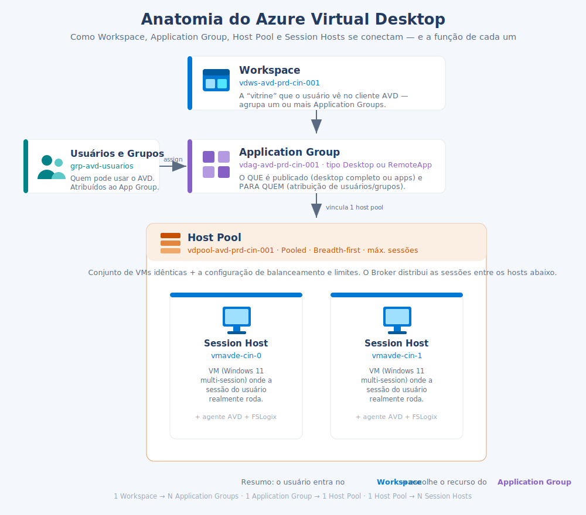

# Anatomia do AVD — Workspace, Application Group, Host Pool e Session Hosts

> **Disciplina:** Azure Virtual Desktop — Pós-Graduação em Arquitetura Avançada em Azure
> **Objetivo:** desfazer a confusão mais comum de quem começa no AVD — *quem é quem* entre Workspace, Application Group, Host Pool e Session Hosts, e como eles se encaixam.

  

---

## 🧩 A função de cada componente

| Componente | Ícone | O que é | Função (em uma frase) |
|------------|:-----:|---------|------------------------|
| **Workspace** | 🪟 | `vdws-avd-prd-cin-001` | A **vitrine** que o usuário vê no cliente AVD. Agrupa Application Groups e é o "container" lógico de apresentação. |
| **Application Group** | 🔲 | `vdag-avd-prd-cin-001` | Define **o que** é publicado (um **Desktop** completo ou **RemoteApps**) e **para quem** (atribuição de usuários/grupos). |
| **Host Pool** | 🗄️ | `vdpool-avd-prd-cin-001` | O **conjunto de VMs idênticas** + a configuração: tipo (**Pooled**/**Personal**), balanceamento e limite de sessões. |
| **Session Host** | 🖥️ | `vmavde-cin-0`, `vmavde-cin-1` | A **VM** (Windows 11 multi-session) **onde a sessão do usuário realmente roda** — com o agente AVD e o FSLogix. |

## 🔗 Como se relacionam (cardinalidade)

- **1 Workspace → N Application Groups** (um workspace pode reunir vários grupos de apps/desktops).
- **1 Application Group → 1 Host Pool** (cada grupo aponta para um único pool).
- **1 Host Pool → N Session Hosts** (o pool tem uma ou mais VMs).
- **Usuários/Grupos → Application Group** (o acesso é dado **atribuindo** pessoas ao App Group).

## 🎬 O caminho do usuário

1. O usuário abre o cliente e enxerga o **Workspace**.
2. Dentro dele, clica no recurso publicado pelo **Application Group** (desktop ou app) — só vê o que foi **atribuído** a ele.
3. O **Host Pool** (via Broker) escolhe um **Session Host** disponível.
4. A sessão é entregue **no Session Host**, com o perfil montado pelo FSLogix.

> 💡 **Analogia rápida:** o **Workspace** é o *shopping*, o **Application Group** é a *vitrine de uma loja* (e a lista de quem tem a chave), o **Host Pool** é o *estoque de salas idênticas*, e cada **Session Host** é a *sala* onde o atendimento acontece.

---

## 🔗 Relacionado
- [Fluxo de conexão AVD (diagrama de sequência)](00_Fluxo_de_Conexao_AVD.md)
- [Guia de decisão — Entra ID vs AD DS](00_Guia_Decisao_Identidade_Entra_vs_ADDS.md)
