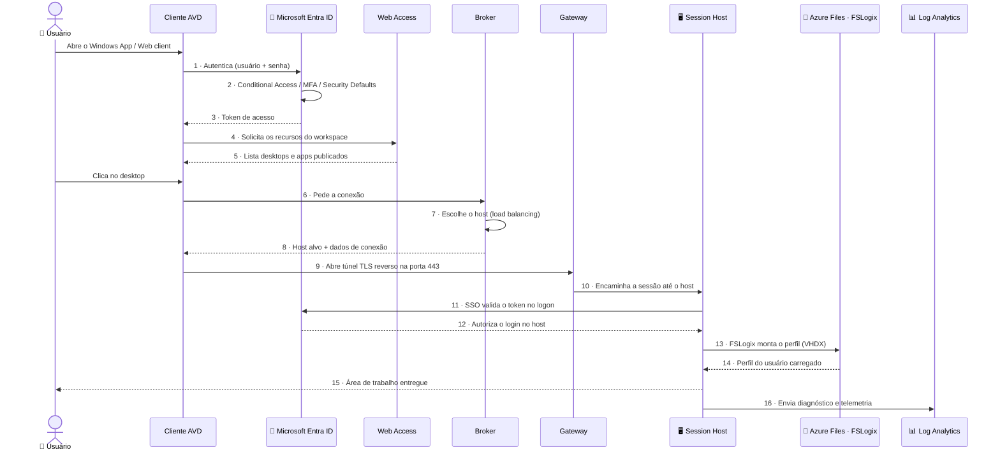

# Fluxo de uma conexão AVD — diagrama de sequência

> **Disciplina:** Azure Virtual Desktop — Pós-Graduação em Arquitetura Avançada em Azure
> **Objetivo:** mostrar, passo a passo, **o que acontece "por baixo do capô"** quando um usuário conecta — da autenticação ao carregamento do perfil. Use como mapa mental ao depurar qualquer problema de conexão.

  
  
  

---

## 🎬 O filme da conexão

---

## 📝 Passo a passo explicado

| Passo | O que acontece | Onde depurar se falhar |
|:-----:|----------------|------------------------|
| 1–3 | Cliente autentica no **Entra ID**; Conditional Access/MFA/Security Defaults são avaliados; token é emitido | **Entra ID → Sign-in logs** |
| 4–5 | **Web Access** devolve os recursos que o usuário tem direito (atribuição no **Application Group**) | Atribuição do App Group |
| 6–8 | **Broker** faz o *load balancing* e escolhe um session host disponível | **Host pool → Session hosts** (estado *Available*) |
| 9–10 | **Gateway** abre um túnel **TLS reverso (443)** — sem expor RDP público — e leva a sessão ao host | Saída de rede do host (NAT Gateway) |
| 11–12 | O **SSO** valida o token no logon do Windows e autoriza a entrada | RBAC *VM User Login* (Entra) / domínio (AD DS) + saída p/ `login.microsoftonline.com` |
| 13–14 | O **FSLogix** monta o perfil do usuário a partir do `.vhdx` no Azure Files | Logs do FSLogix · `klist` · Azure Files |
| 15 | A **área de trabalho** é entregue ao usuário | — |
| 16 | Logs e métricas fluem para o **Log Analytics** (AVD Insights) | Diagnostic settings |

---

## 🔀 O que muda entre Entra ID e AD DS

O fluxo é **o mesmo**; muda apenas *como* dois passos são resolvidos:

| Passo | 🔐 Entra ID (cloud-native) | 🗄️ AD DS (híbrido) |
|:-----:|----------------------------|--------------------|
| **11–12 · Autorização do logon** | RBAC `Virtual Machine User Login` + SSO Entra | Autorização pelo domínio `avdlab.local` + SSO Entra |
| **13 · Montagem do perfil** | Azure Files via **Entra Kerberos** | Azure Files via **AD DS** (AzFilesHybrid), geralmente por **Private Endpoint** |

> 💡 **Por que isso é importante para depurar:** quase todo erro de conexão cai em **um** desses passos. "Sign in Failed" → passos 11–12 (SSO/MFA/saída de rede). Perfil temporário → passos 13–14 (FSLogix/Kerberos). Recurso não aparece no cliente → passos 4–5 (atribuição no App Group). Saber em qual passo o filme parou direciona a correção.

---

## 🔗 Relacionado

- [Guia de decisão — Entra ID vs AD DS](00_Guia_Decisao_Identidade_Entra_vs_ADDS.md)
- [Lab 01 — Host Pool com Entra ID](Lab01_Hostpool_2VMs_EntraID.md) · [Lab 03 — Host Pool com AD DS](Lab03_Hostpool_2VMs_ADDS.md)
