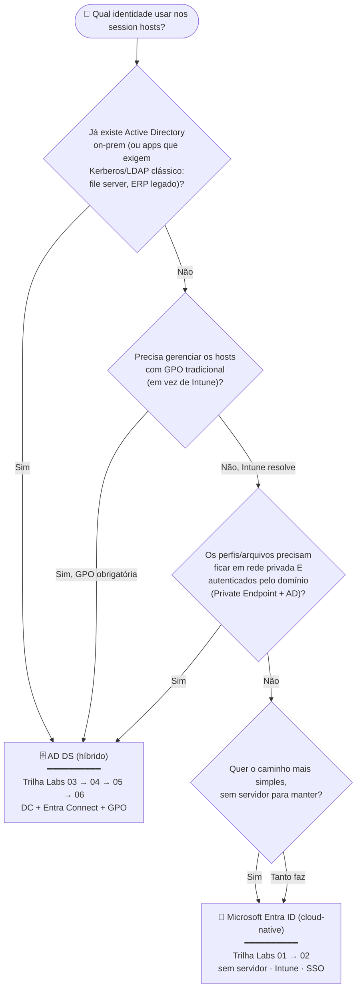

# Guia de decisão — Microsoft Entra ID vs AD DS no AVD

> **Disciplina:** Azure Virtual Desktop — Pós-Graduação em Arquitetura Avançada em Azure
> **Objetivo:** ajudar o aluno a escolher **qual modelo de identidade** usar para os session hosts antes de iniciar os laboratórios — e, com isso, qual trilha seguir.

  
  
  

---

## 🧭 Fluxograma de decisão

> **Regra de bolso:** comece sempre se perguntando *"existe alguma dependência que **obriga** o domínio clássico?"*. Se a resposta for **não** em todas as perguntas, **Entra ID** é o caminho mais simples, barato e moderno. O AD DS entra quando há uma **âncora no legado** (AD existente, GPO obrigatória, app que fala Kerberos clássico, ou storage que precisa de identidade de domínio).

---

## 📊 Comparativo lado a lado

| Dimensão | 🔐 Microsoft Entra ID (cloud-native) | 🗄️ AD DS (híbrido) |
|----------|--------------------------------------|--------------------|
| **Servidor a manter** | Nenhum (sem DC) | Controlador de domínio (VM) + patching/backup |
| **Identidade do usuário** | Só nuvem ou sincronizada | **Tem de ser híbrida** (criada no AD + Entra Connect) |
| **Ingresso dos hosts** | Microsoft Entra ID join | Domain join (`avdlab.local`) |
| **Gerência de políticas** | **Intune** (Settings Catalog) | **GPO** (Group Policy) |
| **Login no host** | RBAC `Virtual Machine User Login` + SSO | Autorização via AD + SSO Entra |
| **FSLogix / Azure Files** | **Entra Kerberos** (cloud) | **AD DS** (AzFilesHybrid) |
| **Rede privada p/ perfis** | Possível, menos comum | **Private Endpoint** (Lab 05) |
| **Apps Kerberos/LDAP clássicos** | ❌ Não atende | ✅ Atende |
| **Complexidade / custo** | Menor | Maior (DC, sync, GPO) |
| **Laboratórios** | **Labs 01 → 02** | **Labs 03 → 04 → 05 → 06** |

---

## 🎯 Recomendação por cenário

| Cenário | Escolha | Por quê |
|---------|---------|---------|
| Startup/empresa **100% nuvem**, sem AD | 🔐 **Entra ID** | Nada de legado; caminho mais simples e barato |
| Empresa com **AD on-prem** já em uso | 🗄️ **AD DS** | Reusa identidades, GPOs e apps de domínio existentes |
| Precisa de **GPO** detalhada nos hosts | 🗄️ **AD DS** | GPO clássica (ou avaliar Intune como equivalente) |
| App legado que fala **Kerberos/LDAP** | 🗄️ **AD DS** | Entra ID puro não entrega Kerberos clássico |
| Perfis FSLogix em **rede privada + domínio** | 🗄️ **AD DS** | Private Endpoint + Azure Files com AD (Lab 05) |
| POC rápida / aula introdutória | 🔐 **Entra ID** | Sobe em minutos, sem servidor para manter |

> 💡 **Importante:** em **ambos** os modelos a **autenticação do AVD passa sempre pelo Microsoft Entra ID** — a diferença está em como os *session hosts* e o *storage de perfis* são ingressados e gerenciados. Por isso o cenário AD DS exige **identidades híbridas** (sincronizadas para o Entra ID via Entra Connect).

---

## ➡️ Próximo passo

- Escolheu **Entra ID**? Comece pelo **[Lab 01 — Host Pool com Entra ID](Lab01_Hostpool_2VMs_EntraID.md)**.
- Escolheu **AD DS**? Comece pelo **[Lab 03 — Host Pool com AD DS](Lab03_Hostpool_2VMs_ADDS.md)**.
