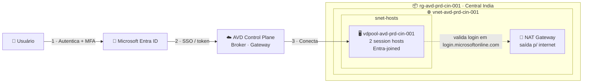

# Lab 01 — Host Pool com 2 VMs autenticando via Microsoft Entra ID

> **Disciplina:** Azure Virtual Desktop — Pós-Graduação em Arquitetura Avançada em Azure
> **Modalidade:** Passo a passo via Portal do Azure (portal-first)
> **Dependências:** Ambiente base do Lab 1.1 (Resource Group, VNet e sub-redes). Se ainda não existir, a Parte A cobre a criação mínima.

---

<p align="center">
  
  
  
  
</p>

## 🗺️ Arquitetura deste laboratório



> **Leitura:** o usuário autentica no Entra ID → o SSO carrega o token para a sessão → o Control Plane (PaaS da Microsoft) conecta ao host pool. Os 2 hosts vivem na `snet-hosts` e precisam da **NAT Gateway** para sair à internet (provisionamento do agente e validação de login).

---

## 🧭 Ficha do laboratório

| Item | Detalhe |
|------|---------|
| **Dificuldade** | ★★ Intermediário |
| **Tempo estimado** | 60–75 min |
| **Objetivo** | Provisionar um host pool *Pooled* com 2 session hosts ingressados diretamente no **Microsoft Entra ID** (sem AD DS / sem Entra Domain Services), habilitar SSO e validar a conexão de um usuário. |
| **Pré-requisitos** | Assinatura com papel **Owner** ou (**Contributor** + **User Access Administrator**). Um usuário de teste no Entra ID (ex.: `joao.teste@seudominio.onmicrosoft.com`). Resource Providers registrados (`Microsoft.DesktopVirtualization`, `Microsoft.Compute`, `Microsoft.Network`, `Microsoft.AADIAM`). |
| **Recursos consumidos** | 2× VM (recomendado `Standard_D2s_v5` ou `Standard_D2as_v5`), Host Pool, Workspace, DAG, VNet. |
| **Entrega** | Host pool `vdpool-avd-prd-cin-001` com 2 hosts *Available* e um usuário conectando com SSO. |

### Cenário
Este é o cenário **cloud-native** mais simples: não há controlador de domínio. A identidade é 100% Microsoft Entra ID. É a base reutilizada no **Lab 02** (FSLogix com Entra Kerberos), então **mantenha este host pool ao final do lab**.

### Convenção de nomes (padrão do catálogo)
| Recurso | Nome |
|---------|------|
| Resource Group | `rg-avd-prd-cin-001` |
| VNet / sub-rede dos hosts | `vnet-avd-prd-cin-001` / `snet-hosts-prd-cin-001` (10.50.1.0/24) |
| Host Pool | `vdpool-avd-prd-cin-001` |
| Workspace | `vdws-avd-prd-cin-001` |
| Desktop App Group | `vdag-avd-prd-cin-001` |
| Session hosts | `vmavde-cin` (gera `vmavde-cin-0`, `vmavde-cin-1`) |
| Região | Central India (alternativa: South India) |

---

## Parte A — Verificar o ambiente base

> Se você já concluiu o Lab 1.1, pule para a Parte B. Caso contrário, crie o mínimo necessário.

1. No portal, barra de busca → **Resource groups** → confirme que `rg-avd-prd-cin-001` existe em **Central India**. Se não existir: **+ Create** → Subscription, Resource group = `rg-avd-prd-cin-001`, Region = **Central India** → **Review + create** → **Create**.
2. Barra de busca → **Virtual networks** → confirme `vnet-avd-prd-cin-001` (10.50.0.0/16) com a sub-rede `snet-hosts-prd-cin-001` (10.50.1.0/24). Se não existir, crie a VNet com essa sub-rede.
3. Confirme os Resource Providers: **Subscriptions** → selecione a assinatura → **Settings → Resource providers** → busque e garanta **Registered** para `Microsoft.DesktopVirtualization`, `Microsoft.Compute`, `Microsoft.Network` e `Microsoft.AADIAM`.

### A.1 — Garantir saída de internet na sub-rede dos hosts (OBRIGATÓRIO)

> ⚠️ **Passo crítico.** Desde **30/09/2025** a Microsoft aposentou o *default outbound access*: uma sub-rede nova **nasce sem saída para a internet**. Sem saída, o provisionamento dos hosts **falha** na extensão DSC com o erro `VMExtensionProvisioningError ... Error downloading https://wvdportalstorageblob.blob.core.windows.net/...` porque o agente AVD não consegue ser baixado. Configure a saída **antes** de criar o host pool.

O caminho mais limpo para laboratório é uma **NAT Gateway** ligada à `snet-hosts-prd-cin-001`:

1. Barra de busca → **NAT gateways** → **+ Create**.
   - **Resource group:** `rg-avd-prd-cin-001`; **Name:** `ng-avd-prd-cin-001`; **Region:** Central India.
2. Aba **Outbound IP** → **Public IP addresses** → **Create a new public IP** → nome `pip-ng-avd-prd-cin-001`.
3. Aba **Subnet** → selecione `vnet-avd-prd-cin-001` → marque **`snet-hosts-prd-cin-001`**.
4. **Review + create → Create.** Em poucos minutos a sub-rede passa a ter saída para a internet.

> Se você criar um **NSG** na `snet-hosts-prd-cin-001`, garanta que a regra padrão `AllowInternetOutbound` continue ativa (saída HTTPS/443 para as Service Tags `WindowsVirtualDesktop`, `AzureFrontDoor.Frontend`, `Storage`, `AzureMonitor`). Um NSG bloqueando saída causa o mesmo erro de DSC.

> **Importante para o SSO (Parte E):** essa mesma saída é necessária para o **login funcionar dentro do host** — o session host precisa alcançar `login.microsoftonline.com` no momento da conexão. Sem saída, mesmo com credencial válida, a entrada falha.

---

## Parte B — Criar o Host Pool, Workspace, App Group e os 2 session hosts

O portal cria tudo em um único assistente.

1. Barra de busca → **Azure Virtual Desktop** → no menu lateral, **Host pools** → **+ Create**.

### Aba *Basics*
2. Preencha:
   - **Subscription:** sua assinatura.
   - **Resource group:** `rg-avd-prd-cin-001`.
   - **Host pool name:** `vdpool-avd-prd-cin-001`.
   - **Location:** Central India (define onde ficam os metadados/objeto do host pool).
   - **Validation environment:** **No**.
   - **Preferred app group type:** **Desktop**.
   - **Host pool type:** **Pooled**.
   - **Load balancing algorithm:** **Breadth-first**.
   - **Max session limit:** `5`.

### Aba *Virtual Machines*
3. **Add virtual machines:** **Yes**.
4. Preencha:
   - **Resource group:** `rg-avd-prd-cin-001` (pode ser o mesmo).
   - **Name prefix:** `vmavde-cin`.
   - **Virtual machine location:** Central India.
   - **Availability options:** No infrastructure redundancy required (suficiente para lab).
   - **Security type:** **Trusted launch virtual machines** (deixe Secure Boot e vTPM marcados).
   - **Image:** **Windows 11 Enterprise multi-session, version 24H2 + Microsoft 365 Apps** (ou sem M365, se preferir mais leve).
   - **Virtual machine size:** `Standard_D2s_v5` (ou `Standard_D2as_v5`).
   - **Number of VMs:** `2`.
   - **OS disk type:** Standard SSD (lab) ou Premium SSD (produção).
5. **Network and security:**
   - **Virtual network:** `vnet-avd-prd-cin-001`.
   - **Subnet:** `snet-hosts-prd-cin-001`.
   - **Network security group:** Basic.
   - **Public inbound ports:** **No**.
6. **Domain to join** — esta é a parte central do lab:
   - **Select which directory you would like to join:** **Microsoft Entra ID**.
   - Marque **Enroll the VM with Intune** somente se você usará Intune para gerenciar/aplicar políticas (recomendado para o Lab 02, onde aplicaremos o Settings Catalog; pode marcar agora se já tiver Intune licenciado). Se não tiver Intune, deixe desmarcado.
7. **Virtual Machine Administrator account:**
   - **Username:** `localadmin`.
   - **Password / Confirm password:** defina uma senha forte e **anote** (será o admin local das VMs).

### Aba *Workspace*
8. **Register desktop app group:** **Yes**.
9. **To this workspace:** **Create new** → nome `vdws-avd-prd-cin-001`.

### Finalizar
10. **Review + create** → aguarde a validação → **Create**. O provisionamento das 2 VMs + ingresso no Entra ID leva ~10–20 min.

> **O que aconteceu:** o portal criou o host pool, um Desktop Application Group (DAG) padrão, registrou-o no workspace `vdws-avd-prd-cin-001` e provisionou 2 VMs já ingressadas no Entra ID via a extensão **AADLoginForWindows**.

---

## Parte C — Conceder permissão de login nas VMs (RBAC de identidade)

Em VMs ingressadas no Entra ID, o login do usuário é autorizado por **RBAC de Azure**, não por grupos locais. É obrigatório atribuir o papel **Virtual Machine User Login**.

1. Barra de busca → **Resource groups** → `rg-avd-prd-cin-001` → **Access control (IAM)** → **+ Add → Add role assignment**.
2. Aba **Role:** busque e selecione **Virtual Machine User Login**.
   > Se o usuário também precisar de direitos administrativos na VM, atribua adicionalmente **Virtual Machine Administrator Login**.
3. Aba **Members:** **Assign access to → User, group, or service principal** → **+ Select members** → selecione `joao.teste` (ou o grupo de usuários AVD).
4. **Review + assign**.

> **Por que no Resource Group?** Atribuir no RG faz o papel valer para todas as VMs do lab. Em produção, prefira atribuir no escopo das VMs ou do RG dedicado aos hosts.

---

## Parte D — Atribuir o usuário ao Application Group (acesso AVD)

O RBAC da Parte C autoriza o *login no SO*. Para o recurso **aparecer** no cliente AVD, o usuário precisa estar atribuído ao **Application Group**.

1. **Azure Virtual Desktop → Application groups** → `vdag-avd-prd-cin-001` (ou o DAG criado automaticamente).
2. **Assignments** → **+ Add** → selecione `joao.teste` (ou o grupo) → **Select**.

---

## Parte E — Habilitar Single Sign-On (SSO) no Host Pool

O SSO via Entra ID evita pedir credencial duas vezes (uma no cliente, outra no Windows) e usa autenticação moderna. **Este passo é o que faz a conexão funcionar quando o tenant usa Security Defaults / MFA** — sem SSO, o login dentro do host falha com a tela **"Sign in Failed — Please check your username and password"**, mesmo com a senha correta.

São **dois** sub-passos, ambos obrigatórios: (E.1) as RDP Properties no host pool e (E.2) habilitar o SSO nos service principals do tenant. Se você fizer só um, o SSO não funciona.

### E.1 — Configurar as RDP Properties do host pool

1. **Azure Virtual Desktop → Host pools → `vdpool-avd-prd-cin-001`** → **Settings → RDP Properties** → aba **Advanced**.
2. Garanta que a string de propriedades contenha **as duas** propriedades abaixo (acrescente ao final, separadas por `;`):
   - `enablerdsaadauth:i:1` — liga o SSO (autenticação moderna do Entra).
   - `targetisaadjoined:i:1` — **necessário quando o cliente que conecta não é Entra-joined** (ex.: o aluno conectando do PC pessoal). Sem ela, a conexão a um host Entra-joined é recusada.
   > Atalho visual: na mesma tela, marque **Microsoft Entra single sign-on → "Connections will use Microsoft Entra authentication to provide single sign-on"** — isso adiciona o `enablerdsaadauth:i:1` automaticamente. O `targetisaadjoined:i:1` adicione manualmente na string.

   Exemplo de string final (mantendo as redireções padrão + as duas de SSO no fim):
   ```
   ...;redirectwebauthn:i:1;use multimon:i:1;targetisaadjoined:i:1;enablerdsaadauth:i:1
   ```
3. **Save**.

### E.2 — Habilitar o SSO nos service principals do tenant (uma vez por tenant)

É preciso autorizar os apps de primeira parte **Microsoft Remote Desktop** e **Windows Cloud Login** a aceitar o SSO. Não há botão no portal — faça via **Microsoft Graph**. O caminho mais simples e testado é pelo **Azure Cloud Shell** (modo **PowerShell**), com uma conta **Global Administrator**.

> ⚠️ **Não use `az rest` para isso.** O token do Azure CLI não carrega o escopo `Application.ReadWrite.All` e o comando retorna `Authorization_RequestDenied / Insufficient privileges`. O `Connect-MgGraph` abaixo pede o escopo explicitamente e funciona.

1. Abra o **Cloud Shell** (ícone `>_` no topo do portal) em modo **PowerShell**.
2. Conecte ao Graph pedindo o escopo (vai aparecer um código para autenticar em `https://login.microsoft.com/device`):
   ```powershell
   Connect-MgGraph -Scopes "Application.ReadWrite.All"
   ```
   Autentique como **Global Administrator** e aceite o consentimento.
3. Habilite o SSO nos dois apps usando `Invoke-MgGraphRequest` (já incluso no Cloud Shell — não precisa instalar módulo beta):
   ```powershell
   Invoke-MgGraphRequest -Method PATCH `
     -Uri "https://graph.microsoft.com/beta/servicePrincipals(appId='a4a365df-50f1-4397-bc59-1a1564b8bb9c')/remoteDesktopSecurityConfiguration" `
     -Body @{ isRemoteDesktopProtocolEnabled = $true }

   Invoke-MgGraphRequest -Method PATCH `
     -Uri "https://graph.microsoft.com/beta/servicePrincipals(appId='270efc09-cd0d-444b-a71f-39af4910ec45')/remoteDesktopSecurityConfiguration" `
     -Body @{ isRemoteDesktopProtocolEnabled = $true }
   ```
4. Confirme (deve retornar `isRemoteDesktopProtocolEnabled  True`):
   ```powershell
   Invoke-MgGraphRequest -Method GET `
     -Uri "https://graph.microsoft.com/beta/servicePrincipals(appId='a4a365df-50f1-4397-bc59-1a1564b8bb9c')/remoteDesktopSecurityConfiguration"
   ```

> Os dois App IDs são os apps de 1ª parte da Microsoft: `a4a365df-...` = **Microsoft Remote Desktop**; `270efc09-...` = **Windows Cloud Login**.

> Se o `Connect-MgGraph` retornar "Insufficient privileges", sua conta não tem o papel necessário — verifique em **Entra ID → Roles and administrators** se você é **Global Administrator** (ou peça para quem é executar E.2).

---

## Parte F — Conectar e validar

1. Confirme os hosts: **Host pools → `vdpool-avd-prd-cin-001` → Session hosts**. Os 2 hosts devem aparecer com **Status = Available** e **Agent = Available**.
2. Em uma máquina cliente, abra o **Windows App** (ou o cliente **Remote Desktop**), ou acesse o web client em `https://client.wvd.microsoft.com/arm/webclient/`.
3. Faça login como `joao.teste`.
4. O workspace **vdws-avd-prd-cin-001** deve listar o desktop. Abra-o.
5. Com SSO habilitado, a sessão entra sem segundo prompt de senha. Será solicitado MFA se houver Security Defaults / Conditional Access exigindo (recomendado em produção).

### Critérios de sucesso
- [ ] Os 2 session hosts aparecem como **Available**.
- [ ] No portal das VMs, a propriedade confirma ingresso **Microsoft Entra ID** (não "Hybrid", não "AD DS").
- [ ] `joao.teste` enxerga e abre o desktop publicado.
- [ ] A conexão usa SSO (sem segundo pedido de senha do Windows).
- [ ] Dentro da sessão, `whoami` retorna a conta no formato `azuread\joao.teste` ou equivalente Entra.

---

## Erros comuns

| Sintoma | Causa provável | Correção |
|---------|----------------|----------|
| **Deploy falha:** `VMExtensionProvisioningError ... Microsoft.PowerShell.DSC ... Error downloading https://wvdportalstorageblob.blob.core.windows.net/...` | Sub-rede **sem saída para a internet** (default outbound aposentado em 30/09/2025) → agente AVD não baixa | Crie a **NAT Gateway** na `snet-hosts` (Parte A.1). Depois **remova os hosts com falha** (Session hosts → Remove) e exclua VMs/discos/NICs órfãos, então **+ Add** novamente |
| **"Sign in Failed — Please check your username and password and try again"** (tela de cadeado) ao conectar, mas a credencial funciona no portal/web client | Tenant com **Security Defaults** exige MFA e o **SSO não está completo** → o login dentro do host não completa o MFA | Complete a **Parte E inteira**: E.1 (as duas RDP Properties) **e** E.2 (habilitar `remoteDesktopSecurityConfiguration` nos dois apps via Cloud Shell). Verifique nas RDP Properties que `enablerdsaadauth:i:1` e `targetisaadjoined:i:1` estão salvos |
| "We couldn't connect... Your account is configured to prevent you from using this device" | Falta o papel **Virtual Machine User Login** | Refaça a Parte C |
| Recurso não aparece no cliente | Usuário não atribuído ao App Group | Refaça a Parte D |
| Login falha mas credencial é válida na nuvem | Host **sem saída** para alcançar `login.microsoftonline.com` no logon | Confirme a NAT Gateway (A.1); teste no host: `Test-NetConnection login.microsoftonline.com -Port 443` |
| `az rest` retorna `Authorization_RequestDenied / Insufficient privileges` ao habilitar o SSO | Token do Azure CLI não carrega `Application.ReadWrite.All` | Use `Connect-MgGraph -Scopes "Application.ReadWrite.All"` + `Invoke-MgGraphRequest` (Parte E.2) como Global Admin |
| Host fica em *Unavailable* | Extensão de Entra join falhou / sem saída para internet | Verifique NSG/saída da `snet-hosts`; reimplante o host |

> 💡 **Diagnóstico decisivo de falha de login:** **Entra ID → Monitoring → Sign-in logs**, filtrando pelo usuário. Se **não houver** registro da tentativa no horário, é **rede** (host não alcançou o Entra). Se **houver** registro com falha, leia o *Failure reason* (normalmente MFA/SSO).

---

## Limpeza (opcional ao final da trilha)
> **Não delete agora** se for fazer o Lab 02 em seguida — ele reutiliza este host pool. Quando encerrar a trilha cloud-native, exclua o `rg-avd-prd-cin-001` ou apenas as VMs `vmavde-cin-0x` para parar a cobrança de compute.

---

## Próximo lab
➡️ **Lab 02 — FSLogix integrado ao Microsoft Entra ID**, reaproveitando exatamente este host pool.
