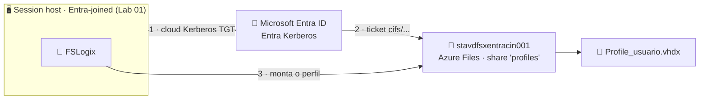

# Lab 02 — FSLogix integrado ao Microsoft Entra ID (Azure Files com Entra Kerberos)

> **Disciplina:** Azure Virtual Desktop — Pós-Graduação em Arquitetura Avançada em Azure
> **Modalidade:** Passo a passo via Portal do Azure (portal-first)
> **Dependência obrigatória:** **Lab 01** concluído — host pool `vdpool-avd-prd-cin-001` com 2 hosts ingressados no **Microsoft Entra ID**.

---

<p align="center">
  
  
  
  
</p>

## 🗺️ Arquitetura deste laboratório



> **Leitura:** sem controlador de domínio, o host Entra-joined pega um *ticket Kerberos de nuvem* no Entra ID e monta o **Azure Files** via SMB. O FSLogix grava o perfil do usuário como um `.vhdx` no share — perfil que segue o usuário entre os hosts.

---

## 🧭 Ficha do laboratório

| Item | Detalhe |
|------|---------|
| **Dificuldade** | ★★★ Avançado |
| **Tempo estimado** | 75–90 min |
| **Objetivo** | Armazenar perfis FSLogix em um **Azure Files** autenticado por **Microsoft Entra Kerberos** (cenário cloud-native, **sem AD DS**), reutilizando o host pool do Lab 01. |
| **Pré-requisitos** | Lab 01 concluído; **Intune** disponível (para aplicar o Settings Catalog nos hosts) ou disposição para configurar a chave de registro manualmente; papel **Owner** para conceder admin consent na API permission. |
| **Recursos consumidos** | 1× Storage Account (**Standard / StorageV2**), 1× File Share, configuração de identidade e RBAC. |
| **Entrega** | Perfil do usuário criado como `.vhdx` no share, com login carregando o perfil FSLogix a partir do Azure Files via Entra Kerberos. |

### Cenário
Sem controlador de domínio, o Azure Files autentica via **Microsoft Entra Kerberos**: o host Entra-joined obtém um *cloud TGT* do Entra ID e monta o share SMB. É o complemento natural do Lab 01.

> ⚠️ **Requisitos de plataforma (validar antes de começar):**
> - Hosts com **Windows 11 multi-session 24H2** (ou superior) com as atualizações cumulativas recentes. O Lab 01 já usa imagem 24H2.
> - Uma conta de armazenamento **não pode** usar Entra Kerberos e AD DS ao mesmo tempo — escolha apenas Entra Kerberos.
> - **MFA não pode** ser exigido para a app de storage no fluxo do Kerberos silencioso (ver Parte E).

### Convenção de nomes
| Recurso | Nome |
|---------|------|
| Storage Account | `stavdfsxentracin001` (precisa ser único globalmente — ajuste se necessário) |
| File Share | `profiles` |
| Sub-rede FSLogix | `snet-fslogix-prd-cin-001` (10.50.2.0/24) |
| Private Endpoint | `pep-st-entra-prd-cin-001` (Parte I) |

---

## Parte A — Criar a Storage Account e o File Share

1. Barra de busca → **Storage accounts** → **+ Create**.
2. Aba **Basics:**
   - **Resource group:** `rg-avd-prd-cin-001`.
   - **Storage account name:** `stavdfsxentracin001` (minúsculas, sem hífen; ajuste para ficar único).
   - **Region:** Central India.
   - **Primary service:** Azure Files.
   - **Performance:** **Standard** (suficiente para o laboratório e bem mais econômico). *Premium fica para produção, quando você precisa de latência muito baixa.*
   - **Redundancy:** LRS (lab).
   - Aba **Data protection:** **desmarque o backup** (Recovery Services / "Enable backup") — em laboratório evita custo e a criação de um cofre desnecessário.
3. **Review + create** → **Create**.
4. Aberta a conta → **Data storage → File shares** → **+ File share**:
   - **Name:** `profiles`.
   - **Tier:** deixe **Transaction optimized** (padrão do Standard).
   - **Quota:** defina um valor pequeno para o lab (ex.: 100 GiB).
   - Se o portal oferecer **habilitar backup** do share, **desmarque/pule** (não habilite backup no laboratório).
   - **Create**.

---

## Parte B — Habilitar a autenticação Microsoft Entra Kerberos

1. Na Storage Account → **Data storage → File shares** → no topo, **Active Directory** (ou **Security → Identity-based access**).
   > Caminho alternativo: **Settings → Configuration** não tem isso; use **File shares → Active Directory**, ou **Security + networking → Identity-based access**.
2. Em **Microsoft Entra Kerberos**, clique **Set up** (ou **Configure**) → marque **Microsoft Entra Kerberos**.
   - **Deixe os campos de Domain name / Domain GUID em branco** — eles só são usados no cenário híbrido com AD DS. Para cloud-native puro, ficam vazios.
3. **Save**.

---

## Parte C — Conceder admin consent à API permission (obrigatório)

Ao habilitar o Entra Kerberos, é criado um **App registration** correspondente à storage account. Ele precisa de **admin consent** para a permissão `openid` usada na emissão do ticket.

> 🧠 **Por que esse passo existe (em linguagem simples):** quando o usuário faz logon, o host pede ao Entra ID um "ingresso" (ticket Kerberos) para abrir o Azure Files. Esse pedido é feito **em nome do usuário** pelo app de identidade da storage account. O *admin consent* é o **carimbo do administrador autorizando, de uma vez por todas, que aquele app possa identificar o usuário (`openid`)**. Sem esse carimbo, o Entra ID recusa emitir o ticket, o FSLogix não monta o perfil e o usuário cai num perfil **temporário**.

1. Barra de busca → **Microsoft Entra ID → App registrations** → aba **All applications**.
2. Busque por `[Storage Account] stavdfsxentracin001.file.core.windows.net` (o nome contém o FQDN da conta).
3. Abra o app → **API permissions**.
4. Confirme a permissão **Microsoft Graph → openid** (delegated). Clique **Grant admin consent for [seu tenant]** → **Yes**.
   > Sem este consent, o login do usuário falha ao obter o ticket Kerberos para o share.

---

## Parte D — Configurar as permissões de acesso (RBAC + NTFS)

Há duas camadas: **share-level (RBAC do Azure)** e **directory/file-level (NTFS)**.

### D.1 — Criar o grupo de perfis e dar a permissão de share (RBAC)

Crie um **grupo específico** para quem terá perfil FSLogix neste storage — assim o acesso ao share é controlado por grupo, e não usuário a usuário.

1. **Microsoft Entra ID → Groups → + New group**:
   - **Group type:** Security · **Group name:** `grp-avd-fslogix-usuarios`.
   - **Members:** adicione `joao.teste` (e os demais usuários do AVD que terão perfil — normalmente os mesmos do `grp-avd-usuarios`).
   - **Create**.
2. Storage Account → **Access Control (IAM)** → **+ Add → Add role assignment**.
3. Para os **usuários** que terão perfil: atribua **Storage File Data SMB Share Contributor** ao grupo **`grp-avd-fslogix-usuarios`**.
4. Para o **administrador** (você, para configurar NTFS): atribua **Storage File Data SMB Share Elevated Contributor** à sua conta admin (ou ao grupo `grp-avd-admins`).
5. **Review + assign** em cada atribuição.

> Alternativa rápida: na janela **Identity-based access** da conta, defina **Default share-level permission** = **Storage File Data SMB Share Contributor** para aplicar a todos os usuários autenticados (menos granular; bom para lab).

### D.2 — Permissões NTFS no share (configuração FSLogix recomendada)
O FSLogix exige que **usuários** tenham permissão de criar a própria pasta/`.vhdx`, mas não enxerguem perfis de outros. Aplique a recomendação Microsoft no share montado.

1. Obtenha a **storage account key** para montar o share como admin: Storage Account → **Security + networking → Access keys** → copie a **key1**.
2. Em uma máquina com linha de visão ao Azure Files (pode ser um dos hosts AVD via RDP, como `localadmin`), abra **PowerShell como Administrador** e monte o share usando a key (passo administrativo **obrigatório**, não há equivalente de NTFS no portal):

   ```powershell
   # Substituir conta, key e share
   $conta   = "stavdfsxentracin001"
   $key     = "<COLE_A_KEY1_AQUI>"
   $unc     = "\\$conta.file.core.windows.net\profiles"

   # Monta como Z: usando a chave da conta (acesso administrativo)
   cmd /c "net use Z: $unc /user:Azure\$conta $key"

   # Aplica as permissões NTFS recomendadas para FSLogix:
   icacls Z: /grant "Creator Owner:(OI)(CI)(IO)(M)"
   icacls Z: /grant "Authenticated Users:(M)"
   icacls Z: /grant "Authenticated Users:(CI)(M)"
   icacls Z: /remove "Builtin\Users"
   # Observação: NÃO desmontamos a unidade — deixamos Z: mapeada de propósito,
   # para o administrador inspecionar os perfis (.vhdx) com facilidade depois.
   ```
   > Isso garante: cada usuário cria e é dono do próprio perfil; usuários não acessam perfis alheios.
   > 🔧 A unidade **Z:** fica **mapeada** para facilitar a administração (abrir o share, ver os `.vhdx`, conferir tamanho). Quando quiser remover, rode `net use Z: /delete`.

---

## Parte E — Garantir que MFA não bloqueie o Kerberos silencioso

O host precisa obter o ticket Kerberos **silenciosamente** no logon. Se houver Conditional Access exigindo MFA para a app de storage, o fluxo falha.

1. **Microsoft Entra ID → Conditional Access** (ou **Security → Conditional Access**).
2. Garanta que a aplicação **Microsoft Azure Files** (App ID começa com a storage) ou a sessão de logon do host **não** esteja sujeita a uma política que exija MFA no momento do logon do AVD. Em lab, normalmente não há política; em produção, **exclua** a app de storage da política de MFA ou use confiança de dispositivo.

---

## Parte F — Habilitar o cloud Kerberos ticket retrieval nos hosts (obrigatório)

Hosts Entra-joined **não** buscam o cloud TGT por padrão. É preciso ligar a política **`CloudKerberosTicketRetrievalEnabled`**. O caminho recomendado é o **Intune (Settings Catalog)**.

### Via Intune (recomendado)
1. Barra de busca → **Intune** (ou **Microsoft Intune admin center** → `intune.microsoft.com`).
2. **Devices → Configuration → + Create → New Policy**:
   - **Platform:** Windows 10 and later.
   - **Profile type:** **Settings catalog**.
3. **Name:** `AVD - FSLogix Entra Kerberos`.
4. **+ Add settings** → busque **Kerberos** → categoria **Administrative Templates › System › Kerberos** → marque **Allow retrieving the cloud kerberos ticket during the logon** → defina **Enabled**.
5. **+ Add settings** → busque **FSLogix** (caso queira já entregar a config FSLogix por aqui — ver Parte G). 
6. **Assignments:** atribua ao grupo de dispositivos que contém os 2 hosts (`vmavde-cin-0`, `vmavde-cin-1`). Crie um grupo dinâmico/estático com esses devices se necessário.
7. **Create**. Aguarde a sincronização (force com `Sync` no device ou reinicie os hosts).

> **Sem Intune?** Aplique a chave manualmente em cada host (RDP como `localadmin`, PowerShell como Admin):
> ```powershell
> New-ItemProperty -Path "HKLM:\SYSTEM\CurrentControlSet\Control\Lsa\Kerberos\Parameters" `
>   -Name "CloudKerberosTicketRetrievalEnabled" -Value 1 -PropertyType DWORD -Force
> ```
> Reinicie o host após aplicar.

---

## Parte G — Configurar o FSLogix nos session hosts

O FSLogix já vem **instalado** na imagem Windows 11 multi-session. Falta apenas **configurar** as chaves de registro apontando para o share. Faça via **Intune Settings Catalog** (recomendado) ou diretamente no registro de cada host.

### Chaves obrigatórias (categoria *FSLogix › Profile Containers* no Settings Catalog)
| Chave | Valor |
|-------|-------|
| **Enabled** | `1` |
| **VHD Locations** | `\\stavdfsxentracin001.file.core.windows.net\profiles` |
| **Delete Local Profile When VHD Should Apply** | `1` |
| **Flip Flop Profile Directory Name** | `1` (nome de pasta legível) |

### Via Intune
1. Na mesma política `AVD - FSLogix Entra Kerberos` (ou nova) → **+ Add settings** → busque **FSLogix** → categoria **FSLogix › Profile Containers**.
2. Configure as 4 chaves acima.
3. **Save** e aguarde sincronização.

### Via registro (sem Intune) — em cada host, PowerShell como Admin

> ⚠️ **Ajuste o nome da SUA storage account.** No comando abaixo, troque `stavdfsxentracin001` pelo nome que **você** criou na Parte A (ele é único globalmente, então o seu será diferente). Se o nome estiver errado, o FSLogix aponta para um share inexistente e o perfil cai como temporário.

```powershell
# >>> TROQUE 'stavdfsxentracin001' pelo nome da SUA storage account <<<
$base = "HKLM:\SOFTWARE\FSLogix\Profiles"
New-Item -Path $base -Force | Out-Null
New-ItemProperty -Path $base -Name "Enabled" -Value 1 -PropertyType DWORD -Force
New-ItemProperty -Path $base -Name "VHDLocations" -Value "\\stavdfsxentracin001.file.core.windows.net\profiles" -PropertyType MultiString -Force
New-ItemProperty -Path $base -Name "DeleteLocalProfileWhenVHDShouldApply" -Value 1 -PropertyType DWORD -Force
New-ItemProperty -Path $base -Name "FlipFlopProfileDirectoryName" -Value 1 -PropertyType DWORD -Force
```

**O que cada chave faz:**

| Chave | Função |
|-------|--------|
| `Enabled = 1` | Liga o FSLogix Profile Container. Sem isso, nada acontece. |
| `VHDLocations` | Caminho UNC do share onde os `.vhdx` de perfil são criados/lidos. **É aqui que entra o nome da sua storage account.** |
| `DeleteLocalProfileWhenVHDShouldApply = 1` | Se houver um perfil local "sujo" do usuário, o FSLogix o remove e usa o do VHDX — evita conflito de perfil. |
| `FlipFlopProfileDirectoryName = 1` | Nomeia a pasta como `usuario_SID` (em vez de `SID_usuario`), deixando o nome **legível** para o administrador. |

---

## Parte H — Instalar o cliente, conectar e validar

### H.1 — Instalar o cliente AVD
O acesso ao AVD é feito pelo **Windows App** (nome atual do antigo "Remote Desktop client"), pelo **cliente Remote Desktop clássico** ou pelo **navegador**. Escolha um:

**Opção 1 — Windows App (recomendado · Windows, macOS, iOS, Android):**
1. **Windows:** instale pela **Microsoft Store** em **https://apps.microsoft.com/detail/9n1f85v9t8bn**. No **macOS/celular**, procure **"Windows App"** na **App Store / Google Play**. *(O Windows App substituiu o antigo "Remote Desktop client".)*
2. Abra o **Windows App** → **Sign in** com a conta do usuário (ex.: `joao.teste@seudominio.onmicrosoft.com`).
3. Os **workspaces atribuídos** ao usuário aparecem automaticamente; o desktop publicado fica visível para abrir.

**Opção 2 — Web client (sem instalar nada):**
1. No navegador, acesse **https://windows.cloud.microsoft/**.
2. Faça login com a conta do usuário → o desktop publicado aparece.

> 💡 **Se o recurso não aparecer no cliente:** confirme que (1) o usuário está no grupo `grp-avd-usuarios` **atribuído ao Application Group** (Lab 01, Parte D) e (2) você fez login com o **mesmo UPN** atribuído. Feche e reabra o cliente para atualizar a lista (no Windows App/Remote Desktop: botão **Refresh**).

### H.2 — Conectar e validar
1. Reinicie os 2 hosts (para aplicar Kerberos + FSLogix).
2. Conecte como `joao.teste` (o mesmo usuário do Lab 01).
3. Dentro da sessão, abra **PowerShell** e confirme o ticket de nuvem:
   ```cmd
   klist
   ```
   Deve listar um ticket para `cifs/stavdfsxentracin001.file.core.windows.net`.
4. **Confirme que o VHDX foi criado no Azure Files:** no portal → **Storage accounts → `stavdfsxentracin001` → Data storage → File shares → `profiles` → Browse**. Deve existir uma **pasta do usuário** (ex.: `joao.teste_S-1-5-21-…` ou `S-1-5-21-…_joao.teste`) contendo o arquivo **`Profile_joao.teste.vhdx`**. A presença desse `.vhdx` é a prova de que o FSLogix **criou e montou** o perfil no share.

### 🔎 Onde buscar logs (diagnóstico de causa raiz)
Se algo falhar, investigue **nesta ordem** — cada fonte aponta para uma camada diferente do problema:

| Fonte | Onde | O que procurar |
|-------|------|----------------|
| **Logs do FSLogix** | `C:\ProgramData\FSLogix\Logs\Profile` (e `...\Logs\ODFC`) | `Profile container attached` (sucesso) ou erros de rede/permissão / `Access is denied` |
| **Visualizador de Eventos** | *Event Viewer →* `Applications and Services Logs → Microsoft → FSLogix → Apps` | Eventos de **Erro/Aviso** do FSLogix com código e descrição |
| **Ticket Kerberos** | Na sessão: `klist` | Deve haver ticket `cifs/<seu-storage>.file.core.windows.net`; se faltar → Parte F |
| **Conectividade SMB** | `Test-NetConnection <seu-storage>.file.core.windows.net -Port 445` | `TcpTestSucceeded: True` (porta 445 liberada na saída) |
| **Ferramenta frx** | `& 'C:\Program Files\FSLogix\Apps\frx.exe' list-redirects` | Estado do redirecionamento de perfil |
| **Sign-in logs (Entra)** | **Entra ID → Sign-in logs** | Falha ao obter token/ticket (MFA exigido, consent ausente) |

> 💡 **Atalho mental:** perfil temporário quase sempre é (1) sem ticket Kerberos (`klist`), (2) **consent** ausente (Parte C), (3) **RBAC de share** faltando (Parte D), ou (4) **nome de storage errado** no registro (Parte G).

### Critérios de sucesso
- [ ] `klist` na sessão mostra ticket Kerberos para o FQDN do storage.
- [ ] Existe um `.vhdx` do usuário no share `profiles`.
- [ ] O log do FSLogix (`C:\ProgramData\FSLogix\Logs\Profile`) mostra `Profile container attached` sem erro de rede/permissão.
- [ ] Reconectar mantém configurações do usuário (teste: criar um arquivo na Área de Trabalho, sair, reconectar — o arquivo persiste).

---

## Parte I — Proteger o Azure Files com Private Endpoint (rede privada)

Até aqui o FSLogix acessa o `stavdfsxentracin001` pelo **endpoint público** do Azure Files. Como **configuração final de segurança**, coloque o storage atrás de um **Private Endpoint**: ele ganha um **IP privado dentro da VNet** e o tráfego SMB dos perfis deixa de passar pela internet pública.

> 💡 **Vantagem no cenário Entra ID:** como os hosts são Entra-joined e a VNet usa o **DNS padrão do Azure**, a **Private DNS Zone** resolve o FQDN automaticamente — **sem** precisar do encaminhamento manual de DNS que o cenário AD DS exige (Lab 05).

### I.1 — Criar o Private Endpoint
1. **Storage accounts → `stavdfsxentracin001` → Security + networking → Networking** → aba **Private endpoint connections** → **+ Private endpoint**.
2. **Basics:**
   - **Name:** `pep-st-entra-prd-cin-001`.
   - **Region:** Central India.
3. **Resource:**
   - **Target sub-resource:** **file** (é o serviço de arquivos que o FSLogix usa).
4. **Virtual Network:**
   - **Virtual network:** `vnet-avd-prd-cin-001`.
   - **Subnet:** `snet-fslogix-prd-cin-001`.
   - **Private IP configuration:** *Dynamically allocate IP address* (padrão).
5. **DNS:**
   - **Integrate with private DNS zone:** **Yes**.
   - O portal cria/usa a zona **`privatelink.file.core.windows.net`** e a **vincula à VNet** automaticamente.
6. **Review + create → Create.** Aguarde ~1–2 min.

### I.2 — Desabilitar o acesso público (recomendado)
Com o Private Endpoint pronto, feche a porta pública do storage:
1. **Storage account → Security + networking → Networking → aba Firewalls and virtual networks**.
2. **Public network access:** selecione **Disabled** (ou **Enabled from selected virtual networks and IP addresses** deixando apenas a `vnet-avd-prd-cin-001`).
3. **Save**.

> ⚠️ O **Entra Kerberos** (Partes B/C) é *control plane* (autenticação via Entra ID), então **desabilitar o acesso público não quebra** a autenticação — apenas o **dado** (SMB, porta 445) passa a trafegar pelo **IP privado**.

### I.3 — Validar a resolução e o acesso privados
1. Em um host (na sessão, PowerShell/CMD), confirme que o FQDN resolve para **IP privado**:
   ```cmd
   nslookup stavdfsxentracin001.file.core.windows.net
   ```
   Deve retornar um endereço **10.50.2.x** (da `snet-fslogix`), **não** um IP público.
2. Teste a porta SMB pelo caminho privado:
   ```powershell
   Test-NetConnection stavdfsxentracin001.file.core.windows.net -Port 445
   ```
   Espere `TcpTestSucceeded : True`.
3. **Reinicie/reconecte** o usuário e confirme (Parte H.2, passo 4) que o **`.vhdx` continua sendo criado/montado** no share — agora pela **rede privada**.

### Critérios de sucesso (Private Endpoint)
- [ ] Private Endpoint `pep-st-entra-prd-cin-001` criado na `snet-fslogix`.
- [ ] `nslookup` do FQDN retorna **IP 10.50.2.x** (privado).
- [ ] Acesso público ao storage **Disabled**.
- [ ] Perfil FSLogix continua montando (o `.vhdx` aparece no share) pela rede privada.

---

## Erros comuns

| Sintoma | Causa | Correção |
|---------|-------|----------|
| Perfil temporário (`TEMP`) criado | FSLogix não conseguiu montar o VHDX | Veja `C:\ProgramData\FSLogix\Logs`; geralmente Kerberos não habilitado (Parte F) ou consent ausente (Parte C) |
| `klist` sem ticket cifs | `CloudKerberosTicketRetrievalEnabled` não aplicado | Refaça a Parte F e reinicie o host |
| Erro de acesso negado ao share | RBAC de share faltando | Refaça D.1 (Storage File Data SMB Share Contributor) |
| Falha de logon silencioso | MFA exigido na app de storage | Refaça a Parte E (excluir storage do MFA) |
| Após ligar o Private Endpoint, `nslookup` ainda retorna IP público | Zona `privatelink.file.core.windows.net` não vinculada à VNet | Confirme o vínculo da Private DNS Zone à `vnet-avd-prd-cin-001` (Parte I.1) e aguarde a propagação |
| Perfil deixa de montar após **Disabled** no acesso público | Private Endpoint não criado / host sem rota à `snet-fslogix` | Confirme o Private Endpoint na `snet-fslogix` e a resolução privada (Parte I.3) |

---

## 🧹 Limpeza — encerre o ambiente Entra ID antes do Lab 03

A trilha **Entra ID (Labs 01–02) termina aqui**. O próximo lab inicia o cenário **AD DS** praticamente do zero. Para **não pagar por recursos parados**, **exclua agora** o ambiente que você criou.

**Excluir (recursos dos Labs 01–02):**
1. **Host pool + session hosts:** **Azure Virtual Desktop → Host pools → `vdpool-avd-prd-cin-001`** → remova os session hosts e exclua o host pool; depois exclua as VMs `vmavde-cin-0` / `vmavde-cin-1` com seus **discos** e **NICs**.
2. **Workspace e Application Group:** exclua `vdws-avd-prd-cin-001` e `vdag-avd-prd-cin-001`.
3. **Storage de perfis:** exclua a storage account `stavdfsxentracin001`.
4. *(Opcional)* **NAT Gateway / IP público:** `ng-avd-prd-cin-001` e `pip-ng-avd-prd-cin-001`, se não for reaproveitar.

> ✅ **Pode manter** (a trilha AD DS reaproveita): o **Resource Group** `rg-avd-prd-cin-001`, a **VNet** `vnet-avd-prd-cin-001` e as **sub-redes** — assim você não recria a base de rede no Lab 03. Os **grupos do Entra ID** (`grp-avd-usuarios`, `grp-avd-admins`) também podem ser mantidos.
>
> 🧨 **Quer zerar tudo?** Para um recomeço completo, exclua o **Resource Group inteiro** `rg-avd-prd-cin-001`. Nesse caso, **recrie** no início do Lab 03: o RG, a VNet `vnet-avd-prd-cin-001` (10.50.0.0/16), as sub-redes (`snet-hosts`, `snet-fslogix`, `snet-adds`) e a **NAT Gateway** na `snet-hosts`.

> 💡 **Por que limpar agora:** os 2 session hosts ligados são o maior custo. Excluí-los (ou ao menos **desalocá-los**) entre as trilhas evita cobrança desnecessária de compute.

---

## Próximo lab
➡️ **Lab 03 — Host Pool com 2 VMs ingressadas em AD DS** (cenário híbrido clássico, com criação do controlador de domínio).
