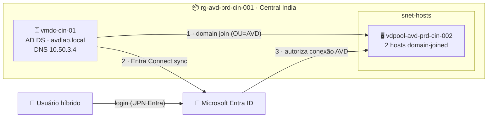

# Lab 03 — Host Pool com 2 VMs ingressadas em Active Directory Domain Services (AD DS)

> **Disciplina:** Azure Virtual Desktop — Pós-Graduação em Arquitetura Avançada em Azure
> **Modalidade:** Passo a passo via Portal do Azure (portal-first)
> **Resultado:** Cria-se um **AD DS próprio** (controlador de domínio em uma VM) sincronizado com o Entra ID, e um host pool com 2 hosts **domain-joined**. Esta estrutura é a base dos **Labs 04, 05 e 06**.

---

<p align="center">
  
  
  
  
</p>

## 🗺️ Arquitetura deste laboratório



> **Leitura:** o `vmdc-cin-01` é o controlador do domínio `avdlab.local`; os hosts ingressam nele. O **Entra Connect** sincroniza os usuários para o Entra ID (a autenticação do AVD sempre passa pela nuvem). Esta estrutura é reaproveitada pelos Labs 04, 05 e 06.

---

## 🧭 Ficha do laboratório

| Item | Detalhe |
|------|---------|
| **Dificuldade** | ★★★ Avançado |
| **Tempo estimado** | 90–120 min |
| **Objetivo** | Construir um domínio AD DS (`avdlab.local`), sincronizá-lo com o Entra ID (Entra Connect), e provisionar um host pool com 2 session hosts ingressados no domínio. |
| **Pré-requisitos** | Lab 1.1 (VNet/sub-redes). Papel **Owner** ou (Contributor + User Access Administrator). |
| **Recursos consumidos** | 1× VM controlador de domínio (`Standard_B2s`/`D2s_v5`), 2× VM session host, Host Pool, Workspace, DAG. |
| **Entrega** | Domínio `avdlab.local` ativo, hosts domain-joined *Available* e usuário de domínio conectando ao AVD. |

### Cenário
Empresa com **Active Directory tradicional**. As VMs do AVD ingressam no domínio AD DS, e os usuários são sincronizados para o Entra ID (necessário porque a **autenticação do AVD sempre passa pelo Entra ID**). Por isso usamos **identidades híbridas**.

> 💡 **Atenção arquitetural:** o usuário que conecta ao AVD precisa existir nos **dois** lados — criado no AD DS e sincronizado para o Entra ID. Um usuário só-em-nuvem **não** consegue logar em host AD DS-joined.

### Convenção de nomes
| Recurso | Nome |
|---------|------|
| Domínio AD DS | `avdlab.local` |
| VM controladora de domínio | `vmdc-cin-01` (sub-rede `snet-adds-prd-cin-001`, 10.50.3.0/24, IP estático 10.50.3.4) |
| Host Pool | `vdpool-avd-prd-cin-002` |
| Workspace | `vdws-avd-prd-cin-001` (reutiliza, ou cria se não existir) |
| Desktop App Group | `vdag-avd-prd-cin-002` |
| Session hosts | `vmavda-cin` (gera `vmavda-cin-0`, `vmavda-cin-1`) |
| Unidade Organizacional alvo | `OU=AVD,DC=avdlab,DC=local` |

> 📛 **Sobre o nome do domínio — escolha o SEU (importante):** o `avdlab.local` é só um exemplo. **Cada aluno deve usar um domínio próprio** (ex.: `seunome.local`, `contoso.local`) para não colidir com colegas que compartilhem o mesmo tenant Entra.
>
> ✅ **Recomendado para o laboratório:** se você tiver um **domínio público real** (ex.: `seudominio.com.br`), use-o como nome do AD DS **e adicione/verifique esse domínio no Entra ID** (*Entra ID → Custom domain names*). Assim o **sufixo UPN dos usuários** (`joao@seudominio.com.br`) funciona de ponta a ponta — login no AVD com o **domínio customizado real**, sem o ajuste automático para `@...onmicrosoft.com`. Domínios `.local` funcionam, mas **forçam o UPN a cair no `onmicrosoft.com`** na sincronização (ver nota da Parte D).

---

## Parte A — Provisionar a VM controladora de domínio

1. Barra de busca → **Virtual machines** → **+ Create → Azure virtual machine**.
2. Aba **Basics:**
   - **Resource group:** `rg-avd-prd-cin-001`.
   - **Virtual machine name:** `vmdc-cin-01`.
   - **Region:** Central India.
   - **Image:** **Windows Server 2022 Datacenter — x64 Gen2** (ou 2025).
   - **Size:** `Standard_B2s` (suficiente para lab) ou `Standard_D2s_v5`.
   - **Administrator account:** username `dcadmin` + senha forte (**anote**).
   - **Public inbound ports:** **None** (vamos usar Bastion ou RDP via rede interna; em lab você pode permitir 3389 temporariamente — não recomendado).
3. Aba **Networking:**
   - **Virtual network:** `vnet-avd-prd-cin-001`.
   - **Subnet:** `snet-adds-prd-cin-001` (10.50.3.0/24).
   - **Public IP:** crie um temporário só para o setup, ou use **Azure Bastion** (mais seguro).
4. **Review + create** → **Create**.

### A.1 — Fixar IP privado estático do DC (obrigatório)
Um DC **precisa** de IP fixo.
1. Aberta a VM → **Networking → Network settings** → clique na **NIC** → **IP configurations** → `ipconfig1`.
2. **Assignment: Static** → defina **10.50.3.4** → **Save**. A VM reiniciará a NIC.

---

## Parte B — Instalar a função AD DS e promover o DC

1. Conecte na `vmdc-cin-01` (RDP / Bastion) como `dcadmin`.
2. Abra **Server Manager** → **Manage → Add Roles and Features**:
   - **Role-based or feature-based installation** → selecione o servidor local.
   - Marque **Active Directory Domain Services** → **Add Features** → avance → **Install**.
3. Após instalar, no Server Manager clique na **bandeira de notificação** (⚑) → **Promote this server to a domain controller**.
4. **Deployment Configuration:** **Add a new forest** → **Root domain name:** `avdlab.local` → **Next**.
5. **Domain Controller Options:** defina a **DSRM password** (anote) → **Next**.
6. Avance pelas telas (DNS, NetBIOS = `AVDLAB`, paths) aceitando padrões → **Install**. A VM reinicia ao final.

### B.1 — Criar OU e usuários de domínio
1. Reconecte como `AVDLAB\dcadmin`.
2. **Server Manager → Tools → Active Directory Users and Computers**.
3. Botão direito em `avdlab.local` → **New → Organizational Unit** → nome `AVD`.
4. Dentro da OU `AVD` → **New → User** → crie `joao.teste` (User logon name `joao.teste@avdlab.local`) → defina senha e **desmarque** "User must change password at next logon", marque "Password never expires" (lab) → **Finish**.

---

## Parte C — Apontar o DNS da VNet para o DC

Para que os hosts encontrem o domínio, a VNet deve resolver DNS pelo DC.

1. Barra de busca → **Virtual networks → `vnet-avd-prd-cin-001`** → **Settings → DNS servers**.
2. **Custom** → adicione **10.50.3.4** (o DC) → **Save**.
   > As VMs já criadas precisam reiniciar a NIC para pegar o novo DNS; as novas (hosts) já nascerão com ele.

---

## Parte D — Sincronizar identidades com o Entra ID (Entra Connect)

A autenticação do AVD passa pelo Entra ID, então os usuários do AD DS precisam ser sincronizados.

> 🖥️ **Onde instalar (boa prática vs. laboratório):** em produção, o **ideal é instalar o Entra Connect numa VM membro dedicada** (não no controlador de domínio), por segurança e isolamento. **Neste laboratório**, para **reduzir o número de VMs e o custo**, vamos instalá-lo **no próprio `vmdc-cin-01`** — aceitável apenas em ambiente de estudo.

> 👤 **Crie uma conta de serviço exclusiva para a sincronização** — **não** use uma conta de usuário nomeada (como `dcadmin`). Uma conta dedicada dá **controle e rastreabilidade**. No DC, em **Active Directory Users and Computers → OU AVD → New → User**, crie:
> - **Nome de logon:** `svc.entraid` (ex.: `svc.entraid@avdlab.local`).
> - Senha forte · **Password never expires** · **não** exigir troca no próximo logon.
> - É essa conta que será usada como **conta de serviço do conector local do AD** no assistente.

1. Na `vmdc-cin-01`, baixe e instale o **Microsoft Entra Connect** (antigo Azure AD Connect): site oficial da Microsoft → "Microsoft Entra Connect".
2. Execute o assistente (use **Customize** para poder definir a conta de serviço):
   - Informe credenciais de **Global Administrator** do tenant Entra.
   - Em **Connect your directories**, ao adicionar o domínio AD, escolha **usar uma conta de serviço existente** e informe **`svc.entraid`**. (Se preferir o padrão, o assistente cria uma conta `AAD_xxxx` automaticamente — mas a conta dedicada dá mais controle.) Para criar/elevar a conta do conector, será pedida **uma vez** uma credencial de **Enterprise Admin** (`AVDLAB\dcadmin`).
   - Selecione a OU `AVD` para sincronizar (em **Domain and OU filtering**).
   - Conclua. Force a sync se quiser:
     ```powershell
     Import-Module ADSync
     Start-ADSyncSyncCycle -PolicyType Delta
     ```
3. Valide no portal: **Microsoft Entra ID → Users** → `joao.teste` deve aparecer com **On-premises sync enabled = Yes**.

> 💡 **Verificação de UPN:** o sufixo UPN do usuário no AD (`@avdlab.local`) idealmente deve corresponder a um domínio **verificado** no Entra ID. Em lab, se usar `.local`, o Entra Connect ajusta o UPN para `@seudominio.onmicrosoft.com`. Anote qual UPN o usuário terá no Entra — é com ele que fará login no AVD.

---

## Parte E — Criar o Host Pool com os 2 hosts ingressados no AD DS

1. **Azure Virtual Desktop → Host pools → + Create**.
2. **Basics:**
   - **Resource group:** `rg-avd-prd-cin-001`; **Host pool name:** `vdpool-avd-prd-cin-002`; **Location:** Central India.
   - **Host pool type:** **Pooled**; **Algorithm:** Breadth-first; **Max session limit:** `5`; **Preferred app group type:** Desktop.
3. **Virtual Machines:** **Add virtual machines = Yes**:
   - **Name prefix:** `vmavda-cin`.
   - **Image:** Windows 11 Enterprise multi-session 24H2 (+ M365 opcional).
   - **Size:** `Standard_D2s_v5`; **Number of VMs:** `2`.
   - **Network:** `vnet-avd-prd-cin-001` / `snet-hosts-prd-cin-001`.
   - **Domain to join:** **Active Directory** (não "Microsoft Entra ID").
     - **AD domain join UPN:** uma conta com permissão de join no domínio, ex. `dcadmin@avdlab.local` (ou conta de serviço dedicada).
     - **Password:** senha da conta.
     - **Specify domain or unit:** marque e informe a OU alvo **`OU=AVD,DC=avdlab,DC=local`** (assim os hosts caem na OU certa, importante para GPO no Lab 04).
   - **Virtual Machine Administrator account:** `localadmin` + senha.
4. **Workspace:** **Register desktop app group = Yes** → workspace `vdws-avd-prd-cin-001` (criar se não existir).
5. **Review + create** → **Create**.

> O agente de join usa a conta informada para ingressar as VMs no `avdlab.local`, dentro da OU `AVD`.

---

## Parte F — Atribuir acesso ao usuário

1. **Crie/atribua um grupo (boa prática):** no AD (ADUC), crie um grupo de segurança `grp-avd-usuarios` na OU `AVD`, adicione os usuários e deixe o **Entra Connect** sincronizá-lo. Você publica para o grupo, não usuário a usuário.
2. **Atribuir ao Application Group (obrigatório para o recurso aparecer):**
   - **Azure Virtual Desktop → Application groups → `vdag-avd-prd-cin-002`** → **Assignments → + Add** → selecione o grupo **`grp-avd-usuarios`** (a identidade **sincronizada** no Entra) → **Select**.

### Preciso adicionar o grupo ao "Remote Desktop Users" nos servidores?

**Não — normalmente não é necessário fazer isso manualmente.** No AVD:
- A **atribuição no Application Group** (passo 2) autoriza o usuário no **plano de controle** (Broker) — é o passo **obrigatório**.
- Nos **session hosts**, o direito *Allow log on through Remote Desktop Services* já pertence ao grupo local **Remote Desktop Users**, e o provisionamento do host pool cuida do necessário para os usuários atribuídos. Você **não** precisa entrar host a host para adicionar o grupo.
- **Não** é preciso o papel **Virtual Machine User Login** (isso é só do cenário Entra-join do Lab 01); aqui a autorização do SO é via **AD**.

**Exceção — quando mexer nisso:** se, mesmo atribuído ao App Group, o usuário receber *"To sign in remotely, you need the right to sign in through Remote Desktop Services"*, então adicione o **`grp-avd-usuarios`** ao **Remote Desktop Users** — mas via **GPO** (nunca manualmente em cada host):
- **Group Policy Management → GPO da OU `AVD` → Edit →** *Computer Configuration → Preferences → Control Panel Settings → Local Users and Groups* → **New → Local Group** → **Remote Desktop Users (built-in)** → **Add** `AVDLAB\grp-avd-usuarios` → nos hosts, `gpupdate /force`.
- Alternativa equivalente: *Security Settings → Restricted Groups*.

---

## Parte G — Conectar e validar

1. **Host pools → `vdpool-avd-prd-cin-002` → Session hosts:** os 2 hosts devem ficar **Available**.
2. Abra o **Windows App** / web client → login com o **UPN do Entra** de `joao.teste` (ver nota da Parte D).
3. Abra o desktop publicado.
4. Dentro da sessão, valide o ingresso no domínio:
   ```cmd
   systeminfo | findstr /B /C:"Domain"
   whoami
   ```
   `Domain` deve ser `avdlab.local`; `whoami` deve retornar `avdlab\joao.teste`.

### Critérios de sucesso
- [ ] `vmdc-cin-01` promovida a DC do domínio `avdlab.local` com IP 10.50.3.4.
- [ ] VNet `vnet-avd-prd-cin-001` usa DNS 10.50.3.4.
- [ ] `joao.teste` sincronizado para o Entra ID.
- [ ] Os 2 hosts `vmavda-cin-0x` aparecem **Available** e na OU `AVD`.
- [ ] Login no AVD com a identidade híbrida; `whoami` = `avdlab\joao.teste`.

---

## Erros comuns

| Sintoma | Causa | Correção |
|---------|-------|----------|
| Host falha ao ingressar | DNS da VNet não aponta para o DC, ou credencial/UPN de join errada | Refaça Parte C; verifique a conta de join e a OU |
| Usuário não loga ("conta não existe") | Usuário não sincronizado para o Entra | Force `Start-ADSyncSyncCycle -PolicyType Delta` (Parte D) |
| Recurso não aparece no cliente | Falta atribuição no App Group | Refaça Parte F |
| Login pede senha mas falha | UPN usado no login difere do UPN no Entra | Use o UPN exato mostrado em Entra ID → Users |

---

## Parte H — Administração e diagnóstico

### H.1 — Operação do host pool
As mesmas consoles do Lab 01 valem aqui: **Host pool → Sessions** (ver usuários conectados, *Send message*, *Disconnect*, *Log off*) e **Session hosts** (status, agente, **drain mode** para manutenção). Reveja a **Parte G do Lab 01** para o passo a passo da operação.

### H.2 — Onde buscar logs (cenário AD DS)
| Sintoma | Onde olhar | O que procurar |
|---------|-----------|----------------|
| Host não ingressa no domínio | Na VM: *Event Viewer →* `Windows Logs → System` e o arquivo `C:\Windows\debug\NetSetup.LOG` | Erro de DNS, credencial ou OU no domain join |
| Usuário não aparece/loga | **Entra ID → Users** (sync) e, no DC: `Start-ADSyncSyncCycle -PolicyType Delta` | Usuário não sincronizado / UPN divergente |
| Falha de conexão AVD | **Entra ID → Sign-in logs** + **Host pool → Insights** (se Log Analytics ligado) | MFA/Conditional Access; estado do agente AVD |
| Resolução de nomes | Na VM: `nslookup avdlab.local` e `ipconfig /all` (DNS deve ser 10.50.3.4) | DNS da VNet apontando ao DC |
| Saúde do domínio | No DC: `dcdiag` e `repadmin /showrepl` | Erros do controlador de domínio |

---

## Importante — não destrua esta estrutura
Os **Labs 04 (imagem), 05 (FSLogix + private endpoints) e 06 (scaling plan)** reutilizam este domínio e host pool. Mantenha `vmdc-cin-01` e `vdpool-avd-prd-cin-002` ativos.

---

## Próximo lab
➡️ **Lab 04 — Criar imagem customizada de Windows 11** (idioma, teclado, fuso, GPOs) e publicá-la no Compute Gallery para reuso nesta estrutura AD DS.
