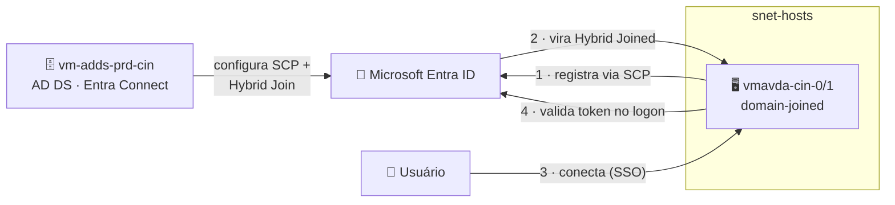

# Lab 04 — Habilitar Single Sign-On (SSO) no cenário AD DS

> **Disciplina:** Azure Virtual Desktop — Pós-Graduação em Arquitetura Avançada em Azure
> **Modalidade:** Passo a passo via Portal do Azure (portal-first). O ajuste de hybrid join é feito no **Entra Connect** e validado no SO (sem equivalente de portal).
> **Dependência:** **Lab 03** (domínio AD DS + host pool `vdpool-avd-prd-cin-002` + Entra Connect instalado).

---

<p align="center">
  
  
  
  
</p>

## 🗺️ Arquitetura deste laboratório



> **Leitura:** o SSO do AVD é **sempre baseado no Entra ID** — o mesmo do Lab 01/02. A diferença no AD DS é que os hosts precisam ser **Microsoft Entra *hybrid* joined** (registrados no Entra via Entra Connect). Feito isso, é a mesma propriedade RDP + o passo de tenant que você já habilitou no Lab 02.

---

## 🧭 Ficha do laboratório

| Item | Detalhe |
|------|---------|
| **Dificuldade** | ★★★ Avançado |
| **Tempo estimado** | 45–60 min |
| **Objetivo** | Habilitar **SSO** para os session hosts AD DS, tornando-os **Entra hybrid joined** e ligando a autenticação moderna do Entra na conexão. |
| **Pré-requisitos** | Lab 03 concluído (Entra Connect já sincronizando). Conta **Global Administrator** e **Enterprise Admin**. UPN dos usuários em **domínio verificado** no Entra (ver Lab 03). |
| **Entrega** | Hosts `vmavda-cin-0/1` como **hybrid joined** e conexão sem segundo prompt de senha. |

### Por que esse lab existe
No cenário Entra ID (Lab 01/02) os hosts já nascem Entra-joined, então o SSO "sai de graça". No **AD DS**, os hosts são domain-joined — para o SSO funcionar, eles precisam também estar **registrados no Entra ID (hybrid join)**. Este lab cobre exatamente essa peça extra.

---

## Pré-requisitos (confirme antes)

- **Entra Connect** já instalado e sincronizando usuários (Lab 03, Parte D).
- **UPN roteável:** o sufixo UPN dos usuários precisa corresponder a um **domínio verificado no Entra ID**. Se o AD usa `.local`, adicione antes um sufixo UPN público no AD e verifique esse domínio no Entra (senão o hybrid join falha). Daí a recomendação do Lab 03 de usar **domínio público real**.
- **Saída de rede** dos hosts para os endpoints de registro: `login.microsoftonline.com`, `device.login.microsoftonline.com`, `enterpriseregistration.windows.net` (a NAT Gateway da `snet-hosts` cobre).

---

## Parte A — Habilitar o Hybrid Entra Join no Entra Connect

No `vm-adds-prd-cin` (onde está o Entra Connect):

1. Abra o **Microsoft Entra Connect** → **Configure**.
2. **Configure device options** → **Next**.
3. Informe credenciais de **Global Administrator** do tenant.
4. Selecione **Configure Hybrid Azure AD join** → **Next**.
5. **Device operating systems:** marque **Windows 10 or later domain-joined devices**.
6. **SCP (Service Connection Point):** selecione o seu **forest** e a autoridade **Azure Active Directory** → informe credenciais de **Enterprise Admin** para o Entra Connect **gravar o SCP** no AD automaticamente.
7. **Next → Configure** → conclua.

> O **SCP** é o "ponteiro" no AD que diz às máquinas para se registrarem no seu tenant Entra. É ele que dispara o hybrid join automático dos hosts.

---

## Parte B — Forçar e validar o hybrid join nos hosts

Em cada session host (`vmavda-cin-0` / `vmavda-cin-1`), via RDP como administrador:

1. Force o registro:
   ```cmd
   gpupdate /force
   dsregcmd /join
   ```
   (Ou aguarde a tarefa agendada **Automatic-Device-Join**; um reinício ajuda.)
2. Verifique o estado:
   ```cmd
   dsregcmd /status
   ```
   Na seção *Device State*, procure:
   ```
   AzureAdJoined : YES
   DomainJoined  : YES
   ```
   **Os dois = YES** significa **Microsoft Entra hybrid joined** — o pré-requisito do SSO.
3. Confirme no portal: **Microsoft Entra ID → Devices → All devices** — o host aparece com **Join type = Microsoft Entra hybrid joined**.

> Se ficar `AzureAdJoined : NO`: (a) SCP não configurado, (b) sem saída de rede para os endpoints de registro, ou (c) UPN não roteável. Veja *Event Viewer → Applications and Services Logs → Microsoft → Windows → User Device Registration*.

---

## Parte C — Confirmar o SSO no tenant (reaproveitado do Lab 02)

O passo de habilitar o SSO nos service principals é **por tenant** e você já executou no **Lab 02** — **vale para este host pool também**, não precisa refazer. Só confirme (Cloud Shell, modo **PowerShell**).

> ⚠️ **O Cloud Shell não mantém a sessão do Graph entre aberturas.** Rode o `Connect-MgGraph` **antes** do GET — senão aparece `Invoke-MgGraphRequest: Authentication needed. Please call Connect-MgGraph`.

```powershell
# 1) Conecte ao Graph (autentique no código mostrado, como Global Admin)
Connect-MgGraph -Scopes "Application.Read.All"

# 2) Confirme o SSO no app "Microsoft Remote Desktop"
Invoke-MgGraphRequest -Method GET `
  -Uri "https://graph.microsoft.com/beta/servicePrincipals(appId='a4a365df-50f1-4397-bc59-1a1564b8bb9c')/remoteDesktopSecurityConfiguration"
```
Deve retornar `isRemoteDesktopProtocolEnabled : True`. Para conferir também o *Windows Cloud Login*, repita trocando o `appId` por `270efc09-cd0d-444b-a71f-39af4910ec45`.

> Se vier `False`/vazio, rode os dois `PATCH` da Parte E.2 do **Lab 01** — mas aí conecte com escopo de **escrita**: `Connect-MgGraph -Scopes "Application.ReadWrite.All"`.

---

## Parte D — Ligar o SSO no host pool do AD DS

1. **Azure Virtual Desktop → Host pools → `vdpool-avd-prd-cin-002`** → **Settings → RDP Properties → Advanced**.
2. Garanta as duas propriedades (ou marque **Microsoft Entra single sign-on** na tela visual, que adiciona o `enablerdsaadauth:i:1`):
   ```
   enablerdsaadauth:i:1
   targetisaadjoined:i:1
   ```
3. **Save**.

---

## Parte E — Conectar e validar

1. **Conecte ao AVD** — abra o **web client** em **https://client.wvd.microsoft.com/arm/webclient/** (ou o **Windows App**).
2. Faça login com o **UPN do Entra** do usuário sincronizado.
3. Na **primeira conexão**, pode aparecer **uma vez** a tela de consentimento do app *Windows Cloud Login* → **Allow** (um Global Admin pode dar admin consent antecipado para evitar o prompt).
4. A sessão entra **sem o segundo prompt de senha do Windows**. Dentro dela:
   ```cmd
   whoami      :: avdlab\usuario (conta de domínio)
   klist       :: tickets Kerberos do domínio
   ```

### Critérios de sucesso
- [ ] `dsregcmd /status` nos hosts: `AzureAdJoined: YES` + `DomainJoined: YES`.
- [ ] Host aparece como **Microsoft Entra hybrid joined** em Entra ID → Devices.
- [ ] `remoteDesktopSecurityConfiguration` = `True` (tenant).
- [ ] `enablerdsaadauth:i:1` salvo no host pool.
- [ ] Conexão entra **sem** segundo prompt de senha.

---

## Erros comuns

| Sintoma | Causa | Correção |
|---------|-------|----------|
| `AzureAdJoined: NO` | SCP/registro de device não concluiu | Refaça a Parte A; rode `dsregcmd /join`; cheque *User Device Registration* no Event Viewer |
| Hybrid join falha por UPN | domínio `.local` sem sufixo roteável | Adicione um sufixo UPN público no AD e **verifique o domínio** no Entra (Lab 03) |
| "Sign in Failed" ao conectar | host ainda não é hybrid joined **ou** RDP property faltando | Confirme Parte B e Parte D |
| Pede senha duas vezes | SSO do tenant não confirmado | Refaça a Parte C |
| Sem registro nos logs do device | sem saída de rede para endpoints de registro | Confirme a NAT Gateway / saída para `enterpriseregistration.windows.net` |

---

## 🔀 Resumo — SSO Entra ID vs AD DS

| Etapa | 🔐 Entra ID (Lab 01) | 🗄️ AD DS (este lab) |
|------|----------------------|---------------------|
| Propriedade RDP | ✅ igual | ✅ igual |
| SSO no tenant | ✅ feito (1×) | ♻️ **reaproveitado** |
| Pré-requisito de join | nativo (Entra join) | ➕ **hybrid join via Entra Connect** |

---

## Próximo lab
➡️ **Lab 05 — FSLogix integrado ao AD DS com Private Endpoints**, nesta mesma estrutura de domínio.
