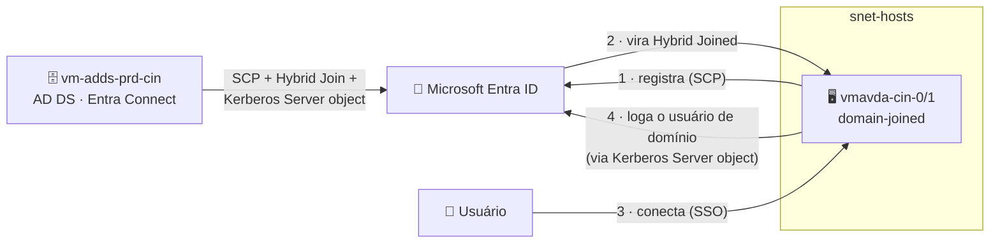

# Lab 04 — Habilitar Single Sign-On (SSO) no cenário AD DS

> **Disciplina:** Azure Virtual Desktop — Pós-Graduação em Arquitetura Avançada em Azure
> **Modalidade:** Passo a passo via Portal do Azure (portal-first). O hybrid join e o Kerberos Server object são feitos no **SO/Entra Connect** (sem equivalente de portal) — são passos obrigatórios.
> **Dependência:** **Lab 03** (domínio AD DS + host pool `vdpool-avd-prd-cin-002` + Entra Connect instalado).

---

<p align="center">
  
  
  
  
</p>

## 🗺️ Arquitetura deste laboratório



> **Leitura:** o SSO do AVD é **sempre baseado no Entra ID** — o mesmo do Lab 01/02. No AD DS há **duas peças extras**: (a) os hosts precisam ser **Microsoft Entra hybrid joined**, e (b) o domínio precisa de um **Microsoft Entra Kerberos Server object** para o host conseguir **logar o usuário de domínio** após a autenticação na nuvem. Sem o objeto Kerberos, o SSO é "pulado" e cai numa tela de senha.

---

## 🧭 Ficha do laboratório

| Item | Detalhe |
|------|---------|
| **Dificuldade** | ★★★ Avançado |
| **Tempo estimado** | 60–90 min |
| **Objetivo** | Habilitar **SSO** nos session hosts AD DS: torná-los **Entra hybrid joined**, criar o **Kerberos Server object** e ligar a autenticação moderna na conexão. |
| **Pré-requisitos** | Lab 03 concluído (Entra Connect sincronizando, **Password Hash Sync** ligado). Conta **Global Administrator** do Entra **e** **Domain Admin** do AD. Domínio **verificado** no Entra (ver Lab 03). |
| **Entrega** | Hosts `vmavda-cin-0/1` hybrid joined + Kerberos Server object criado + conexão **sem segundo prompt de senha**. |

### Por que esse lab existe
No cenário Entra ID (Lab 01/02) os hosts já nascem Entra-joined e o SSO "sai de graça". No **AD DS**, os hosts são domain-joined e o usuário é de **domínio** — para o SSO funcionar é preciso **(a)** registrar os hosts no Entra (hybrid join) e **(b)** criar o **Kerberos Server object** para o host completar o logon do usuário de domínio.

---

## Pré-requisitos (confirme antes — evitam 90% dos erros)

- **Entra Connect** instalado e sincronizando usuários (Lab 03, Parte D), com **Password Hash Synchronization (PHS)** ligado. *Teste:* o usuário consegue logar em **https://myapps.microsoft.com** com a senha do AD.
- **Domínio verificado no Entra:** o sufixo UPN dos usuários (ex.: `@seudominio.com`) precisa corresponder a um **domínio verificado** no tenant (*Entra ID → Custom domain names*). `.local` não funciona aqui — use um domínio público real (Lab 03).
- **Saída de internet** do DC e dos hosts para os endpoints: `login.microsoftonline.com`, `device.login.microsoftonline.com`, `enterpriseregistration.windows.net` (a NAT Gateway das sub-redes cobre isso). O **DC** também precisa de saída (para criar o Kerberos Server object e instalar módulos).

---

## Parte A — Habilitar o Hybrid Entra Join no Entra Connect

No `vm-adds-prd-cin` (onde está o Entra Connect):

1. Abra o **Microsoft Entra Connect** → **Configure**.
2. **Configure device options** → **Next**.
3. Informe credenciais de **Global Administrator** do tenant.
4. Selecione **Configure Hybrid Azure AD join** → **Next**.
5. **Device operating systems:** marque **Windows 10 or later domain-joined devices**.
6. **SCP (Service Connection Point):** selecione o seu **forest** e a autoridade **Azure Active Directory** → informe credenciais de **Enterprise Admin** para o Entra Connect **gravar o SCP** no AD.
7. **Next → Configure** → conclua.

> O **SCP** é o "ponteiro" no AD que diz às máquinas para se registrarem no seu tenant. É ele que dispara o hybrid join automático dos hosts.

---

## Parte B — Forçar e validar o hybrid join nos hosts

### B.1 — O registro é automático (entenda antes de rodar comando)
Com o SCP configurado e o objeto de computador sincronizado, **o host se registra sozinho** pela tarefa agendada **`Automatic-Device-Join`** (*Task Scheduler → Microsoft → Windows → Workplace Join*), que roda no contexto **SYSTEM** no boot/logon. **Em produção você não roda nada manualmente** — no máximo um reboot acelera.

> 💡 No nosso laboratório, um host pode precisar de um empurrão manual (abaixo) por causa de timing/estado antigo; o outro costuma entrar **sozinho**. As duas formas são válidas.

### B.2 — Validar
Em cada host (`vmavda-cin-0/1`), via RDP, abra um **prompt elevado** e rode:
```cmd
dsregcmd /status
```
Na seção *Device State*, o sucesso é:
```
AzureAdJoined : YES
DomainJoined  : YES
```
**Os dois = YES** = **Microsoft Entra hybrid joined**. Confirme também em **Entra ID → Devices → All devices** (deve aparecer como *Microsoft Entra hybrid joined*).

### B.3 — Se ficar `AzureAdJoined : NO` (forçar + corrigir estado fantasma)
Em laboratório é comum o host trazer um **estado de registro antigo** e ficar tentando "renovar" um objeto que não existe. O sintoma no `dsregcmd /status` é:
```
Registration Type  : fallback_sync
Server ErrorSubCode: error_missing_device
Server Operation   : DeviceRenew
Server Message     : The device object by the given id (...) is not found.
```
**Correção (na ordem):**
1. No host, prompt **elevado**: `dsregcmd /leave` → **reinicie** a VM.
2. No `vm-adds-prd-cin`, **force a sincronização** do objeto de computador para o Entra:
   ```powershell
   Start-ADSyncSyncCycle -PolicyType Delta
   ```
   > Confirme antes que a **OU dos hosts** está no escopo de sync do Entra Connect (*Domain and OU filtering*). Se os computadores não sincronizam, o registro falha com `error_missing_device`.
3. No host, após o reboot: `dsregcmd /join` → `dsregcmd /status`. Deve virar `AzureAdJoined : YES`.

> Por que isso acontece: no caminho **sync-join**, o host grava um certificado no próprio objeto do AD → o Entra Connect sincroniza o objeto → só então o host completa o join. As primeiras tentativas mostram `error_missing_device` até o sync rodar.

---

## Parte C — Confirmar o SSO no tenant (reaproveitado do Lab 02)

Habilitar o SSO nos service principals é **por tenant** e você já fez no **Lab 02** — vale para este host pool também. Só **confirme** (Cloud Shell, modo **PowerShell**).

> ⚠️ **O Cloud Shell não mantém a sessão do Graph entre aberturas.** Rode o `Connect-MgGraph` **antes** do GET — senão aparece `Invoke-MgGraphRequest: Authentication needed. Please call Connect-MgGraph`.

```powershell
# 1) Conecte ao Graph (autentique no código mostrado, como Global Admin)
Connect-MgGraph -Scopes "Application.Read.All"

# 2) Confirme o SSO no app "Microsoft Remote Desktop"
Invoke-MgGraphRequest -Method GET `
  -Uri "https://graph.microsoft.com/beta/servicePrincipals(appId='a4a365df-50f1-4397-bc59-1a1564b8bb9c')/remoteDesktopSecurityConfiguration"
```
Deve retornar `isRemoteDesktopProtocolEnabled : True`. Para conferir o *Windows Cloud Login*, repita trocando o `appId` por `270efc09-cd0d-444b-a71f-39af4910ec45`.

> Se vier `False`/vazio, rode os dois `PATCH` da Parte E.2 do **Lab 01** — mas aí conecte com escopo de **escrita**: `Connect-MgGraph -Scopes "Application.ReadWrite.All"`.

---

## Parte D — Criar o Microsoft Entra Kerberos Server object (OBRIGATÓRIO no AD DS)

> 🔑 **Este é o passo que faz o SSO realmente fechar no cenário AD DS.** Sem ele, a autenticação no Entra dá certo, mas o host **não consegue logar o usuário de domínio** → o SSO é "pulado" e você vê **"Sign in Failed — check your username and password"**. O objeto Kerberos permite o Entra emitir tickets Kerberos para o seu AD on-prem.

### ⚠️ Onde e como rodar (leia antes — aqui erramos muito)
- **NÃO é no Cloud Shell.** O comando precisa **gravar um objeto no seu AD on-prem**, então tem que **alcançar um controlador de domínio**. O Cloud Shell não tem linha de visão à sua VNet/DC. **Rode no `vm-adds-prd-cin`** (é o DC e tem saída para o Entra).
- **Use o Windows PowerShell 5.1**, **não** o PowerShell 7. O módulo depende do 5.1. Confirme: `$PSVersionTable.PSVersion` deve começar com **5.1**.
- Rode o PowerShell **como Administrador**.

### D.1 — Instalar o módulo `AzureADHybridAuthenticationManagement`
No Windows Server, a PowerShell Gallery exige **TLS 1.2** e o provedor **NuGet** — sem isso, o `Install-Module` **falha silenciosamente** (instala "nada"). Rode tudo:
```powershell
# 0) Confirmar versão (tem que ser 5.1)
$PSVersionTable.PSVersion

# 1) Forçar TLS 1.2 (a Gallery recusa TLS 1.0/1.1)
[Net.ServicePointManager]::SecurityProtocol = [Net.ServicePointManager]::SecurityProtocol -bor [Net.SecurityProtocolType]::Tls12

# 2) Provedor NuGet + confiar na Gallery
Install-PackageProvider -Name NuGet -MinimumVersion 2.8.5.201 -Force
Set-PSRepository -Name PSGallery -InstallationPolicy Trusted

# 3) Instalar e carregar
Install-Module AzureADHybridAuthenticationManagement -Scope AllUsers -Force -AllowClobber
Import-Module AzureADHybridAuthenticationManagement

# 4) Conferir que os cmdlets apareceram
Get-Command -Module AzureADHybridAuthenticationManagement
```
O passo 4 deve listar `Set-AzureADKerberosServer` e `Get-AzureADKerberosServer`. **Se vier vazio**, quase sempre é: (a) você está no **PowerShell 7** (abra o `powershell.exe` 5.1), ou (b) o DC **não tem saída** para a Gallery (`Test-NetConnection www.powershellgallery.com -Port 443`).

### D.2 — Criar o objeto (duas identidades diferentes!)
O comando usa **dois logins distintos** — não confunda:

| Parâmetro | Qual identidade | Exemplo |
|-----------|-----------------|---------|
| **`-UserPrincipalName`** | **Global Admin do ENTRA** (nuvem) — autentica no tenant | `raphael@seudominio.com` |
| **`-DomainCredential`** | **Domain Admin do AD DS** (on-prem) — grava o objeto no AD | `SEUDOMINIO\dcadmin` |

```powershell
$domain     = "seudominio.com"          # seu domínio AD (o mesmo verificado no Entra)
$domainCred = Get-Credential            # Domain Admin do AD DS: SEUDOMINIO\dcadmin

# Use -UserPrincipalName (NÃO -CloudCredential): é a auth moderna que SUPORTA MFA.
Set-AzureADKerberosServer -Domain $domain `
  -UserPrincipalName "raphael@seudominio.com" `
  -DomainCredential $domainCred
```

> 🧭 **Cuidados que nos custaram tempo:**
> - **MFA (Security Defaults):** use **`-UserPrincipalName`** (não `-CloudCredential`). Com `-UserPrincipalName` o módulo abre **autenticação moderna** (suporta MFA). Com `-CloudCredential` (usuário/senha) o MFA **quebra**.
> - **Tenant certo:** o UPN define **qual tenant** o comando mira. Use o GA com o **domínio customizado verificado** (`@seudominio.com`) ou o **onmicrosoft real** do tenant ativo. Se usar um `@...onmicrosoft.com` errado, dá **`AADSTS5000225: tenant blocked due to inactivity`** (você bate num tenant dormente). Confirme o **Tenant ID** em *Entra ID → Overview*.
> - **Sucesso é silencioso:** o `Set-...` **não imprime nada** quando dá certo. Valide com o `Get` abaixo.

### D.3 — Validar o objeto
```powershell
Get-AzureADKerberosServer -Domain $domain `
  -UserPrincipalName "raphael@seudominio.com" `
  -DomainCredential $domainCred
```
Sucesso retorna algo assim (o importante: `KeyVersion` **igual a** `CloudKeyVersion` = on-prem e nuvem em sincronia):
```
Id                 : 15770
UserAccount        : CN=krbtgt_AzureAD,CN=Users,DC=seudominio,DC=com
ComputerAccount    : CN=AzureADKerberos,OU=Domain Controllers,DC=seudominio,DC=com
KeyVersion         : 16892
CloudKeyVersion    : 16892
KeyUpdatedFrom     : vm-adds-prd-cin.seudominio.com
```

> ℹ️ O objeto é criado **uma vez por domínio** e também habilita **Windows Hello for Business (cloud trust)** e o **FSLogix com Entra Kerberos híbrido** — é um alicerce do ambiente inteiro.

---

## Parte E — Ligar o SSO no host pool do AD DS

1. **Azure Virtual Desktop → Host pools → `vdpool-avd-prd-cin-002`** → **Settings → RDP Properties → Advanced**.
2. Garanta as duas propriedades (ou marque **Microsoft Entra single sign-on** na tela visual, que adiciona o `enablerdsaadauth:i:1`):
   ```
   enablerdsaadauth:i:1
   targetisaadjoined:i:1
   ```
3. **Save**.

---

## Parte F — Conectar e validar

1. **Conecte ao AVD** — abra **https://windows.cloud.microsoft/** (ou **https://client.wvd.microsoft.com/arm/webclient/**, ou o **Windows App**).
2. Faça login com o **UPN do usuário sincronizado** (ex.: `useravd01@seudominio.com`).
3. Abra o desktop publicado. Agora deve entrar **sem o segundo prompt de senha**.
4. Dentro da sessão, no **contexto do usuário** (sem elevar):
   ```cmd
   dsregcmd /status
   ```
   Procure **`AzureAdPrt : YES`** — a prova definitiva de que o SSO fechou ponta a ponta. (`whoami` mostra `SEUDOMINIO\useravd01`.)

> ⏳ O Kerberos Server object pode levar **alguns minutos** para propagar. Se a primeira reconexão ainda pedir senha, aguarde ~5–10 min (ou reinicie os hosts) e tente de novo.

### 🤔 "SSO ≠ zero prompt" — o que é esperado
- **Single Sign-On = você autentica UMA vez** (no Entra/cliente), não zero vezes. O ganho é **não** ter o **segundo** prompt (o logon do Windows dentro da sessão).
- No **web client (navegador)** você pode ver **uma** confirmação de identidade do Entra na conexão (o navegador não carrega o PRT do dispositivo). Com **Security Defaults**, essa etapa pode pedir **MFA** — é por design.
- Para experiência **100% silenciosa**, use o **Windows App / Remote Desktop client** num computador **Entra joined/registrado** (o usuário já tem PRT).

### Critérios de sucesso
- [ ] Hosts com `AzureAdJoined: YES` + `DomainJoined: YES` (hybrid joined).
- [ ] `remoteDesktopSecurityConfiguration` = `True` (tenant).
- [ ] **Kerberos Server object** criado (`Get-AzureADKerberosServer` com `KeyVersion = CloudKeyVersion`).
- [ ] `enablerdsaadauth:i:1` salvo no host pool.
- [ ] Conexão entra **sem** segundo prompt de senha; na sessão, `dsregcmd /status` mostra `AzureAdPrt : YES`.

---

## Erros comuns (todos que enfrentamos neste lab)

| Sintoma | Causa | Correção |
|---------|-------|----------|
| `dsregcmd`: `error_missing_device` / `fallback_sync` / `DeviceRenew` | Objeto de computador **não sincronizado** para o Entra + estado de registro antigo | `dsregcmd /leave` + reboot → `Start-ADSyncSyncCycle -PolicyType Delta` (OU dos hosts no escopo) → `dsregcmd /join` (Parte B.3) |
| **"Sign in Failed — check your username and password"** ao abrir o desktop (login no Entra teve sucesso nos sign-in logs) | **Falta o Kerberos Server object** — SSO "pulado" no host de domínio | Criar o objeto (Parte D) e reconectar |
| `Invoke-MgGraphRequest: Authentication needed. Please call Connect-MgGraph` | Sessão do Graph não persiste no Cloud Shell | Rode `Connect-MgGraph` antes do GET (Parte C) |
| `Install-Module` "funciona" mas `Get-Module -ListAvailable` vem vazio | PowerShell Gallery exige **TLS 1.2** + **NuGet** | Forçar TLS 1.2, instalar NuGet, reinstalar (Parte D.1) |
| `Set-AzureADKerberosServer` não é reconhecido | Módulo não importado, ou está no **PowerShell 7** | `Import-Module ...`; use **Windows PowerShell 5.1** |
| `AADSTS5000225: tenant blocked due to inactivity` | `-UserPrincipalName` aponta para o **tenant errado** (onmicrosoft chutado) | Use o GA com `@seudominio.com` (domínio verificado) do **tenant ativo** |
| Falha de logon mas credencial válida no `myapps.microsoft.com` | **Não é** PHS (credencial ok) — é o Kerberos Server object faltando | Parte D |
| Perfil/desktop pede senha mesmo após tudo | Propagação do objeto ainda não concluída | Aguarde ~5–10 min ou reinicie os hosts |

> 💡 **Diagnóstico decisivo:** **Entra ID → Sign-in logs**. Se o login no Entra aparece **Success** mas o desktop falha, o problema é **no host** (Kerberos Server object / hybrid join), não na credencial.

---

## 🔀 Resumo — SSO Entra ID vs AD DS

| Etapa | 🔐 Entra ID (Lab 01) | 🗄️ AD DS (este lab) |
|------|----------------------|---------------------|
| Propriedade RDP | ✅ igual | ✅ igual |
| SSO no tenant | ✅ feito (1×) | ♻️ **reaproveitado** |
| Pré-requisito de join | nativo (Entra join) | ➕ **hybrid join via Entra Connect** |
| Logon do usuário no host | direto (usuário de nuvem) | ➕ **Kerberos Server object** (usuário de domínio) |

---

## Próximo lab
➡️ **Lab 05 — FSLogix integrado ao AD DS com Private Endpoints**, nesta mesma estrutura de domínio.
