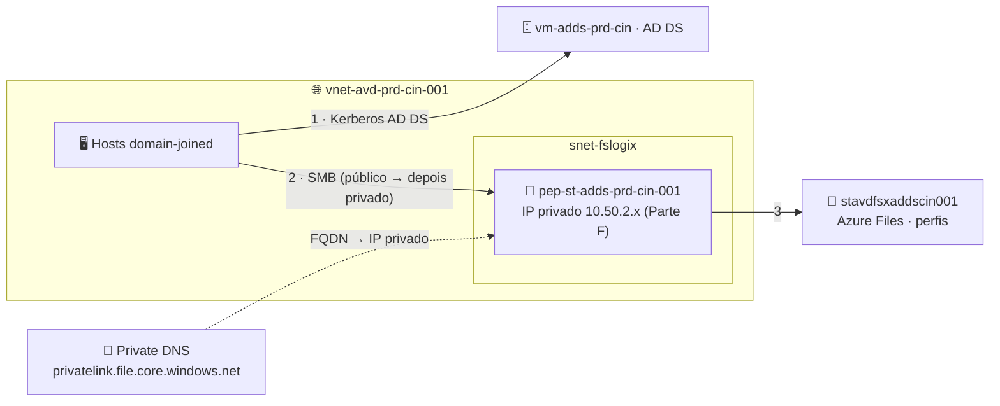

# Lab 05 — FSLogix integrado ao AD DS (e Private Endpoint por último)

> **Disciplina:** Azure Virtual Desktop — Pós-Graduação em Arquitetura Avançada em Azure
> **Modalidade:** Passo a passo via Portal do Azure (portal-first). O passo de habilitar a identidade AD DS no storage exige um script Microsoft (`AzFilesHybrid`) — é obrigatório, sem equivalente de portal.
> **Dependência:** **Lab 03** (domínio + host pool `vdpool-avd-prd-cin-002`) e **Lab 04** (SSO). A imagem customizada é opcional e vem depois, no **Lab 06**.

---

<p align="center">
  
  
  
  
</p>

## 🗺️ Arquitetura deste laboratório



> **Leitura:** o Azure Files é ingressado no **AD DS** (via AzFilesHybrid) e os hosts montam o perfil por SMB. **Estratégia deste lab:** primeiro deixamos tudo **funcionando pelo endpoint público** (mais simples de validar) e **só no final (Parte F)** trocamos por **Private Endpoint** e desabilitamos o acesso público — a parte mais complexa fica por último, com a base já comprovada.

---

## 🧭 Ficha do laboratório

| Item | Detalhe |
|------|---------|
| **Dificuldade** | ★★★ Avançado |
| **Tempo estimado** | 90–120 min |
| **Objetivo** | Armazenar perfis FSLogix em **Azure Files autenticado por AD DS**. **Primeiro** validar o FSLogix funcionando (endpoint público); **por último**, proteger com **Private Endpoint** (rede privada). |
| **Pré-requisitos** | Lab 03 concluído; acesso de **Domain Admin** (`AVDLAB\dcadmin`); **Owner** na assinatura. |
| **Recursos consumidos** | 1× Storage Account, 1× File Share, RBAC, objeto de computador no AD, e (na Parte F) 1× Private Endpoint + Private DNS Zone. |
| **Entrega** | Perfis `.vhdx` no Azure Files montando via Kerberos AD DS — primeiro pelo público, depois **somente pela rede privada**. |

### Convenção de nomes
| Recurso | Nome |
|---------|------|
| Storage Account | `stavdfsxaddscin001` (único globalmente — ajuste) |
| File Share | `profiles` |
| Private Endpoint (Parte F) | `pep-st-adds-prd-cin-001` |
| Private DNS Zone (Parte F) | `privatelink.file.core.windows.net` |
| Sub-rede do endpoint | `snet-fslogix-prd-cin-001` (10.50.2.0/24) |

> 🧭 **Roteiro:** A (storage público) → B (AzFilesHybrid) → C (permissões) → D (FSLogix/GPO) → **E (validar funcionando)** → **F (proteger com Private Endpoint)**.

---

## Parte A — Criar a Storage Account (acesso público por enquanto)

1. **Storage accounts → + Create.**
2. **Basics:**
   - **Resource group:** `rg-avd-prd-cin-001`; **Name:** `stavdfsxaddscin001`; **Region:** Central India.
   - **Performance:** **Premium → File shares** (recomendado p/ perfis) ou **Standard/StorageV2**.
   - **Redundancy:** LRS (lab).
3. **Networking:**
   - **Public network access:** **Enabled from all networks** (deixe **público por enquanto**).
     > 💡 Manter o acesso público agora simplifica os testes de FSLogix. **Na Parte F** trocamos por **Private Endpoint** e **desabilitamos** o acesso público.
4. **Review + create → Create.**
5. **Data storage → File shares → + File share** → **Name:** `profiles` (defina quota/provisionamento) → **Create**.

---

## Parte B — Habilitar autenticação AD DS no Azure Files (AzFilesHybrid)

Não há botão de portal para "domain join" da storage account em AD DS on-prem/IaaS — usa-se o módulo **AzFilesHybrid**. Passo **obrigatório**.

1. No **`vm-adds-prd-cin`** (tem linha de visão ao AD e ao Azure), abra **PowerShell como Admin**.
2. Baixe o módulo **AzFilesHybrid** (GitHub oficial `Azure-Samples/azure-files-samples` → releases) e descompacte.
3. Execute:
   ```powershell
   # Pré-requisitos
   Install-Module -Name Az -Scope CurrentUser -Repository PSGallery -Force
   Set-ExecutionPolicy -ExecutionPolicy Unrestricted -Scope Process

   # Na pasta do AzFilesHybrid descompactado:
   .\CopyToPSPath.ps1
   Import-Module -Name AzFilesHybrid

   Connect-AzAccount    # login no tenant/sub
   $subId = "<SUBSCRIPTION_ID>"
   $rg    = "rg-avd-prd-cin-001"
   $sa    = "stavdfsxaddscin001"

   Select-AzSubscription -SubscriptionId $subId

   # Cria a conta no AD (computer ou service account) que representa o storage e habilita Kerberos
   Join-AzStorageAccountForAuth `
     -ResourceGroupName $rg `
     -StorageAccountName $sa `
     -DomainAccountType "ComputerAccount" `
     -OrganizationalUnitDistinguishedName "OU=AVD,DC=avdlab,DC=local"
   ```
4. Valide:
   ```powershell
   Debug-AzStorageAccountAuth -StorageAccountName $sa -ResourceGroupName $rg -Verbose
   ```
   Deve passar nas checagens de Kerberos/SPN. No AD (ADUC), aparece um objeto de computador com o nome do storage na OU `AVD`.

---

## Parte C — Configurar as permissões (RBAC de share + NTFS)

### C.1 — RBAC de nível de share
> **Boa prática — grupo dedicado:** no AD (ADUC), crie um grupo `grp-avd-fslogix-usuarios` na OU `AVD` com os usuários de perfil e deixe o Entra Connect sincronizá-lo; atribua o RBAC do share a esse grupo.

1. Storage Account → **Access Control (IAM) → + Add → Add role assignment.**
2. Usuários AVD: **Storage File Data SMB Share Contributor** ao grupo **`grp-avd-fslogix-usuarios`**.
3. Sua conta admin: **Storage File Data SMB Share Elevated Contributor** (para configurar NTFS).
4. **Review + assign.**

### C.2 — NTFS no share
1. Storage Account → **Security + networking → Access keys** → copie a **key1**.
2. Em um host, **PowerShell como Admin** (neste momento o FQDN resolve pelo **endpoint público**):
   ```powershell
   $conta = "stavdfsxaddscin001"
   $key   = "<KEY1>"
   $unc   = "\\$conta.file.core.windows.net\profiles"
   cmd /c "net use Z: $unc /user:Azure\$conta $key"

   icacls Z: /grant "Creator Owner:(OI)(CI)(IO)(M)"
   icacls Z: /grant "AVDLAB\Domain Users:(M)"
   icacls Z: /grant "AVDLAB\Domain Users:(CI)(M)"
   icacls Z: /remove "Builtin\Users"
   # Deixamos Z: mapeada de propósito, para o admin inspecionar os .vhdx depois.
   ```
   > 🔧 Para remover a unidade depois: `net use Z: /delete`.

---

## Parte D — Configurar o FSLogix nos hosts (via GPO do domínio)

Como há AD DS, o caminho natural é **GPO** (alternativa: registro direto). Crie uma GPO `GPO-FSLogix` na OU `AVD` (ou reaproveite uma baseline existente).

1. No `vm-adds-prd-cin`, garanta os **ADMX do FSLogix** no Central Store (`\\avdlab.local\SYSVOL\...\PolicyDefinitions`) — importe agora se ainda não fez.
2. **Group Policy Management → OU AVD → editar a GPO** → *Computer Configuration → Policies → Administrative Templates → FSLogix → Profile Containers*:
   | Política | Valor |
   |----------|-------|
   | **Enabled** | Enabled = `1` |
   | **VHD Locations** | `\\stavdfsxaddscin001.file.core.windows.net\profiles` |
   | **Delete Local Profile When VHD Should Apply** | Enabled |
   | **Flip Flop Profile Directory Name** | Enabled |
3. Nos hosts: `gpupdate /force` (ou reinicie).

> **Sem GPO?** Em cada host, mesmas chaves do Lab 02 Parte G, apenas trocando o `VHDLocations` para `\\stavdfsxaddscin001.file.core.windows.net\profiles`.

---

## Parte E — Validar o FSLogix funcionando (endpoint público)

Aqui garantimos que **tudo funciona** antes de trancar a rede.

1. Reinicie os hosts `vmavda-cin-0x`.
2. Conecte como `joao.teste` (identidade do domínio sincronizada).
3. Na sessão:
   ```cmd
   nslookup stavdfsxaddscin001.file.core.windows.net   :: neste momento retorna IP PÚBLICO (esperado)
   klist                                                :: ticket cifs/stavdfsxaddscin001...
   ```
4. No portal: **Storage Account → File shares → profiles → Browse** → deve existir o `.vhdx` do usuário.
5. Confira o log do FSLogix: `C:\ProgramData\FSLogix\Logs\Profile` → `Profile container attached`.

### 🔎 Onde buscar logs (diagnóstico de causa raiz)
| Fonte | Onde | O que procurar |
|-------|------|----------------|
| **Logs do FSLogix** | `C:\ProgramData\FSLogix\Logs\Profile` | `Profile container attached` ou `Access is denied` / erro de rede |
| **Event Viewer** | `Applications and Services Logs → Microsoft → FSLogix → Apps` | Eventos de Erro/Aviso do FSLogix |
| **Ticket Kerberos (AD)** | `klist` na sessão | Ticket `cifs/<seu-storage>...`; senão revise o join AD do storage (Parte B) |
| **Conectividade SMB** | `Test-NetConnection <seu-storage>.file.core.windows.net -Port 445` | `TcpTestSucceeded: True` |
| **Join do storage** | No host/DC com módulo Az: `Debug-AzStorageAccountAuth` | Falhas de SPN/Kerberos do storage no AD |

> 💡 **Atalho mental (nesta fase):** perfil temporário = (1) storage não ingressado no AD (Parte B), (2) **RBAC de share** faltando (Parte C), ou (3) `VHDLocations` errado na GPO (Parte D).

### ✅ Critérios de sucesso (Parte E)
- [ ] Storage account ingressado no AD DS (objeto na OU `AVD`, `Debug-AzStorageAccountAuth` OK).
- [ ] `.vhdx` do usuário criado no share; perfil monta sem cair para temporário.
- [ ] FSLogix aplicado por GPO (`gpresult /r` mostra a GPO de FSLogix).
- [ ] `klist` mostra o ticket `cifs/...` do storage.

> 🎯 **Só avance para a Parte F depois que a Parte E estiver 100%.** Assim, se algo quebrar ao ligar o Private Endpoint, você sabe que o problema é **de rede/DNS**, não de FSLogix/permissão.

---

## Parte F — Proteger com Private Endpoint (passo final, mais complexo)

Agora que o FSLogix funciona, vamos fechar o acesso público e forçar o tráfego por um **IP privado** na VNet.

### F.1 — Criar o Private Endpoint + Private DNS Zone
1. Na Storage Account → **Security + networking → Networking** → aba **Private endpoint connections** → **+ Private endpoint**.
2. **Basics:** **Name:** `pep-st-adds-prd-cin-001`; **Region:** Central India.
3. **Resource:** **Target sub-resource:** **file**.
4. **Virtual Network:** **VNet:** `vnet-avd-prd-cin-001`; **Subnet:** `snet-fslogix-prd-cin-001`.
5. **DNS:** **Integrate with private DNS zone:** **Yes** → o portal cria/usa a zona **`privatelink.file.core.windows.net`** e a vincula à VNet.
6. **Review + create → Create.**

### F.2 — Encaminhamento de DNS no DC (crítico no cenário AD DS)
A VNet usa o **DNS do DC** (10.50.3.4, Lab 03). Para o `privatelink` resolver, o **DC precisa encaminhar** as consultas ao resolvedor do Azure:
1. No `vm-adds-prd-cin`: **DNS Manager → botão direito no servidor → Forwarders → Edit → adicione `168.63.129.16`** → OK.
2. Assim `*.file.core.windows.net` passa a resolver para o **IP privado** via a Private DNS Zone vinculada.

> ⚠️ **Esta é a diferença-chave do cenário AD DS** (vs. Lab 02/Entra ID): como o DNS é o DC, sem esse **forwarder para 168.63.129.16** o FQDN continua resolvendo para IP público e o Private Endpoint "não funciona".

### F.3 — Desabilitar o acesso público
1. Storage Account → **Security + networking → Networking → Firewalls and virtual networks**.
2. **Public network access:** **Disabled** (ou "Enabled from selected virtual networks" deixando só a `vnet-avd-prd-cin-001`).
3. **Save**.

### F.4 — Validar a rede privada
1. Em um host, confirme a resolução **privada**:
   ```cmd
   nslookup stavdfsxaddscin001.file.core.windows.net   :: agora deve ser IP 10.50.2.x (privado)
   ```
   ```powershell
   Test-NetConnection stavdfsxaddscin001.file.core.windows.net -Port 445   :: TcpTestSucceeded: True
   ```
2. **Reinicie/reconecte** o `joao.teste` e confirme (Parte E, passo 4) que o **`.vhdx` continua sendo montado** — agora pela **rede privada**.

### ✅ Critérios de sucesso (Parte F)
- [ ] Private Endpoint `pep-st-adds-prd-cin-001` criado na `snet-fslogix`.
- [ ] **Forwarder `168.63.129.16`** configurado no DC.
- [ ] `nslookup` do FQDN retorna **IP 10.50.2.x** (privado).
- [ ] Acesso público à storage account **Disabled**.
- [ ] Perfil FSLogix continua montando (o `.vhdx` aparece no share) pela rede privada.

---

## Erros comuns

| Sintoma | Causa | Correção |
|---------|-------|----------|
| Perfil cai para temporário **na Parte E** (público) | Storage não ingressado no AD, RBAC ausente ou `VHDLocations` errado | Refaça Partes B / C / D; cheque `klist` e o log do FSLogix |
| `Join-AzStorageAccountForAuth` falha | OU incorreta ou sem permissão no AD | Confirme a OU `OU=AVD,DC=avdlab,DC=local` e use conta Domain Admin |
| **Após a Parte F**, `nslookup` ainda retorna IP público | **DC sem forwarder** p/ 168.63.129.16, ou zona `privatelink` não vinculada à VNet | Refaça F.2; confirme o link da zona na VNet |
| **Após a Parte F**, perfil deixa de montar | PE não criado / host sem rota à `snet-fslogix` / resolução ainda pública | Confirme o Private Endpoint e a resolução privada (F.4) |
| Acesso negado ao montar share | Storage não ingressado no AD ou RBAC ausente | Refaça Parte B e C.1 |

---

## Comparação rápida — Lab 02 vs Lab 05
| Aspecto | Lab 02 (Entra) | Lab 05 (AD DS) |
|---------|----------------|----------------|
| Identidade do storage | Entra Kerberos | AD DS (AzFilesHybrid) |
| Rede | Endpoint público → Private Endpoint (Parte I) | Endpoint público → **Private Endpoint (Parte F)** |
| DNS do Private Endpoint | **Automático** (VNet usa DNS do Azure) | **Manual** — forwarder `168.63.129.16` no DC |
| Config nos hosts | Intune Settings Catalog | GPO de domínio |
| Pré-requisito de host | Entra-joined + Cloud Kerberos | Domain-joined |

---

## Próximo lab
➡️ **Lab 06 — Imagem customizada de Windows 11** (idioma, teclado, fuso, GPOs) e publicação no Compute Gallery, para esta mesma estrutura AD DS.
