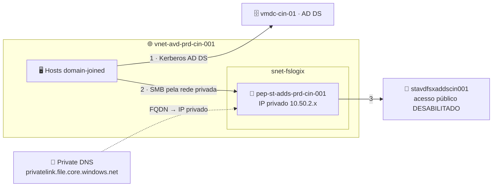

# Lab 05 — FSLogix integrado ao AD DS com Private Endpoints

> **Disciplina:** Azure Virtual Desktop — Pós-Graduação em Arquitetura Avançada em Azure
> **Modalidade:** Passo a passo via Portal do Azure (portal-first). O passo de habilitar a identidade AD DS no storage exige um script Microsoft (`AzFilesHybrid`) — é obrigatório, sem equivalente de portal.
> **Dependência:** **Lab 03** (domínio `avdlab.local` + host pool `vdpool-avd-prd-cin-002`). Idealmente **Lab 04** (imagem pt-BR).

---

<p align="center">
  
  
  
  
</p>

## 🗺️ Arquitetura deste laboratório



> **Leitura:** o Azure Files é ingressado no **AD DS** (via AzFilesHybrid) e só responde pela **rede privada** — o Private Endpoint dá um IP interno e a Private DNS resolve o FQDN para ele. Nenhum tráfego de perfil sai para a internet pública.

---

## 🧭 Ficha do laboratório

| Item | Detalhe |
|------|---------|
| **Dificuldade** | ★★★ Avançado |
| **Tempo estimado** | 90–120 min |
| **Objetivo** | Armazenar perfis FSLogix em **Azure Files autenticado por AD DS**, acessível **somente pela rede privada** via **Private Endpoint** (sem endpoint público), na estrutura de domínio do Lab 03. |
| **Pré-requisitos** | Lab 03 concluído; acesso de Domain Admin (`AVDLAB\dcadmin`); Owner na assinatura. |
| **Recursos consumidos** | 1× Storage Account, 1× File Share, 1× Private Endpoint + Private DNS Zone, RBAC, objeto de conta de computador/serviço no AD. |
| **Entrega** | Perfis `.vhdx` no Azure Files, resolvendo o FQDN do storage para **IP privado**, com FSLogix montando via Kerberos do AD DS. |

### Convenção de nomes
| Recurso | Nome |
|---------|------|
| Storage Account | `stavdfsxaddscin001` (único globalmente — ajuste) |
| File Share | `profiles` |
| Private Endpoint | `pep-st-adds-prd-cin-001` |
| Private DNS Zone | `privatelink.file.core.windows.net` |
| Sub-rede do endpoint | `snet-fslogix-prd-cin-001` (10.50.2.0/24) |

---

## Parte A — Criar a Storage Account

1. **Storage accounts → + Create.**
2. **Basics:**
   - **Resource group:** `rg-avd-prd-cin-001`; **Name:** `stavdfsxaddscin001`; **Region:** Central India.
   - **Performance:** **Premium → File shares** (recomendado p/ perfis) ou Standard/StorageV2.
   - **Redundancy:** LRS.
3. **Networking (importante):**
   - **Network access:** **Disable public access** (ou "Enabled from selected virtual networks"). Vamos usar **somente Private Endpoint**.
     > Você pode deixar público temporariamente para criar o share e desabilitar depois; o caminho mais limpo é já configurar private endpoint aqui na aba Networking.
4. **Review + create → Create.**
5. **Data storage → File shares → + File share** → **Name:** `profiles` (defina quota/provisionamento) → **Create**.

---

## Parte B — Criar o Private Endpoint + Private DNS Zone

O Private Endpoint dá um **IP privado** ao serviço de arquivos dentro da `snet-fslogix-prd-cin-001`, e a Private DNS Zone faz o FQDN `stavdfsxaddscin001.file.core.windows.net` resolver para esse IP privado.

1. Na Storage Account → **Security + networking → Networking** → aba **Private endpoint connections** → **+ Private endpoint**.
2. **Basics:** **Name:** `pep-st-adds-prd-cin-001`; **Region:** Central India.
3. **Resource:** **Target sub-resource:** **file**.
4. **Virtual Network:**
   - **VNet:** `vnet-avd-prd-cin-001`; **Subnet:** `snet-fslogix-prd-cin-001`.
5. **DNS:**
   - **Integrate with private DNS zone:** **Yes**.
   - O portal cria/usa a zona **`privatelink.file.core.windows.net`** e vincula-a à VNet.
6. **Review + create → Create.**

### B.1 — Validar a resolução privada
A VNet já usa o DNS do DC (10.50.3.4, Lab 03). Para o `privatelink` funcionar com DNS customizado, garanta o encaminhamento:
- Como a VNet aponta para o **DC** como DNS, o DC precisa **encaminhar** as consultas do Azure para o resolvedor do Azure (168.63.129.16). No DC: **DNS Manager → Forwarders → adicione 168.63.129.16**. Assim `*.file.core.windows.net` resolve para o IP privado via a Private DNS Zone vinculada.
- Teste em um host:
  ```cmd
  nslookup stavdfsxaddscin001.file.core.windows.net
  ```
  Deve retornar um **IP 10.50.2.x** (privado), não um IP público.

---

## Parte C — Habilitar autenticação AD DS no Azure Files (AzFilesHybrid)

Não há botão de portal para "domain join" da storage account em AD DS on-prem/IaaS — usa-se o módulo **AzFilesHybrid**. Passo **obrigatório**.

1. No **`vmdc-cin-01`** (tem linha de visão ao AD e ao Azure), abra **PowerShell como Admin**.
2. Baixe o módulo **AzFilesHybrid** (GitHub oficial `Azure-Samples/azure-files-samples` → releases) e descompacte.
3. Execute:
   ```powershell
   # Pré-requisitos
   Install-Module -Name Az -Scope CurrentUser -Repository PSGallery -Force
   Set-ExecutionPolicy -ExecutionPolicy Unrestricted -Scope Process

   # Na pasta do AzFilesHybrid descompactado:
   .\CopyToPSPath.ps1
   Import-Module -Name AzFilesHybrid

   Connect-AzAccount    # login no tenant/sub
   $subId = "<SUBSCRIPTION_ID>"
   $rg    = "rg-avd-prd-cin-001"
   $sa    = "stavdfsxaddscin001"

   Select-AzSubscription -SubscriptionId $subId

   # Cria a conta no AD (computer ou service account) que representa o storage e habilita Kerberos
   Join-AzStorageAccountForAuth `
     -ResourceGroupName $rg `
     -StorageAccountName $sa `
     -DomainAccountType "ComputerAccount" `
     -OrganizationalUnitDistinguishedName "OU=AVD,DC=avdlab,DC=local"
   ```
4. Valide:
   ```powershell
   Debug-AzStorageAccountAuth -StorageAccountName $sa -ResourceGroupName $rg -Verbose
   ```
   Deve passar nas checagens de Kerberos/SPN. No AD (ADUC), aparece um objeto de computador com o nome do storage na OU `AVD`.

---

## Parte D — Configurar as permissões (RBAC de share + NTFS)

### D.1 — RBAC de nível de share
1. Storage Account → **Access Control (IAM) → + Add → Add role assignment.**
2. Usuários AVD: **Storage File Data SMB Share Contributor** (grupo ou `joao.teste`).
3. Sua conta admin: **Storage File Data SMB Share Elevated Contributor** (para configurar NTFS).
4. **Review + assign.**

### D.2 — NTFS no share
1. Storage Account → **Security + networking → Access keys** → copie a **key1**.
2. Em um host (com resolução privada já funcionando), **PowerShell como Admin**:
   ```powershell
   $conta = "stavdfsxaddscin001"
   $key   = "<KEY1>"
   $unc   = "\\$conta.file.core.windows.net\profiles"
   cmd /c "net use Z: $unc /user:Azure\$conta $key"

   icacls Z: /grant "Creator Owner:(OI)(CI)(IO)(M)"
   icacls Z: /grant "AVDLAB\Domain Users:(M)"
   icacls Z: /grant "AVDLAB\Domain Users:(CI)(M)"
   icacls Z: /remove "Builtin\Users"
   net use Z: /delete
   ```

---

## Parte E — Configurar o FSLogix nos hosts (via GPO do domínio)

Como há AD DS, o caminho natural é **GPO** (alternativa: registro direto). Reaproveite a GPO `GPO-AVD-Baseline` do Lab 04 ou crie `GPO-FSLogix`.

1. No `vmdc-cin-01`, garanta os **ADMX do FSLogix** no Central Store (`\\avdlab.local\SYSVOL\...\PolicyDefinitions`). (Feito no Lab 04; senão importe agora.)
2. **Group Policy Management → OU AVD → editar a GPO** → *Computer Configuration → Policies → Administrative Templates → FSLogix → Profile Containers*:
   | Política | Valor |
   |----------|-------|
   | **Enabled** | Enabled = `1` |
   | **VHD Locations** | `\\stavdfsxaddscin001.file.core.windows.net\profiles` |
   | **Delete Local Profile When VHD Should Apply** | Enabled |
   | **Flip Flop Profile Directory Name** | Enabled |
3. Nos hosts: `gpupdate /force` (ou reinicie).

> **Sem GPO?** Em cada host, mesmas chaves do Lab 02 Parte G, apenas trocando o `VHDLocations` para `\\stavdfsxaddscin001.file.core.windows.net\profiles`.

---

## Parte F — Validar

1. Reinicie os hosts `vmavda-cin-0x`.
2. Conecte como `joao.teste` (identidade do domínio sincronizada).
3. Na sessão:
   ```cmd
   nslookup stavdfsxaddscin001.file.core.windows.net   :: deve ser IP 10.50.2.x privado
   klist                                              :: ticket cifs/stavdfsxaddscin001...
   ```
4. No portal: **Storage Account → File shares → profiles → Browse** → deve existir o `.vhdx` do usuário.
5. Confira o log do FSLogix: `C:\ProgramData\FSLogix\Logs\Profile` → `Profile container attached`.

### Critérios de sucesso
- [ ] `nslookup` do FQDN do storage retorna **IP privado** (Private Endpoint funcionando).
- [ ] Acesso público à storage account **desabilitado**.
- [ ] Storage account ingressado no AD DS (objeto na OU `AVD`, `Debug-AzStorageAccountAuth` OK).
- [ ] `.vhdx` do usuário criado no share; perfil monta sem cair para temporário.
- [ ] FSLogix aplicado por GPO (`gpresult /r` mostra a GPO de FSLogix).

---

## Erros comuns

| Sintoma | Causa | Correção |
|---------|-------|----------|
| FQDN resolve para IP público | DC sem forwarder p/ 168.63.129.16 ou zona privada não vinculada à VNet | Refaça B.1; confirme o link da zona `privatelink.file.core.windows.net` na VNet |
| Acesso negado ao montar share | Storage não ingressado no AD ou RBAC ausente | Refaça Parte C e D.1 |
| Perfil cai para temporário | Host sem linha de visão privada ou Kerberos falhando | Verifique Private Endpoint + `klist`; cheque log FSLogix |
| `Join-AzStorageAccountForAuth` falha | OU incorreta ou sem permissão no AD | Confirme a OU `OU=AVD,DC=avdlab,DC=local` e use conta Domain Admin |

---

## Comparação rápida — Lab 02 vs Lab 05
| Aspecto | Lab 02 (Entra) | Lab 05 (AD DS) |
|---------|----------------|----------------|
| Identidade do storage | Entra Kerberos | AD DS (AzFilesHybrid) |
| Rede | Endpoint público (padrão) | **Private Endpoint** (privado) |
| Config nos hosts | Intune Settings Catalog | GPO de domínio |
| Pré-requisito de host | Entra-joined + Cloud Kerberos | Domain-joined |

---

## Próximo lab
➡️ **Lab 06 — Scaling Plan nativo do AVD** para agendar startup/shutdown desta estrutura, reduzindo custo fora do horário.
