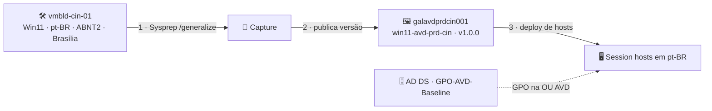

# Lab 06 — Imagem customizada de Windows 11 (idioma, teclado, fuso horário e GPOs)

> **Disciplina:** Azure Virtual Desktop — Pós-Graduação em Arquitetura Avançada em Azure
> **Modalidade:** Passo a passo via Portal do Azure (portal-first). Os ajustes de SO (idioma/teclado/fuso e Sysprep) exigem comandos **no SO da VM** — não há equivalente de portal, então são passos obrigatórios.
> **Dependência:** **Lab 03** (estrutura AD DS). A imagem será usada para implantar hosts nesta estrutura, e as **GPOs** virão do domínio `avdlab.local`.

---

<p align="center">
  
  
  
  
</p>

## 🗺️ Arquitetura deste laboratório



> **Leitura:** a VM de build recebe idioma/teclado/fuso e é generalizada (Sysprep) — a imagem vai para o **Compute Gallery** versionada. Novos hosts nascem em pt-BR a partir dela; a **GPO** do domínio garante a conformidade contínua. A imagem define o *estado inicial*, a GPO mantém o *estado*.

---

## 🧭 Ficha do laboratório

| Item | Detalhe |
|------|---------|
| **Dificuldade** | ★★★ Avançado |
| **Tempo estimado** | 90–120 min |
| **Objetivo** | Construir uma *golden image* de Windows 11 com **idioma pt-BR, teclado ABNT2, fuso horário de Brasília**, herdados por todos os usuários; capturá-la no **Azure Compute Gallery**; e aplicar configurações corporativas via **GPO** do domínio. |
| **Pré-requisitos** | Lab 03 (domínio `avdlab.local` ativo). Papel Owner/Contributor. |
| **Recursos consumidos** | 1× VM de build, 1× Azure Compute Gallery, 1× Image definition + version. |
| **Entrega** | Imagem versionada no gallery, pronta para implantar hosts em pt-BR; GPO de baseline aplicada à OU `AVD`. |

### Convenção de nomes
| Recurso | Nome |
|---------|------|
| VM de build | `vmbld-cin-01` (sub-rede `snet-hosts-prd-cin-001`) |
| Compute Gallery | `galavdprdcin001` (sem hífen) |
| Image definition | `win11-avd-prd-cin` |
| Image version | `1.0.0` |
| Fuso horário | `E. South America Standard Time` (Brasília) |
| Locale | `pt-BR`, GeoId `32` (Brasil) |

---

## Parte A — Provisionar a VM de build

1. **Virtual machines → + Create → Azure virtual machine.**
2. **Basics:**
   - **Resource group:** `rg-avd-prd-cin-001`; **Name:** `vmbld-cin-01`; **Region:** Central India.
   - **Image:** **Windows 11 Enterprise multi-session, version 24H2** (sem M365 para imagem mais limpa, ou com M365 se desejar embutir Office).
     > Use "See all images" → **Microsoft Windows 11** → escolha a edição *multi-session* + *24H2*.
   - **Security type:** Trusted launch.
   - **Size:** `Standard_D2s_v5`.
   - **Administrator account:** `localadmin` + senha (anote).
   - **Public inbound ports:** None (use Bastion ou RDP interno).
3. **Networking:** `vnet-avd-prd-cin-001` / `snet-hosts-prd-cin-001`.
4. **Review + create → Create.**

> ⚠️ **Não ingresse a VM de build no domínio.** A imagem capturada deve ser **genérica**; o domain join acontece no deploy dos hosts (Lab 03/05). Mantenha a build apenas como **workgroup** + admin local.

### Alternativa — criar a VM de build via Azure CLI (se o portal bloquear a imagem multi-session)

Em algumas assinaturas (típico de **Visual Studio/MSDN**) o "Create VM" do **portal oculta/bloqueia** a imagem Windows 11 multi-session. **Isso não é trava de licença** — o **Azure CLI** e o **assistente de host pool do AVD** criam normalmente. Nesse caso, provisione a VM de build pelo **Cloud Shell (Bash)**:

```bash
# === Variáveis (ajuste apenas a assinatura) ===
SUB="<SEU_SUBSCRIPTION_ID>"          # obtenha com: az account show --query id -o tsv
RG="rg-avd-prd-cin-001"
LOC="centralindia"                   # India Central
VNET="vnet-avd-prd-cin-001"
SUBNET="snet-hosts-prd-cin-001"
VM="vmbld-cin-01"
SIZE="Standard_D2s_v5"               # série D (rápido p/ idioma). D4s_v5 = build ainda mais veloz.
ADMIN="suporte"
SKU="win11-25h2-avd"                 # multi-session sem M365 (troque p/ win11-24h2-avd se preferir)
IMG="MicrosoftWindowsDesktop:windows-11:${SKU}:latest"

az account set --subscription "$SUB"

# 1) Confirmar que a SKU existe (procure a linha desejada):
az vm image list --publisher MicrosoftWindowsDesktop --offer windows-11 --all -o table | grep -i avd

# 2) Senha do admin (fora do histórico):
read -s -p "Senha do admin ($ADMIN): " ADMPWD; echo

# 3) Criar a VM de build (Trusted Launch = requisito do Win11):
az vm create \
  --resource-group "$RG" --name "$VM" --image "$IMG" --location "$LOC" --size "$SIZE" \
  --security-type TrustedLaunch --enable-secure-boot true --enable-vtpm true \
  --vnet-name "$VNET" --subnet "$SUBNET" \
  --public-ip-address "${VM}-pip" --public-ip-sku Standard --nsg "${VM}-nsg" --nsg-rule RDP \
  --admin-username "$ADMIN" --admin-password "$ADMPWD" --os-disk-name "${VM}-osdisk" \
  --only-show-errors

# 4) Conferir o resultado:
az vm show -g "$RG" -n "$VM" -d \
  --query "{nome:name, estado:powerState, ipPrivado:privateIps, ipPublico:publicIps, sku:storageProfile.imageReference.sku}" -o table
```

> 💡 A VM sobe com **IP público + RDP (3389)** liberado — como o lab tem muito copia-e-cola, o RDP direto é mais prático que o Bastion Free. Conecte via **Área de Trabalho Remota** no `ipPublico` do passo 4.
>
> 🔒 **Segurança:** a regra `RDP` abre a porta 3389 para **qualquer origem**. Restrinja ao **seu IP** (veja em https://ifconfig.me) logo após criar:
> ```bash
> az network nsg rule update -g "$RG" --nsg-name "${VM}-nsg" -n RDP --source-address-prefixes <SEU_IP>/32
> ```
> E, ao terminar a imagem, **remova o IP público** (não precisa dele nos hosts): `az network public-ip delete -g "$RG" -n "${VM}-pip"` (desassocie da NIC antes, se necessário).
>
> Se a SKU do passo 1 não listar, ajuste `SKU` para uma que apareça. Se a subnet estiver em outro RG, troque `--subnet "$SUBNET"` pelo **ID completo** da subnet. Depois de `estado: VM running`, conecte e siga a partir do **B.1**.


---

## Parte B — Configurar idioma, teclado e fuso horário (no SO)

Conecte na `vmbld-cin-01` como `localadmin`.

### B.1 — Instalar o pacote de idioma Português (Brasil) — método oficial (ISO + DISM)

> ✅ **Este é o método recomendado pela Microsoft para imagens do AVD** ([doc oficial](https://learn.microsoft.com/en-us/azure/virtual-desktop/windows-11-language-packs)). O idioma é instalado **offline, a partir de um ISO** — provisionado para **todos os usuários** (all-users), que é o único estado que **sobrevive ao Sysprep**.
>
> ❌ **NÃO use** a Central de Idiomas (Configurações), `Install-Language`, nem o "Pacote de Experiência Local" da **Microsoft Store**: esses instalam **por usuário** (per-user), puxam FODs do **Windows Update** (lentidão de 15–30 min) e **quebram o Sysprep** com o erro `0x80073cf2` (ver tabela de erros).

**Passo 1 — Baixar o ISO de idiomas** (na VM `vmbld-cin-01`; confira a versão com `Win+R` → `winver`):

*Languages and Optional Features ISO:*
- [Windows 11, version **22H2 / 23H2** (build 22621)](https://software-static.download.prss.microsoft.com/dbazure/988969d5-f34g-4e03-ac9d-1f9786c66749/22621.1.220506-1250.ni_release_amd64fre_CLIENT_LOF_PACKAGES_OEM.iso)
- [Windows 11, version **24H2 / 25H2** (build 26100) ← usar este](https://software-static.download.prss.microsoft.com/dbazure/888969d5-f34g-4e03-ac9d-1f9786c66749/26100.1.240331-1435.ge_release_amd64fre_CLIENT_LOF_PACKAGES_OEM.iso)

> 💡 O **Inbox Apps ISO** é opcional (só atualiza apps de caixa de entrada) — não é necessário para o idioma. Se precisar: [22H2/23H2](https://software-static.download.prss.microsoft.com/dbazure/888969d5-f34g-4e03-ac9d-1f9786c66749/22621.2501.231009-1937.ni_release_svc_prod3_amd64fre_InboxApps.iso) · [24H2/25H2](https://software-static.download.prss.microsoft.com/dbazure/888969d5-f34g-4e03-ac9d-1f9786c66749/26100.6584.250904-1728.ge_release_svc_prod1_amd64fre_InboxApps.iso).
> Se o download for bloqueado, use o **Edge** (não o IE).

**Passo 2 — Montar o ISO:** botão direito no arquivo → **Montar**. Ele recebe uma letra (ex.: `E:`). Os `.cab` de idioma ficam em `E:\LanguagesAndOptionalFeatures\`.

> ⚠️ **Confirme a letra do ISO antes de rodar o script** — ela **muda após reboot/logoff** (o ISO desmonta). Se `E:` não for mais o ISO, o `Add-Package` falha com **`0x80070003` (caminho não encontrado)**. Verifique/remonte:
> ```powershell
> Get-Volume | Where-Object DriveType -eq 'CD-ROM' | Select-Object DriveLetter, FileSystemLabel
> # Se necessário, remonte: Mount-DiskImage -ImagePath "C:\...\CLIENT_LOF_PACKAGES_OEM.iso"
> # Confirme que o .cab existe na letra correta:
> Test-Path "E:\LanguagesAndOptionalFeatures\Microsoft-Windows-Client-Language-Pack_x64_pt-br.cab"   # True
> ```
> Ajuste `$src` para a letra correta e só então execute o Passo 3.

**Passo 3 — Instalar o pt-BR** (PowerShell **como Admin**; ajuste a letra se não for `E:`):
```powershell
$src = "E:\LanguagesAndOptionalFeatures"

# Impedir que o Windows remova o idioma automaticamente (senão some após a captura)
Disable-ScheduledTask -TaskPath "\Microsoft\Windows\AppxDeploymentClient\" -TaskName "Pre-staged app cleanup"
Disable-ScheduledTask -TaskPath "\Microsoft\Windows\MUI\" -TaskName "LPRemove"
Disable-ScheduledTask -TaskPath "\Microsoft\Windows\LanguageComponentsInstaller" -TaskName "Uninstallation"
reg add "HKLM\SOFTWARE\Policies\Microsoft\Control Panel\International" /v BlockCleanupOfUnusedPreinstalledLangPacks /t REG_DWORD /d 1 /f

# 1) Pacote de idioma principal (interface pt-BR) — all-users
Dism /Online /Add-Package /PackagePath:"$src\Microsoft-Windows-Client-Language-Pack_x64_pt-br.cab"

# 2) Recursos do idioma (all-users, SOMENTE da fonte local — sem Windows Update)
$caps = "Language.Basic","Language.Handwriting","Language.OCR","Language.Speech","Language.TextToSpeech"
foreach ($c in $caps) {
  Dism /Online /Add-Capability /CapabilityName:"$c~~~pt-br~0.0.1.0" /Source:$src /LimitAccess
}

# 3) Adicionar pt-BR à lista de idiomas
$l = Get-WinUserLanguageList
$l.Add("pt-BR")
Set-WinUserLanguageList $l -Force

# 4) DEFINIR o pt-BR como idioma de EXIBIÇÃO (passo essencial — sem ele o SO continua em inglês)
Set-SystemPreferredUILanguage pt-BR   # all-users: tela de login e novos usuários (o que vale para a imagem)
Set-WinUILanguageOverride -Language pt-BR   # aplica também ao admin de build para conferir agora
```
> ⚠️ **O passo 4 é obrigatório.** Instalar o pacote (passos 1–3) **não troca** o idioma de exibição — se você parar no `Set-WinUserLanguageList`, o SO **continua em inglês**. É o `Set-SystemPreferredUILanguage` que fixa o pt-BR como idioma da imagem (para todos os usuários). *(Observação: o script da doc oficial do AVD para no passo 3, pois assume que cada usuário escolhe o próprio idioma; para uma imagem single-language pt-BR, o passo 4 é o que faz valer.)*

**Passo 4 — Aplicar:** o `/LimitAccess` faz o DISM usar **só o ISO local** (rápido, sem Windows Update). Depois de rodar, **saia da sessão** (Iniciar → usuário → **Sair**) e **entre de novo** — ou reinicie. Confirme:
```powershell
Get-InstalledLanguage -Language pt-BR   # deve listar pt-BR + LpCab + recursos
Get-SystemPreferredUILanguage           # esperado: pt-BR
```

### B.2 — Configurar fuso horário
```powershell
# Desliga o "definir fuso automaticamente" (senão a VM pode voltar para UTC):
Set-ItemProperty "HKLM:\SYSTEM\CurrentControlSet\Services\tzautoupdate" -Name Start -Value 4

Set-TimeZone -Id "E. South America Standard Time"   # Brasília (UTC-03:00)
Get-TimeZone                                         # confirme: (UTC-03:00) Brasília
```
> 💡 VMs do Azure nascem em **UTC**. Se depois de configurar o fuso ele **voltar a UTC**, é porque o **"definir fuso automaticamente"** está ligado — a primeira linha acima o desliga.

### B.3 — Configurar teclado (ABNT2), locale e formato regional
```powershell
Set-WinUILanguageOverride -Language pt-BR
Set-WinUserLanguageList -LanguageList pt-BR -Force      # inclui teclado ABNT2 (PT-BR)
Set-WinSystemLocale -SystemLocale pt-BR
Set-WinHomeLocation -GeoId 32                            # 32 = Brasil
Set-Culture -CultureInfo pt-BR
```

**✔️ Validação 1 — o que foi aplicado no usuário logado** (confira antes de copiar para o Default):
```powershell
Write-Host "===== VALIDACAO 1 — usuario logado =====" -ForegroundColor Cyan
[pscustomobject]@{
  "UI Language Override"  = (Get-WinUILanguageOverride)
  "System Locale"         = (Get-WinSystemLocale).Name
  "Culture"               = (Get-Culture).Name
  "Home Location (GeoId)" = (Get-WinHomeLocation).GeoId
  "Time Zone"             = (Get-TimeZone).Id
} | Format-List

Get-WinUserLanguageList |
  Select-Object LanguageTag, @{n='Teclados';e={$_.InputMethodTips -join ', '}} |
  Format-Table -AutoSize
```
**Esperado:** UI/Locale/Culture = `pt-BR` · GeoId = `32` · Time Zone = `E. South America Standard Time` · Teclado = `0416:00010416` (ABNT2). Se algo divergir, **reaplique B.1–B.3** antes de seguir.

### B.4 — Aplicar as configurações ao perfil **Default** (crítico para Sysprep)
Para que **todo usuário novo** que logar nos hosts herde idioma/teclado/fuso, copie as configurações do usuário atual para o perfil **Default** e contas do sistema antes do Sysprep:
```powershell
New-Item -ItemType Directory -Force -Path C:\Temp | Out-Null

# Exporta as configurações de internacionalização do usuário atual
$xml = @"
<gs:GlobalizationServices xmlns:gs="urn:longhornGlobalizationUnattend">
  <gs:UserList>
    <gs:User UserID="Current" CopySettingsToDefaultUserAcct="true" CopySettingsToSystemAcct="true"/>
  </gs:UserList>
  <gs:LocationPreferences><gs:GeoID Value="32"/></gs:LocationPreferences>
  <gs:MUILanguagePreferences><gs:MUILanguage Value="pt-BR"/></gs:MUILanguagePreferences>
  <gs:SystemLocale Name="pt-BR"/>
  <gs:InputPreferences>
    <gs:InputLanguageID Action="add" ID="0416:00010416" Default="true"/>  <!-- pt-BR ABNT2 -->
  </gs:InputPreferences>
  <gs:UserLocale>
    <gs:Locale Name="pt-BR" SetAsCurrent="true" ResetAllSettings="false"/>
  </gs:UserLocale>
</gs:GlobalizationServices>
"@
$xml | Out-File C:\Temp\pt-BR.xml -Encoding utf8

# Aplica ao Default e System
control.exe "intl.cpl,,/f:`"C:\Temp\pt-BR.xml`""
```

**✔️ Validação 2 — o que foi copiado para o perfil Default** (o `control.exe` roda silencioso — não há retorno). Carregue a hive do usuário **Default** e verifique as chaves:
```powershell
# Perfil DEFAULT (o que novos usuários herdam):
reg load "HKU\DEF" "C:\Users\Default\NTUSER.DAT"
reg query "HKU\DEF\Control Panel\International" /v LocaleName        # esperado: pt-BR
reg query "HKU\DEF\Control Panel\International\Geo" /v Nation         # esperado: 32 (Brasil)
reg query "HKU\DEF\Keyboard Layout\Preload"                          # deve conter 00010416 (ABNT2)
reg unload "HKU\DEF"

# Conta SYSTEM (.DEFAULT):
reg query "HKU\.DEFAULT\Control Panel\International" /v LocaleName    # esperado: pt-BR
```
> ✅ Se `LocaleName = pt-BR`, `Nation = 32` e o Preload contém `00010416`, o **B.4 funcionou** — todo usuário novo nascerá em pt-BR/ABNT2/Brasil. (Se o `reg unload` der "acesso negado", feche/reabra o PowerShell e refaça só o unload.)

> Após isso, reinicie e reconecte para confirmar que o SO está totalmente em pt-BR.

### B.5 — Instalar aplicações (customização da imagem)

Para a imagem se mostrar de fato **customizada**, instale algumas aplicações. Use sempre **instaladores por máquina (MSI/EXE, all-users)** — **evite apps da Microsoft Store / MSIX**, que instalam por usuário e voltariam a quebrar o Sysprep com `0x80073cf2`.

> ⚠️ O **`winget` NÃO vem** na imagem Windows 11 **multi-session** (dá *"'winget' não é reconhecido..."*). Por isso este passo usa **download direto + instalação silenciosa**.

**Trio sugerido (gratuitos, todos por máquina):**

| Aplicação | Uso | Página de download |
|-----------|-----|--------------------|
| **draw.io Desktop** | Diagramas de arquitetura | [github.com/jgraph/drawio-desktop/releases](https://github.com/jgraph/drawio-desktop/releases) |
| **7-Zip** | Compactação de arquivos | [github.com/ip7z/7zip/releases](https://github.com/ip7z/7zip/releases) |
| **Notepad++** | Editor de texto/código | [github.com/notepad-plus-plus/notepad-plus-plus/releases](https://github.com/notepad-plus-plus/notepad-plus-plus/releases) |

**Script — baixa a versão mais recente de cada um (via API do GitHub) e instala em silêncio** (PowerShell **como Admin**):
```powershell
[Net.ServicePointManager]::SecurityProtocol = [Net.SecurityProtocolType]::Tls12
$ProgressPreference = 'SilentlyContinue'
$dl = "C:\Install"; New-Item -ItemType Directory -Force -Path $dl | Out-Null

function Get-GhAsset($repo, $pattern) {
  $rel = Invoke-RestMethod "https://api.github.com/repos/$repo/releases/latest" -Headers @{ 'User-Agent' = 'avd-lab' }
  ($rel.assets | Where-Object name -like $pattern | Select-Object -First 1).browser_download_url
}

# draw.io — MSI = instalação POR MÁQUINA (all-users), sobrevive ao Sysprep
$u = Get-GhAsset "jgraph/drawio-desktop" "draw.io-*.msi"
Invoke-WebRequest $u -OutFile "$dl\drawio.msi"
Start-Process msiexec.exe -ArgumentList "/i `"$dl\drawio.msi`" /qn /norestart" -Wait

# 7-Zip — instalador x64 (/S = silencioso; vai para Program Files)
$u = Get-GhAsset "ip7z/7zip" "7z*-x64.exe"
Invoke-WebRequest $u -OutFile "$dl\7zip.exe"
Start-Process "$dl\7zip.exe" -ArgumentList "/S" -Wait

# Notepad++ — instalador x64 (/S = silencioso; vai para Program Files)
$u = Get-GhAsset "notepad-plus-plus/notepad-plus-plus" "npp.*.Installer.x64.exe"
Invoke-WebRequest $u -OutFile "$dl\npp.exe"
Start-Process "$dl\npp.exe" -ArgumentList "/S" -Wait
```

> ✅ **Conferir que instalaram por máquina** (aparecem no Uninstall do HKLM, não só no seu perfil):
> ```powershell
> Get-ItemProperty "HKLM:\SOFTWARE\Microsoft\Windows\CurrentVersion\Uninstall\*",
>                   "HKLM:\SOFTWARE\WOW6432Node\Microsoft\Windows\CurrentVersion\Uninstall\*" -ErrorAction SilentlyContinue |
>   Where-Object DisplayName -match "draw.io|7-Zip|Notepad\+\+" |
>   Select-Object DisplayName, DisplayVersion
> ```

> 💡 Para instalação **manual**, baixe pelas páginas acima e rode: `msiexec /i draw.io-<ver>.msi /qn` · `7z<ver>-x64.exe /S` · `npp.<ver>.Installer.x64.exe /S`.
>
> 💡 Se quiser otimizar a imagem para AVD, aplique também o **Virtual Desktop Optimization Tool (VDOT)** ([github.com/The-Virtual-Desktop-Team/Virtual-Desktop-Optimization-Tool](https://github.com/The-Virtual-Desktop-Team/Virtual-Desktop-Optimization-Tool)). Mantenha a imagem enxuta.

### B.6 — Checagem final antes do Sysprep (obrigatório)
Você já validou o **usuário logado** (Validação 1, após B.3) e o **perfil Default** (Validação 2, após B.4). Antes de generalizar, confirme que **não há reboot pendente** — o Sysprep **falha** se houver:
```powershell
$pending = Test-Path "HKLM:\SOFTWARE\Microsoft\Windows\CurrentVersion\Component Based Servicing\RebootPending"
Write-Host ("Reboot pendente: {0}  (precisa ser False para o Sysprep)" -f $pending) -ForegroundColor Yellow
```
> ⛔ **Só prossiga para o Sysprep se:** as Validações **1 (usuário, B.3)** e **2 (Default, B.4)** passaram — tudo em **pt-BR / ABNT2 / GeoId 32 / fuso Brasília** — **e** `Reboot pendente = False`. Se algum valor divergir, reaplique B.1–B.4; se houver reboot pendente, **reinicie** até ficar `False`.
>
> ➡️ Em seguida, execute as **limpezas obrigatórias da Parte C.1** (desligar BitLocker + remover o LXP) — sem elas o Sysprep falha com `0x80310039` / `0x80073cf2`.

---

## Parte C — Generalizar com Sysprep

> **Atenção:** após o Sysprep + captura, esta VM fica **inutilizável**. Não a use como host.

### C.1 — Limpeza obrigatória antes do Sysprep

O Sysprep valida, **nesta ordem**, o **BitLocker** e depois o **provisionamento de Appx**. Faça os dois passos **em sequência** — conclua o Passo 1 (descriptografia) **antes** de olhar o Passo 2.

#### Passo 1 — Desligar o BitLocker e AGUARDAR a descriptografia

O Sysprep falha com **`0x80310039`** se o BitLocker estiver ligado no `C:` (o Win11 24H2/25H2 liga a Criptografia de Dispositivo sozinho). Execute **como Admin**:

```powershell
manage-bde -status C:                 # veja o estado atual
Disable-BitLocker -MountPoint "C:"    # INICIA a descriptografia (se estiver ligado)
```

O comando só **inicia** o processo — não espera. **"Proteção Desativada" NÃO basta**: o volume precisa ficar **100% descriptografado**. Rode o loop abaixo e só siga quando ele imprimir "OK":

```powershell
do { Start-Sleep 15; $v = Get-BitLockerVolume -MountPoint "C:"
     "{0} - {1}% criptografado" -f $v.VolumeStatus, $v.EncryptionPercentage
} while ($v.VolumeStatus -ne "FullyDecrypted")
"OK - volume totalmente descriptografado; pode ir para o Passo 2."
```
> ⏳ A descriptografia pode levar vários minutos. Enquanto o `VolumeStatus` for `DecryptionInProgress`, **não** prossiga.
>
> 💡 Para **evitar** o BitLocker automático em builds futuras, crie **antes** de tudo a chave: `HKLM\SYSTEM\CurrentControlSet\Control\BitLocker` → DWORD `PreventDeviceEncryption = 1`.

#### Passo 2 — Remover apps "per-user" que quebram o Sysprep

**Só execute depois** que o Passo 1 imprimiu "OK".

> **Por que isto é necessário (conceito):** o Sysprep `/generalize` gera uma imagem **genérica**, para ser usada por **qualquer usuário** nos hosts. Por isso ele exige que todo pacote de aplicativo (Appx/MSIX) esteja **provisionado para TODOS os usuários** (*all-users*). Se um app foi instalado **só para o usuário de build** (*per-user*) — típico de apps da **Microsoft Store/MSIX** — o Sysprep aborta com **`0x80073cf2`**: *"installed for a user, but not provisioned for all users"*. Regra de ouro da golden image: **instale por máquina (MSI/EXE)** e remova qualquer resíduo per-user antes de generalizar.

**2a) Reinicie AGORA (se houver reboot pendente) — antes das remoções:**
```powershell
Test-Path "HKLM:\SOFTWARE\Microsoft\Windows\CurrentVersion\Component Based Servicing\RebootPending"   # precisa ser False
```
> ⚠️ O reboot tem que acontecer **aqui**, não depois. Alguns MSIX (ex.: o menu de contexto do Notepad++) **se re-registram no logon** — se você reiniciar *depois* de removê-los, eles voltam.

**2b) Remover o pacote de idioma da Store (LXP)** — com o B.1 (DISM), o pt-BR permanece:
```powershell
Get-AppxPackage -AllUsers -Name Microsoft.LanguageExperiencePackpt-BR | Remove-AppxPackage -AllUsers
```

**2c) Remover o MSIX de menu de contexto do Notepad++** — o instalador clássico do Notepad++ 8.x registra um MSIX ("Editar com Notepad++") que **ressuscita a cada logon**:
```powershell
Get-AppxPackage -Name "*NotepadPlusPlus*" | Remove-AppxPackage
```

**2d) (Diagnóstico) Listar apps registrados por usuário sem provisionamento all-users:**
```powershell
$prov = (Get-AppxProvisionedPackage -Online).DisplayName
Get-AppxPackage | Where-Object { -not $_.NonRemovable -and $prov -notcontains $_.Name } | Select-Object Name
```
> ⚠️ **NÃO remova o que aparecer aqui sem antes olhar o que é.** A lista quase sempre traz só **frameworks/runtimes** — `Microsoft.VCLibs.*`, `Microsoft.NET.Native.*`, `Microsoft.UI.Xaml.*`, `Microsoft.WindowsAppRuntime.*`. Esses são **dependências**: **não remova** (quebra Store, Edge e outros apps). Remova **somente apps reais** deixados por usuário.

> ⛔ **Depois das remoções (2b/2c), NÃO reinicie nem faça logoff.** Vá **direto** para o Sysprep (C.2), na **mesma sessão** — assim os MSIX que ressuscitam no logon não voltam (o Sysprep desliga a VM, sem novo logon). O Notepad++ clássico (`Program Files`) permanece na imagem; nos hosts, o menu de contexto se registra por usuário normalmente.

---

### C.2 — Executar o Sysprep

> Pré-requisitos: Passo 1 (BitLocker `FullyDecrypted`) e Passo 2 concluídos, **sem reboot após as remoções**.

1. Na VM, **PowerShell/CMD como Admin**, rode **imediatamente** após o Passo 2:
   ```cmd
   C:\Windows\System32\Sysprep\sysprep.exe /oobe /generalize /shutdown /mode:vm
   ```
2. Aguarde a VM **parar** (Stopped) — não apenas reiniciar. Confirme no portal o estado **Stopped**.

**Se o Sysprep falhar — procedimento geral (vale para qualquer pacote):**
1. Abra o log **só de erros**: `C:\Windows\System32\Sysprep\Panther\setuperr.log`
2. Ache a linha com `0x80073cf2` — ela traz o **nome exato** do pacote:
   `Package <Nome>_<versão>... was installed for a user, but not provisioned for all users.`
3. Copie essa linha e peça a uma **IA de sua preferência** (Claude, Copilot, ChatGPT…) para **gerar o script de correção** daquele pacote específico. A correção quase sempre é uma destas duas:
   - **Remover** (app da Store/per-user descartável): `Get-AppxPackage -AllUsers -Name "*<Nome>*" | Remove-AppxPackage -AllUsers`
   - **Provisionar para todos** (app que você quer MANTER): `Add-AppxProvisionedPackage -Online -PackagePath "<caminho-do-AppxManifest.xml>" -SkipLicense`
4. Aplique, confirme que sumiu no diagnóstico (2d) e rode o Sysprep de novo (**mesma sessão, sem reboot**).

> 🔎 `setuperr.log` = só os erros (fácil de ler). `setupact.log` (mesma pasta) = log completo — use se precisar de mais contexto. Os erros `BCD ... c000000d` que aparecem nesses logs são **inofensivos** (firmware Gen2) e podem ser ignorados.

## Parte D — Criar o Azure Compute Gallery e capturar a imagem

### D.1 — Criar o gallery
1. Barra de busca → **Azure compute galleries** → **+ Create**.
2. **Resource group:** `rg-avd-prd-cin-001`; **Name:** `galavdprdcin001`; **Region:** Central India → **Review + create → Create**.

### D.2 — Capturar a VM como versão de imagem
1. **Virtual machines → `vmbld-cin-01`** (estado Stopped após Sysprep) → no menu superior, **Capture**.
2. **Basics:**
   - **Resource group:** `rg-avd-prd-cin-001`.
   - **Share image to Azure compute gallery:** **Yes, share it to a gallery as a VM image version**.
   - **Target Azure compute gallery:** `galavdprdcin001`.
   - **Operating system state:** **Generalized**.
   - **Target VM image definition:** **Create new** → 
     - **Name:** `win11-avd-prd-cin`.
     - **Publisher / Offer / SKU:** ex. `avdlab` / `win11-multisession` / `ptbr-24h2`.
     - **OS type:** Windows; **Generation:** Gen2; marque **multi-session** se a opção existir.
   - **Version number:** `1.0.0`.
   - **Replication:** região Central India (adicione South India se quiser DR — ver trilha avançada).
   - Marque **Automatically delete this virtual machine after creating the image** (a VM de build não serve mais).
3. **Review + create → Create.** A replicação leva ~15–30 min.

---

## Parte E — Aplicar GPOs corporativas via domínio (na estrutura do Lab 03)

A imagem cuida do **estado inicial**; as **GPOs** garantem **conformidade contínua** nos hosts ingressados na OU `AVD`. Configure no DC `vm-adds-prd-cin`.

1. Conecte na `vm-adds-prd-cin` como `AVDLAB\dcadmin`.
2. **Server Manager → Tools → Group Policy Management.**
3. Expanda `Forest → Domains → avdlab.local → OU AVD` → botão direito → **Create a GPO in this domain, and Link it here** → nome `GPO-AVD-Baseline`.
4. Botão direito na GPO → **Edit** e configure, por exemplo:
   - **Idioma/Regional (reforço):** *Computer Configuration → Policies → Administrative Templates → Control Panel → Regional and Language Options* → force o idioma de exibição pt-BR.
   - **Fuso horário:** *Computer Configuration → Preferences → Control Panel Settings → não há item direto; use* um item de registro/preferência ou a configuração de SO já vinda da imagem. (Em lab, o fuso da imagem já basta.)
   - **FSLogix (se ainda não configurado no Lab 05):** *Administrative Templates → FSLogix* (importe os ADMX do FSLogix em `\\avdlab.local\SYSVOL\...\PolicyDefinitions` se quiser gerenciar FSLogix por GPO).
   - **Segurança/UX AVD:** desabilitar tela de bloqueio por inatividade agressiva, configurar timeouts de sessão (*Administrative Templates → Windows Components → Remote Desktop Services → Remote Desktop Session Host → Session Time Limits*).
   - **Não armazenar perfis em roaming local** etc.
5. Para importar os **ADMX do FSLogix** (útil já neste lab): baixe o FSLogix, copie `fslogix.admx`/`.adml` para `C:\Windows\PolicyDefinitions` (ou para o Central Store em `\\avdlab.local\SYSVOL\avdlab.local\Policies\PolicyDefinitions`).
6. Nos hosts, force a aplicação:
   ```cmd
   gpupdate /force
   ```

> 💡 **Imagem vs GPO — divisão de responsabilidade:** a *imagem* define o ponto de partida (idioma instalado, fuso, apps). A *GPO* garante que ninguém altere e padroniza o comportamento de sessão. Em ambiente Entra-only (Labs 01/02), o equivalente da GPO é o **Intune Settings Catalog**.

---

## Parte F — (Validação) Implantar um host a partir da imagem

Para confirmar que a imagem funciona, adicione um host ao pool do Lab 03 usando a nova imagem:
1. **Host pools → `vdpool-avd-prd-cin-002` → Session hosts → + Add.**
2. Na seção **Image**, escolha **Shared Image Gallery** → `galavdprdcin001` → `win11-avd-prd-cin` → versão `1.0.0`.
3. Configure rede `snet-hosts-prd-cin-001` e **Domain join = Active Directory** na OU `AVD` (igual ao Lab 03).
4. Após provisionar, conecte no **host novo** e rode a **mesma validação do usuário (Validação 1, B.3)** para confirmar que ele **herdou** tudo da imagem:
   ```powershell
   Write-Host "===== VALIDACAO DO HOST (herdado da imagem) =====" -ForegroundColor Cyan
   [pscustomobject]@{
     "UI Language Override"  = (Get-WinUILanguageOverride)
     "System Locale"         = (Get-WinSystemLocale).Name
     "Culture"               = (Get-Culture).Name
     "Home Location (GeoId)" = (Get-WinHomeLocation).GeoId
     "Time Zone"             = (Get-TimeZone).Id
   } | Format-List
   Get-WinUserLanguageList |
     Select-Object LanguageTag, @{n='Teclados';e={$_.InputMethodTips -join ', '}} |
     Format-Table -AutoSize
   ```
   **Esperado:** `pt-BR` (UI/Locale/Culture) · GeoId `32` · fuso `E. South America Standard Time` · teclado `0416:00010416` (ABNT2).

### ✅ Critérios de sucesso
- [ ] As **Validações 1 (usuário, B.3) e 2 (perfil Default, B.4) passaram** na VM de build, e **`Reboot pendente = False`** (B.6) **antes** do Sysprep.
- [ ] Imagem `win11-avd-prd-cin` versão `1.0.0` replicada no gallery `galavdprdcin001`.
- [ ] O **host novo** (Parte F) retorna no script de validação: **`pt-BR`** (UI/Locale/Culture), **GeoId `32`**, **fuso `E. South America Standard Time`** e **teclado `0416:00010416` (ABNT2)** — **sem intervenção**.
- [ ] GPO `GPO-AVD-Baseline` vinculada à OU `AVD` e aplicada (`gpresult /r` lista a GPO).
- [ ] Usuário novo (sem perfil prévio) herda o idioma/teclado/fuso ao primeiro logon.

---

## Erros comuns

| Sintoma | Causa | Correção |
|---------|-------|----------|
| **Sysprep falha `0x80310039`** — *"BitLocker is on for the OS volume"* | BitLocker/Criptografia de Dispositivo ligado no `C:` (o Win11 24H2 liga sozinho) | Desligue: `Disable-BitLocker -MountPoint "C:"` e aguarde `manage-bde -status C:` = **Fully Decrypted**. Depois rode o Sysprep. Ver **C.1** |
| **Sysprep falha `0x80073cf2`** — *"LanguageExperiencePack... not provisioned for all users"* | Idioma instalado **per-user** (Store/`Install-Language`) — não sobrevive ao generalize | Instale via **ISO + DISM** (**B.1**), depois remova o LXP: `Get-AppxPackage -AllUsers -Name Microsoft.LanguageExperiencePackpt-BR \| Remove-AppxPackage -AllUsers` (**C.1**) |
| **DISM `0x80070003`** no `Add-Package` do `.cab` | O **ISO não está montado na letra** que o `$src` aponta (desmontou após reboot/logoff) | Confirme a letra (`Get-Volume ... CD-ROM`), remonte e ajuste `$src` (**B.1 Passo 2**) |
| SO continua em **inglês** após instalar o pacote | Faltou definir o **idioma de exibição** — parou no `Set-WinUserLanguageList` | Rode `Set-SystemPreferredUILanguage pt-BR` (**B.1 Passo 4**) e faça **logoff/logon** |
| `Install-Language`/Central de Idiomas travando 15–30 min | Puxa FODs do **Windows Update** (bloqueado/lento) | Use o **método oficial ISO + DISM** com `/LimitAccess` (**B.1**) |
| Host novo nasce em inglês | Configurações não copiadas ao perfil Default antes do Sysprep | Refaça B.4 numa nova build e recapture |
| Sysprep falha (genérico "appx packages") | Outro app provisionado por usuário impede o generalize | Rode a checagem do **C.1 passo 3** e remova com `Remove-AppxPackage -AllUsers` (log em `setuperr.log`) |
| `WinMain: File operations pending` no log do Sysprep | Operações de arquivo pendentes de tentativa anterior | **Reinicie** a VM antes de rodar o Sysprep de novo |
| Captura não oferece "Generalized" | VM não foi sysprepada/parada corretamente | Garanta estado **Stopped** após `/generalize /shutdown` |
| GPO não aplica | Host fora da OU `AVD` | Mova o objeto do host para a OU correta e `gpupdate /force` |

## 🔎 Diagnóstico — onde buscar logs da imagem

| Etapa | Onde olhar | O que procurar |
|-------|-----------|----------------|
| Sysprep falhou | `C:\Windows\System32\Sysprep\Panther\setuperr.log` e `setupact.log` | Pacote Appx por-usuário que impede o `/generalize` |
| Idioma/teclado não aplicou | Na VM: `Get-WinSystemLocale`, `Get-WinUserLanguageList`, `Get-WinHomeLocation` | Valores diferentes de `pt-BR` / ABNT2 / GeoId `32` |
| Captura sem opção "Generalized" | Estado da VM no portal | VM precisa estar **Stopped (deallocated)** após o Sysprep |
| GPO não aplica no host | No host: `gpresult /r` e *Event Viewer →* `System` (origem GroupPolicy) | Host fora da OU `AVD` ou sem linha de visão ao DC |
| Replicação lenta da imagem | **Compute Gallery → Image version → Replication** | Status de replicação por região |

---

## Próximo lab
➡️ **Lab 07 — Scaling Plan nativo do AVD** para agendar o startup/shutdown desta estrutura, reduzindo custo fora do horário.
