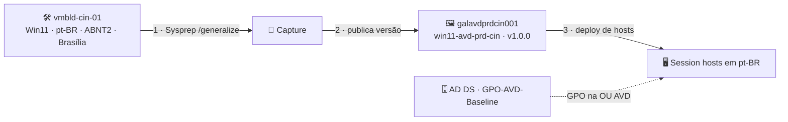

# Lab 06 — Imagem customizada de Windows 11 (idioma, teclado, fuso horário e GPOs)

> **Disciplina:** Azure Virtual Desktop — Pós-Graduação em Arquitetura Avançada em Azure
> **Modalidade:** Passo a passo via Portal do Azure (portal-first). Os ajustes de SO (idioma/teclado/fuso e Sysprep) exigem comandos **no SO da VM** — não há equivalente de portal, então são passos obrigatórios.
> **Dependência:** **Lab 03** (estrutura AD DS). A imagem será usada para implantar hosts nesta estrutura, e as **GPOs** virão do domínio `avdlab.local`.

---

<p align="center">
  
  
  
  
</p>

## 🗺️ Arquitetura deste laboratório



> **Leitura:** a VM de build recebe idioma/teclado/fuso e é generalizada (Sysprep) — a imagem vai para o **Compute Gallery** versionada. Novos hosts nascem em pt-BR a partir dela; a **GPO** do domínio garante a conformidade contínua. A imagem define o *estado inicial*, a GPO mantém o *estado*.

---

## 🧭 Ficha do laboratório

| Item | Detalhe |
|------|---------|
| **Dificuldade** | ★★★ Avançado |
| **Tempo estimado** | 90–120 min |
| **Objetivo** | Construir uma *golden image* de Windows 11 com **idioma pt-BR, teclado ABNT2, fuso horário de Brasília**, herdados por todos os usuários; capturá-la no **Azure Compute Gallery**; e aplicar configurações corporativas via **GPO** do domínio. |
| **Pré-requisitos** | Lab 03 (domínio `avdlab.local` ativo). Papel Owner/Contributor. |
| **Recursos consumidos** | 1× VM de build, 1× Azure Compute Gallery, 1× Image definition + version. |
| **Entrega** | Imagem versionada no gallery, pronta para implantar hosts em pt-BR; GPO de baseline aplicada à OU `AVD`. |

### Convenção de nomes
| Recurso | Nome |
|---------|------|
| VM de build | `vmbld-cin-01` (sub-rede `snet-hosts-prd-cin-001`) |
| Compute Gallery | `galavdprdcin001` (sem hífen) |
| Image definition | `win11-avd-prd-cin` |
| Image version | `1.0.0` |
| Fuso horário | `E. South America Standard Time` (Brasília) |
| Locale | `pt-BR`, GeoId `32` (Brasil) |

---

## Parte A — Provisionar a VM de build

1. **Virtual machines → + Create → Azure virtual machine.**
2. **Basics:**
   - **Resource group:** `rg-avd-prd-cin-001`; **Name:** `vmbld-cin-01`; **Region:** Central India.
   - **Image:** **Windows 11 Enterprise multi-session, version 24H2** (sem M365 para imagem mais limpa, ou com M365 se desejar embutir Office).
     > Use "See all images" → **Microsoft Windows 11** → escolha a edição *multi-session* + *24H2*.
   - **Security type:** Trusted launch.
   - **Size:** `Standard_D2s_v5`.
   - **Administrator account:** `localadmin` + senha (anote).
   - **Public inbound ports:** None (use Bastion ou RDP interno).
3. **Networking:** `vnet-avd-prd-cin-001` / `snet-hosts-prd-cin-001`.
4. **Review + create → Create.**

> ⚠️ **Não ingresse a VM de build no domínio.** A imagem capturada deve ser **genérica**; o domain join acontece no deploy dos hosts (Lab 03/05). Mantenha a build apenas como **workgroup** + admin local.

---

## Parte B — Configurar idioma, teclado e fuso horário (no SO)

Conecte na `vmbld-cin-01` como `localadmin`.

### B.1 — Instalar o pacote de idioma Português (Brasil)

> ⏳ **Aviso — este passo pode demorar MUITO.** A instalação do idioma baixa o **pacote + recursos (FODs)** e pode levar de **10 a 30+ minutos**, às vezes com um reboot exibindo *"Updates are underway. Please keep your computer on."*. É **bem mais rápido numa VM série D** (`Standard_D2s_v5`) do que numa **série B** (burstable). **Não interrompa** no meio.

**Opção 1 (principal) — pela Central de Idiomas do Windows (Configurações):**
1. **Configurações → Hora e Idioma → Idioma e região → + Adicionar um idioma → Português (Brasil)** → **Avançar**.
2. Marque **Pacote de idioma** e **Definir como meu idioma de exibição do Windows** (fala/handwriting são opcionais) → **Instalar**.
3. Acompanhe a **barra de progresso**. Ao terminar, **saia e entre** (ou reinicie) para a interface aplicar o pt-BR.

**Opção 2 — PowerShell (Admin):**
```powershell
Install-Language pt-BR
Set-SystemPreferredUILanguage pt-BR
```
> ⚠️ O `Install-Language` **puxa os FODs do Windows Update** e pode **travar/demorar muito** se o WU estiver bloqueado. Se ficar preso, veja a nota de FOD abaixo.

**Opção 3 (leve, se as anteriores travarem) — LXP pela Microsoft Store:**
Abra a **Microsoft Store** → busque **"Pacote de Experiência Local em Português (Brasil)"** → **Instalar** → depois `Set-WinUILanguageOverride -Language pt-BR`. Traz **interface + teclado** (sem fala/OCR — suficiente para o AVD).

> 🔧 **`Install-Language` travando mesmo com internet?** É bloqueio de FOD por política. Libere e tente de novo:
> ```powershell
> New-Item -Path "HKLM:\SOFTWARE\Microsoft\Windows\CurrentVersion\Policies\Servicing" -Force | Out-Null
> New-ItemProperty -Path "HKLM:\SOFTWARE\Microsoft\Windows\CurrentVersion\Policies\Servicing" -Name "RepairContentServerSource" -Value 2 -PropertyType DWORD -Force
> ```

### B.2 — Configurar fuso horário
```powershell
# Desliga o "definir fuso automaticamente" (senão a VM pode voltar para UTC):
Set-ItemProperty "HKLM:\SYSTEM\CurrentControlSet\Services\tzautoupdate" -Name Start -Value 4

Set-TimeZone -Id "E. South America Standard Time"   # Brasília (UTC-03:00)
Get-TimeZone                                         # confirme: (UTC-03:00) Brasília
```
> 💡 VMs do Azure nascem em **UTC**. Se depois de configurar o fuso ele **voltar a UTC**, é porque o **"definir fuso automaticamente"** está ligado — a primeira linha acima o desliga.

### B.3 — Configurar teclado (ABNT2), locale e formato regional
```powershell
Set-WinUILanguageOverride -Language pt-BR
Set-WinUserLanguageList -LanguageList pt-BR -Force      # inclui teclado ABNT2 (PT-BR)
Set-WinSystemLocale -SystemLocale pt-BR
Set-WinHomeLocation -GeoId 32                            # 32 = Brasil
Set-Culture -CultureInfo pt-BR
```

**✔️ Validação 1 — o que foi aplicado no usuário logado** (confira antes de copiar para o Default):
```powershell
Write-Host "===== VALIDACAO 1 — usuario logado =====" -ForegroundColor Cyan
[pscustomobject]@{
  "UI Language Override"  = (Get-WinUILanguageOverride)
  "System Locale"         = (Get-WinSystemLocale).Name
  "Culture"               = (Get-Culture).Name
  "Home Location (GeoId)" = (Get-WinHomeLocation).GeoId
  "Time Zone"             = (Get-TimeZone).Id
} | Format-List

Get-WinUserLanguageList |
  Select-Object LanguageTag, @{n='Teclados';e={$_.InputMethodTips -join ', '}} |
  Format-Table -AutoSize
```
**Esperado:** UI/Locale/Culture = `pt-BR` · GeoId = `32` · Time Zone = `E. South America Standard Time` · Teclado = `0416:00010416` (ABNT2). Se algo divergir, **reaplique B.1–B.3** antes de seguir.

### B.4 — Aplicar as configurações ao perfil **Default** (crítico para Sysprep)
Para que **todo usuário novo** que logar nos hosts herde idioma/teclado/fuso, copie as configurações do usuário atual para o perfil **Default** e contas do sistema antes do Sysprep:
```powershell
New-Item -ItemType Directory -Force -Path C:\Temp | Out-Null

# Exporta as configurações de internacionalização do usuário atual
$xml = @"
<gs:GlobalizationServices xmlns:gs="urn:longhornGlobalizationUnattend">
  <gs:UserList>
    <gs:User UserID="Current" CopySettingsToDefaultUserAcct="true" CopySettingsToSystemAcct="true"/>
  </gs:UserList>
  <gs:LocationPreferences><gs:GeoID Value="32"/></gs:LocationPreferences>
  <gs:MUILanguagePreferences><gs:MUILanguage Value="pt-BR"/></gs:MUILanguagePreferences>
  <gs:SystemLocale Name="pt-BR"/>
  <gs:InputPreferences>
    <gs:InputLanguageID Action="add" ID="0416:00010416" Default="true"/>  <!-- pt-BR ABNT2 -->
  </gs:InputPreferences>
  <gs:UserLocale>
    <gs:Locale Name="pt-BR" SetAsCurrent="true" ResetAllSettings="false"/>
  </gs:UserLocale>
</gs:GlobalizationServices>
"@
$xml | Out-File C:\Temp\pt-BR.xml -Encoding utf8

# Aplica ao Default e System
control.exe "intl.cpl,,/f:`"C:\Temp\pt-BR.xml`""
```

**✔️ Validação 2 — o que foi copiado para o perfil Default** (o `control.exe` roda silencioso — não há retorno). Carregue a hive do usuário **Default** e verifique as chaves:
```powershell
# Perfil DEFAULT (o que novos usuários herdam):
reg load "HKU\DEF" "C:\Users\Default\NTUSER.DAT"
reg query "HKU\DEF\Control Panel\International" /v LocaleName        # esperado: pt-BR
reg query "HKU\DEF\Control Panel\International\Geo" /v Nation         # esperado: 32 (Brasil)
reg query "HKU\DEF\Keyboard Layout\Preload"                          # deve conter 00010416 (ABNT2)
reg unload "HKU\DEF"

# Conta SYSTEM (.DEFAULT):
reg query "HKU\.DEFAULT\Control Panel\International" /v LocaleName    # esperado: pt-BR
```
> ✅ Se `LocaleName = pt-BR`, `Nation = 32` e o Preload contém `00010416`, o **B.4 funcionou** — todo usuário novo nascerá em pt-BR/ABNT2/Brasil. (Se o `reg unload` der "acesso negado", feche/reabra o PowerShell e refaça só o unload.)

> Após isso, reinicie e reconecte para confirmar que o SO está totalmente em pt-BR.

### B.5 — (Opcional) Personalizações adicionais na imagem
Instale agentes/ferramentas corporativas, remova apps indesejados, aplique otimizações do **Virtual Desktop Optimization Tool (VDOT)** se desejar. Mantenha a imagem enxuta.

### B.6 — Checagem final antes do Sysprep (obrigatório)
Você já validou o **usuário logado** (Validação 1, após B.3) e o **perfil Default** (Validação 2, após B.4). Antes de generalizar, confirme que **não há reboot pendente** — o Sysprep **falha** se houver:
```powershell
$pending = Test-Path "HKLM:\SOFTWARE\Microsoft\Windows\CurrentVersion\Component Based Servicing\RebootPending"
Write-Host ("Reboot pendente: {0}  (precisa ser False para o Sysprep)" -f $pending) -ForegroundColor Yellow
```
> ⛔ **Só prossiga para o Sysprep se:** as Validações **1 (usuário, B.3)** e **2 (Default, B.4)** passaram — tudo em **pt-BR / ABNT2 / GeoId 32 / fuso Brasília** — **e** `Reboot pendente = False`. Se algum valor divergir, reaplique B.1–B.4; se houver reboot pendente, **reinicie** até ficar `False`.

---

## Parte C — Generalizar com Sysprep

> **Atenção:** após o Sysprep + captura, esta VM fica **inutilizável**. Não a use como host.

1. Na VM, abra **PowerShell como Admin**:
   ```cmd
   C:\Windows\System32\Sysprep\sysprep.exe /oobe /generalize /shutdown /mode:vm
   ```
2. Aguarde a VM **parar** (Stopped) — não apenas reiniciar. Confirme no portal o estado **Stopped**.

---

## Parte D — Criar o Azure Compute Gallery e capturar a imagem

### D.1 — Criar o gallery
1. Barra de busca → **Azure compute galleries** → **+ Create**.
2. **Resource group:** `rg-avd-prd-cin-001`; **Name:** `galavdprdcin001`; **Region:** Central India → **Review + create → Create**.

### D.2 — Capturar a VM como versão de imagem
1. **Virtual machines → `vmbld-cin-01`** (estado Stopped após Sysprep) → no menu superior, **Capture**.
2. **Basics:**
   - **Resource group:** `rg-avd-prd-cin-001`.
   - **Share image to Azure compute gallery:** **Yes, share it to a gallery as a VM image version**.
   - **Target Azure compute gallery:** `galavdprdcin001`.
   - **Operating system state:** **Generalized**.
   - **Target VM image definition:** **Create new** → 
     - **Name:** `win11-avd-prd-cin`.
     - **Publisher / Offer / SKU:** ex. `avdlab` / `win11-multisession` / `ptbr-24h2`.
     - **OS type:** Windows; **Generation:** Gen2; marque **multi-session** se a opção existir.
   - **Version number:** `1.0.0`.
   - **Replication:** região Central India (adicione South India se quiser DR — ver trilha avançada).
   - Marque **Automatically delete this virtual machine after creating the image** (a VM de build não serve mais).
3. **Review + create → Create.** A replicação leva ~15–30 min.

---

## Parte E — Aplicar GPOs corporativas via domínio (na estrutura do Lab 03)

A imagem cuida do **estado inicial**; as **GPOs** garantem **conformidade contínua** nos hosts ingressados na OU `AVD`. Configure no DC `vm-adds-prd-cin`.

1. Conecte na `vm-adds-prd-cin` como `AVDLAB\dcadmin`.
2. **Server Manager → Tools → Group Policy Management.**
3. Expanda `Forest → Domains → avdlab.local → OU AVD` → botão direito → **Create a GPO in this domain, and Link it here** → nome `GPO-AVD-Baseline`.
4. Botão direito na GPO → **Edit** e configure, por exemplo:
   - **Idioma/Regional (reforço):** *Computer Configuration → Policies → Administrative Templates → Control Panel → Regional and Language Options* → force o idioma de exibição pt-BR.
   - **Fuso horário:** *Computer Configuration → Preferences → Control Panel Settings → não há item direto; use* um item de registro/preferência ou a configuração de SO já vinda da imagem. (Em lab, o fuso da imagem já basta.)
   - **FSLogix (se ainda não configurado no Lab 05):** *Administrative Templates → FSLogix* (importe os ADMX do FSLogix em `\\avdlab.local\SYSVOL\...\PolicyDefinitions` se quiser gerenciar FSLogix por GPO).
   - **Segurança/UX AVD:** desabilitar tela de bloqueio por inatividade agressiva, configurar timeouts de sessão (*Administrative Templates → Windows Components → Remote Desktop Services → Remote Desktop Session Host → Session Time Limits*).
   - **Não armazenar perfis em roaming local** etc.
5. Para importar os **ADMX do FSLogix** (útil já neste lab): baixe o FSLogix, copie `fslogix.admx`/`.adml` para `C:\Windows\PolicyDefinitions` (ou para o Central Store em `\\avdlab.local\SYSVOL\avdlab.local\Policies\PolicyDefinitions`).
6. Nos hosts, force a aplicação:
   ```cmd
   gpupdate /force
   ```

> 💡 **Imagem vs GPO — divisão de responsabilidade:** a *imagem* define o ponto de partida (idioma instalado, fuso, apps). A *GPO* garante que ninguém altere e padroniza o comportamento de sessão. Em ambiente Entra-only (Labs 01/02), o equivalente da GPO é o **Intune Settings Catalog**.

---

## Parte F — (Validação) Implantar um host a partir da imagem

Para confirmar que a imagem funciona, adicione um host ao pool do Lab 03 usando a nova imagem:
1. **Host pools → `vdpool-avd-prd-cin-002` → Session hosts → + Add.**
2. Na seção **Image**, escolha **Shared Image Gallery** → `galavdprdcin001` → `win11-avd-prd-cin` → versão `1.0.0`.
3. Configure rede `snet-hosts-prd-cin-001` e **Domain join = Active Directory** na OU `AVD` (igual ao Lab 03).
4. Após provisionar, conecte no **host novo** e rode a **mesma validação do usuário (Validação 1, B.3)** para confirmar que ele **herdou** tudo da imagem:
   ```powershell
   Write-Host "===== VALIDACAO DO HOST (herdado da imagem) =====" -ForegroundColor Cyan
   [pscustomobject]@{
     "UI Language Override"  = (Get-WinUILanguageOverride)
     "System Locale"         = (Get-WinSystemLocale).Name
     "Culture"               = (Get-Culture).Name
     "Home Location (GeoId)" = (Get-WinHomeLocation).GeoId
     "Time Zone"             = (Get-TimeZone).Id
   } | Format-List
   Get-WinUserLanguageList |
     Select-Object LanguageTag, @{n='Teclados';e={$_.InputMethodTips -join ', '}} |
     Format-Table -AutoSize
   ```
   **Esperado:** `pt-BR` (UI/Locale/Culture) · GeoId `32` · fuso `E. South America Standard Time` · teclado `0416:00010416` (ABNT2).

### ✅ Critérios de sucesso
- [ ] As **Validações 1 (usuário, B.3) e 2 (perfil Default, B.4) passaram** na VM de build, e **`Reboot pendente = False`** (B.6) **antes** do Sysprep.
- [ ] Imagem `win11-avd-prd-cin` versão `1.0.0` replicada no gallery `galavdprdcin001`.
- [ ] O **host novo** (Parte F) retorna no script de validação: **`pt-BR`** (UI/Locale/Culture), **GeoId `32`**, **fuso `E. South America Standard Time`** e **teclado `0416:00010416` (ABNT2)** — **sem intervenção**.
- [ ] GPO `GPO-AVD-Baseline` vinculada à OU `AVD` e aplicada (`gpresult /r` lista a GPO).
- [ ] Usuário novo (sem perfil prévio) herda o idioma/teclado/fuso ao primeiro logon.

---

## Erros comuns

| Sintoma | Causa | Correção |
|---------|-------|----------|
| Host novo nasce em inglês | Configurações não copiadas ao perfil Default antes do Sysprep | Refaça B.4 numa nova build e recapture |
| Sysprep falha ("appx packages") | App provisionado por usuário impede generalize | Remova o app problemático (log em `C:\Windows\System32\Sysprep\Panther\setuperr.log`) |
| Captura não oferece "Generalized" | VM não foi sysprepada/parada corretamente | Garanta estado **Stopped** após `/generalize /shutdown` |
| GPO não aplica | Host fora da OU `AVD` | Mova o objeto do host para a OU correta e `gpupdate /force` |

---

## 🔎 Diagnóstico — onde buscar logs da imagem

| Etapa | Onde olhar | O que procurar |
|-------|-----------|----------------|
| Sysprep falhou | `C:\Windows\System32\Sysprep\Panther\setuperr.log` e `setupact.log` | Pacote Appx por-usuário que impede o `/generalize` |
| Idioma/teclado não aplicou | Na VM: `Get-WinSystemLocale`, `Get-WinUserLanguageList`, `Get-WinHomeLocation` | Valores diferentes de `pt-BR` / ABNT2 / GeoId `32` |
| Captura sem opção "Generalized" | Estado da VM no portal | VM precisa estar **Stopped (deallocated)** após o Sysprep |
| GPO não aplica no host | No host: `gpresult /r` e *Event Viewer →* `System` (origem GroupPolicy) | Host fora da OU `AVD` ou sem linha de visão ao DC |
| Replicação lenta da imagem | **Compute Gallery → Image version → Replication** | Status de replicação por região |

---

## Próximo lab
➡️ **Lab 07 — Scaling Plan nativo do AVD** para agendar o startup/shutdown desta estrutura, reduzindo custo fora do horário.
