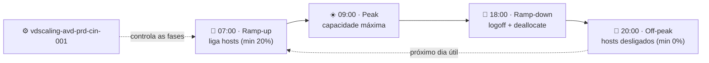

# Lab 06 — Agendamento de startup/shutdown com Scaling Plan nativo do AVD

> **Disciplina:** Azure Virtual Desktop — Pós-Graduação em Arquitetura Avançada em Azure
> **Modalidade:** Passo a passo via Portal do Azure (portal-first).
> **Dependência:** Um host pool existente — recomenda-se o **`vdpool-avd-prd-cin-002`** (Lab 03) e/ou `vdpool-avd-prd-cin-001` (Lab 01).

---

  
  
  
  

## 🗺️ Ciclo diário do Autoscale

> **Leitura:** o scaling plan liga os hosts no início do expediente e os **desaloca** (sem custo de compute) à noite. Com expediente 07:00–18:00 em dias úteis: ~55 h/semana ligado vs 168 h se ficasse sempre on → **~67% de economia** no compute.

---

## 🧭 Ficha do laboratório

| Item | Detalhe |
|------|---------|
| **Dificuldade** | ★★ Intermediário |
| **Tempo estimado** | 45–60 min |
| **Objetivo** | Usar o **Autoscale / Scaling Plan** nativo do AVD para **ligar (start) e desligar/desalocar (deallocate)** os session hosts conforme horário, reduzindo custo de compute fora do expediente. |
| **Pré-requisitos** | Host pool com session hosts; papel **Owner** (para criar a custom role/atribuição que o Autoscale exige) ou Contributor + User Access Administrator. |
| **Recursos consumidos** | 1× Scaling Plan (sem custo direto), atribuição de função ao service principal do AVD. |
| **Entrega** | Scaling plan ativo com schedules de semana, ligando hosts no ramp-up e desalocando no off-peak. |

### Conceito — o que o Autoscale faz
O Autoscale liga e **desaloca** (stop + deallocate, sem cobrança de compute) os session hosts conforme **fases do dia**:
- **Ramp-up** — início do expediente, usuários começam a entrar.
- **Peak** — horário de pico.
- **Ramp-down** — fim do expediente, usuários saem.
- **Off-peak** — noite/madrugada, capacidade mínima.

Há **dois tipos** de scaling plan, e o comportamento difere:
| Tipo | Como decide ligar/desligar |
|------|----------------------------|
| **Pooled** | Por **capacidade/threshold** e % mínimo de hosts ligados por fase (balanceia carga entre hosts). |
| **Personal** | Por **estado da sessão** do usuário (signed-out / disconnected) — define a ação (deallocate/hibernate) por fase. |

> Como os labs usam host pools **Pooled** (`vdpool-avd-prd-cin-002`, `vdpool-avd-prd-cin-001`), este lab foca no **Scaling Plan Pooled**. A Parte F traz as diferenças para Personal.

---

## Parte A — Conceder a permissão de Autoscale ao service principal do AVD (obrigatório)

O serviço AVD precisa de permissão para ligar/desligar e gerenciar a energia das VMs. Cria-se (uma vez) uma **custom role** e atribui-se ao service principal **Azure Virtual Desktop**.

> Em muitos tenants já existe a função **"Desktop Virtualization Power On Off Contributor"** pronta — use-a diretamente e pule a criação da custom role.

1. Barra de busca → **Subscriptions → sua assinatura → Access control (IAM) → + Add → Add role assignment.**
2. **Role:** selecione **Desktop Virtualization Power On Off Contributor**.
   > Se não existir, crie uma custom role com as ações: `Microsoft.Compute/virtualMachines/start/action`, `.../deallocate/action`, `.../restart/action`, `.../read`, e ações de leitura/escrita em `Microsoft.DesktopVirtualization/hostpools` e `.../sessionhosts`. Atribua no escopo da assinatura.
3. **Members:** **Assign access to → User, group, or service principal** → **+ Select members** → busque **Azure Virtual Desktop** (o service principal de 1st party; App ID `9cdead84-a844-4324-93f2-b2e6bb768d07`) → selecione.
4. **Review + assign.**

> ⚠️ Sem esta atribuição, o scaling plan provisiona mas **não consegue** ligar/desligar as VMs.

---

## Parte B — Criar o Scaling Plan (Pooled)

1. **Azure Virtual Desktop → Scaling plans → + Create.**
2. **Basics:**
   - **Resource group:** `rg-avd-prd-cin-001`.
   - **Name:** `vdscaling-avd-prd-cin-001`.
   - **Location:** Central India (metadados).
   - **Time zone:** **(UTC-03:00) Brasilia** — define o relógio dos schedules.
   - **Host pool type:** **Pooled**.
   - **Exclusion tags** (opcional): tag para excluir hosts específicos do scaling (ex.: `noScale`).
3. Avance para **Schedules**.

---

## Parte C — Definir o Schedule de dias úteis

1. Na aba **Schedules → + Add schedule.**
2. **General:**
   - **Schedule name:** `weekdays`.
   - **Repeat on:** Monday a Friday.

### C.1 — Ramp-up (início do expediente)
- **Start time:** `07:00`.
- **Load balancing:** **Breadth-first**.
- **Minimum percentage of hosts (%):** `20` (garante pelo menos ~1 host ligado p/ os primeiros usuários).
- **Capacity threshold (%):** `60` (acima disso, liga mais hosts).

### C.2 — Peak (pico)
- **Start time:** `09:00`.
- **Load balancing:** **Depth-first** (concentra usuários em menos hosts; mais econômico) ou Breadth-first (mais performance).
- **Capacity threshold (%):** `80`.

### C.3 — Ramp-down (fim do expediente) — onde o **desligamento** começa
- **Start time:** `18:00`.
- **Load balancing:** **Depth-first**.
- **Minimum percentage of hosts (%):** `10`.
- **Capacity threshold (%):** `90`.
- **Force logoff users:** defina a política — recomendado **Yes**, com:
  - **Wait time (min):** `30` (avisa o usuário antes de deslogar).
  - **Notification message:** ex. "Sua sessão será encerrada em 30 minutos. Salve seu trabalho."
- **Stop hosts when:** **deallocate** (desaloca a VM → para de cobrar compute) — esta é a ação que **desliga** as máquinas.

### C.4 — Off-peak (madrugada) — máquinas desligadas
- **Start time:** `20:00`.
- **Load balancing:** **Depth-first**.
- **Capacity threshold (%):** `90`.
- **Minimum percentage of hosts (%):** `0` (permite desligar **todos** os hosts se não houver sessão).

3. **Add** para salvar o schedule.

> 💡 **Como o start/stop acontece:** no **ramp-up (07:00)** o Autoscale **liga** os hosts necessários. No **ramp-down (18:00)** ele desloga usuários (respeitando o wait time) e **desaloca** hosts conforme a carga cai. No **off-peak**, com mínimo 0%, os hosts ficam **desligados/desalocados** durante a madrugada — sem custo de compute.

---

## Parte D — (Opcional) Schedule de fim de semana

1. **+ Add schedule** → **Name:** `weekend` → **Repeat on:** Saturday, Sunday.
2. Configure capacidade mínima baixa em todas as fases (ex.: Min 0%, threshold alto), mantendo hosts **desligados** salvo demanda. Ajuste conforme a necessidade da turma/empresa.

---

## Parte E — Associar o Scaling Plan ao(s) Host Pool(s) e habilitar

1. Ainda no assistente, aba **Host pool assignments** (ou após criar: **Scaling plans → `vdscaling-avd-prd-cin-001` → Host pool assignments**).
2. **+ Assign** → selecione **`vdpool-avd-prd-cin-002`** (e/ou outro host pool Pooled).
3. Marque **Enable autoscale** para o host pool.
4. **Review + create → Create** (ou **Save**).

> Um scaling plan só pode ser atribuído a host pools do **mesmo tipo** (Pooled com Pooled). Um host pool aceita **apenas um** scaling plan.

---

## Parte F — Caso Personal (se for agendar um host pool Personal)

Se você tiver um host pool **Personal** e quiser agendar desligamento por inatividade:
1. Crie outro scaling plan com **Host pool type: Personal**.
2. Nos schedules, em vez de threshold/capacidade, você define **ações por estado de sessão**:
   - **Ramp-up:** **Start VM on Connect** (liga sob demanda) + opção de ligar todos no início.
   - **Ramp-down/Off-peak:** ação quando o usuário **desconecta** ou **faz logoff** → **Deallocate** (desliga) após X minutos, ou **Hibernate** (se habilitado).
3. Atribua ao host pool Personal e **Enable autoscale**.

> Para Personal, combine com **Start VM on Connect** no host pool (**Host pool → Properties → Start VM on connect = Yes**) para que a VM religue automaticamente quando o usuário tentar conectar.

---

## Parte G — Validar

1. **Scaling plans → `vdscaling-avd-prd-cin-001` → Host pool assignments:** confirme o host pool com **Autoscale = Enabled**.
2. Para testar **sem esperar o horário**, ajuste temporariamente o **Start time** de uma fase para alguns minutos à frente (ex.: off-peak começando "agora + 10min" com Min 0%) e observe.
3. Acompanhe a ação:
   - **Host pools → `vdpool-avd-prd-cin-002` → Session hosts:** veja os hosts mudarem para **Shutdown/Unavailable** (desalocados) no off-peak, e voltarem a **Available** no ramp-up.
   - **Virtual machines:** o estado das VMs `vmavda-cin-0x` deve ir para **Stopped (deallocated)** quando desligadas.
4. Para auditar decisões do Autoscale, habilite **Diagnostic settings** no scaling plan enviando para o **Log Analytics** (`log-avd-prd-cin-001`) e consulte a tabela de Autoscale.

### Critérios de sucesso
- [ ] Service principal **Azure Virtual Desktop** com a função Power On/Off atribuída.
- [ ] Scaling plan `vdscaling-avd-prd-cin-001` criado com fuso **Brasília** e 4 fases.
- [ ] Host pool com **Autoscale = Enabled**.
- [ ] No off-peak, as VMs vão para **Stopped (deallocated)** (param de cobrar compute).
- [ ] No ramp-up, ao menos o % mínimo de hosts volta a **Available** automaticamente.

---

## Erros comuns

| Sintoma | Causa | Correção |
|---------|-------|----------|
| Hosts não ligam/desligam no horário | Permissão Power On/Off ausente no service principal | Refaça a Parte A |
| VM "parada" mas ainda cobrando | Host foi **Stopped** e não **Deallocated** | Garanta a ação **deallocate** no ramp-down/off-peak |
| Usuários deslogados sem aviso | Force logoff sem wait time/mensagem | Ajuste **Wait time** e **Notification** no ramp-down |
| Não consigo atribuir o plano | Tipo do plano ≠ tipo do host pool | Crie plano do mesmo tipo (Pooled/Personal) |
| Schedule disparou no horário errado | Time zone do plano incorreto | Ajuste **Time zone** para (UTC-03:00) Brasília |

---

## Parte H — Monitoramento e diagnóstico do Autoscale

### H.1 — Acompanhar as decisões do Autoscale
1. **Scaling plans → `vdscaling-avd-prd-cin-001` → Diagnostic settings → + Add diagnostic setting** → envie os logs para o **Log Analytics** `log-avd-prd-cin-001`.
2. Em **Log Analytics → Logs**, consulte a tabela `WVDAutoscaleEvaluationPooled` para ver, por avaliação, quantos hosts foram ligados/desligados e **por quê**.
3. **Host pool → Insights** (workbook nativo do AVD) mostra sessões, hosts disponíveis e uso ao longo do dia.

### H.2 — Onde buscar logs quando "não liga/desliga"
| Sintoma | Onde olhar | O que procurar |
|---------|-----------|----------------|
| Hosts não ligam/desligam | **Subscription → IAM** | Função **Power On/Off Contributor** no SP **Azure Virtual Desktop** (Parte A) |
| Plano não age | **Scaling plan → Host pool assignments** | `Autoscale = Enabled` no host pool certo |
| Decisões inesperadas | **Log Analytics →** `WVDAutoscaleEvaluationPooled` | Thresholds / min % por fase e horário avaliado |
| Disparo em horário errado | **Scaling plan → Properties** | **Time zone** = (UTC-03:00) Brasília |
| Usuário deslogado sem aviso | Configuração do **Ramp-down** | Wait time + Notification message |

---

## Discussão para a aula — economia
Com expediente 07:00–18:00 em dias úteis, hosts ligados ~11h/dia × 5 dias ≈ **55h/semana** vs **168h** se ficassem sempre ligados — **~67% de redução** no custo de compute dos session hosts. Reforce: o **storage (FSLogix)** continua sendo cobrado; o Autoscale economiza **compute**, não armazenamento.

---

## Fim da trilha
Você construiu, via portal: host pools Entra ID e AD DS, FSLogix nos dois modelos de identidade, imagem customizada pt-BR e agendamento de energia. Ao encerrar, **desaloque ou exclua** os recursos para evitar cobrança (ver seção de limpeza em cada lab).
