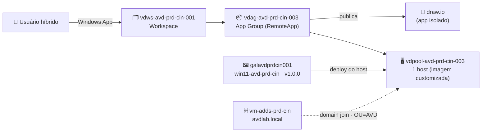

# Lab 07 — Host Pool de Aplicação (RemoteApp) publicando o draw.io da imagem customizada

> **Disciplina:** Azure Virtual Desktop — Pós-Graduação em Arquitetura Avançada em Azure
> **Modalidade:** Passo a passo via Portal do Azure (portal-first).
> **Dependência:** **Lab 03** (domínio `avdlab.local` ativo, DNS na VNet, Entra Connect) **e Lab 06** (imagem `win11-avd-prd-cin` v1.0.0 no gallery `galavdprdcin001`, **com o draw.io já instalado**).

---

  
  
  
  

## 🗺️ Arquitetura deste laboratório

> **Leitura:** reutilizamos a **imagem customizada do Lab 06** (que já tem o draw.io instalado por máquina) para subir **1 host**, ingressado no `avdlab.local`. Em vez de publicar a **área de trabalho inteira**, publicamos **apenas o aplicativo** draw.io como **RemoteApp** — ele abre numa janela isolada, como se fosse local.

---

## 🧭 Ficha do laboratório

| Item | Detalhe |
|------|---------|
| **Dificuldade** | ★★ Intermediário |
| **Tempo estimado** | 60–90 min |
| **Objetivo** | Criar um **host pool Pooled do tipo RemoteApp**, com **1 host** provisionado a partir da **imagem customizada** (Lab 06) e ingressado no AD DS; **publicar o draw.io** como RemoteApp; atribuir o usuário e validar no **Windows App**. |
| **Pré-requisitos** | **Lab 03** (AD DS `avdlab.local`, DNS 10.50.3.4, Entra Connect) e **Lab 06** (imagem `win11-avd-prd-cin` v1.0.0 no gallery `galavdprdcin001`). Papel **Owner** ou (Contributor + User Access Administrator). |
| **Recursos consumidos** | 1× Host Pool, 1× Application Group (RemoteApp), 1× session host, reutiliza o Workspace. |
| **Entrega** | draw.io publicado como **RemoteApp**, aparecendo no Windows App do usuário e abrindo como **app isolado** (sem desktop completo). |

### Cenário — Desktop vs RemoteApp
No AVD, um host pool entrega o recurso ao usuário de uma de duas formas:

- **Desktop (Labs 01/03):** o usuário recebe a **área de trabalho completa** do host.
- **RemoteApp (este lab):** o usuário recebe **apenas o aplicativo publicado** (ex.: draw.io), numa **janela própria**, integrada ao desktop local. Mais leve, mais focado e reduz a superfície exposta (o usuário não vê o Windows do host).

> ⚠️ **Regra do "Preferred app group type":** dentro de **um mesmo host pool**, um usuário **não** pode ser atribuído ao **Desktop** e ao **RemoteApp** ao mesmo tempo. Por isso criamos um **host pool dedicado** para RemoteApp (`vdpool-avd-prd-cin-003`), separado do host pool de Desktop do Lab 03.

### Convenção de nomes
| Recurso | Nome |
|---------|------|
| Host Pool (RemoteApp) | `vdpool-avd-prd-cin-003` |
| Application Group (RemoteApp) | `vdag-avd-prd-cin-003` |
| Workspace | `vdws-avd-prd-cin-001` (reutiliza o dos labs anteriores) |
| Session host | `vmavdapp-cin` (gera `vmavdapp-cin-0`) |
| Imagem | gallery `galavdprdcin001` → definition `win11-avd-prd-cin` → versão `1.0.0` |
| OU alvo (AD DS) | `OU=AVD,DC=avdlab,DC=local` |
| Grupo de usuários | `grp-avd-usuarios` (sincronizado pelo Entra Connect) |

> **Instância `003`:** os labs usam `001` = Entra e `002` = AD DS. Este é um **terceiro** host pool (RemoteApp, também AD DS), por isso `003`.

---

## Parte A — Criar o Host Pool de RemoteApp com 1 host da imagem customizada

1. **Azure Virtual Desktop → Host pools → + Create**.
2. **Basics:**
   - **Resource group:** `rg-avd-prd-cin-001`; **Host pool name:** `vdpool-avd-prd-cin-003`; **Location:** Central India.
   - **Host pool type:** **Pooled**; **Load balancing algorithm:** Breadth-first; **Max session limit:** `10`.
   - **Preferred app group type:** **RemoteApp** ← **esta é a diferença-chave** deste lab (nos Labs 01/03 era *Desktop*).
3. **Virtual Machines → Add virtual machines = Yes:**
   - **Name prefix:** `vmavdapp-cin`.
   - **Image:** clique em **See all images / Shared Image** → aba **Shared Images** → selecione:
     - **Gallery:** `galavdprdcin001` → **Image definition:** `win11-avd-prd-cin` → **Version:** `1.0.0` (a imagem do Lab 06, **com o draw.io já instalado**).
   - **Security type:** **Trusted launch** (a imagem foi capturada como Gen2/Trusted launch).
   - **Size:** `Standard_D2s_v5`; **Number of VMs:** `1`.
   - **Network:** `vnet-avd-prd-cin-001` / `snet-hosts-prd-cin-001`.
   - **Domain to join:** **Active Directory** (não "Microsoft Entra ID"):
     - **AD domain join UPN:** conta com permissão de join, ex. `dcadmin@avdlab.local`.
     - **Password:** senha da conta.
     - **Specify domain or unit:** marque e informe **`OU=AVD,DC=avdlab,DC=local`**.
   - **Virtual Machine Administrator account:** `localadmin` (ou `suporte`) + senha.
4. **Workspace → Register application group = Yes** → **Workspace:** `vdws-avd-prd-cin-001` (reutiliza; cria se não existir).
5. **Review + create → Create.**

> Como o **Preferred app group type = RemoteApp**, o assistente cria automaticamente um **Application Group do tipo RemoteApp** (já com o app padrão vazio), em vez de um Desktop app group.

---

## Parte B — Confirmar o host e localizar o Application Group

1. **Host pools → `vdpool-avd-prd-cin-003` → Session hosts:** o host `vmavdapp-cin-0` deve ficar **Available** (aguarde o agente registrar).
2. **Azure Virtual Desktop → Application groups:** localize o app group **RemoteApp** criado pelo assistente (vinculado ao `vdpool-avd-prd-cin-003`).
   - Se o nome gerado for genérico, você pode **renomear** para `vdag-avd-prd-cin-003` (Application group → não é editável após criado; se quiser o nome exato, crie o app group manualmente — ver nota).
   > 💡 **Quer o nome exato `vdag-avd-prd-cin-003`?** O assistente nomeia o app group automaticamente. Para ter o nome padronizado, você pode **criar o Application Group manualmente** (*Application groups → + Create → Application group type: RemoteApp → Host pool: vdpool-avd-prd-cin-003 → Name: vdag-avd-prd-cin-003*) e registrá-lo no workspace. Em lab, usar o gerado pelo assistente também é válido.

---

## Parte C — Publicar o draw.io como RemoteApp

1. **Application groups → (o RemoteApp group do host pool 003) → Applications → + Add**.
2. **Application source:** **Start menu** (a lista é lida do host — como o draw.io foi instalado **por máquina** na imagem, ele aparece aqui).
   - **Application:** selecione **draw.io** na lista.
   - **Display name:** `Diagramas (draw.io)` (nome que o usuário vê).
   - **Description:** opcional (ex.: "Editor de diagramas de arquitetura").
3. Deixe **Icon path** / **Icon index** no padrão (herda do app) e clique em **Save / Add**.

> **Alternativa — por caminho de arquivo:** se o draw.io não aparecer na lista do menu Iniciar, use **Application source = File path** e informe:
> - **Application path:** `C:\Program Files\draw.io\draw.io.exe`
> - **Application name:** `drawio` · **Display name:** `Diagramas (draw.io)`
> (Confirme o caminho no host: `Get-ItemProperty "HKLM:\SOFTWARE\Microsoft\Windows\CurrentVersion\Uninstall\*","HKLM:\SOFTWARE\WOW6432Node\...\Uninstall\*" | ? DisplayName -match "draw.io" | Select DisplayName, InstallLocation`.)

---

## Parte D — Atribuir acesso ao usuário

1. **Application groups → (RemoteApp group 003) → Assignments → + Add** → selecione o grupo **`grp-avd-usuarios`** (a identidade **sincronizada** no Entra ID pelo Entra Connect) → **Select**.

> 🔎 **Precisa adicionar ao "Remote Desktop Users"?** Normalmente **não** — a atribuição no Application Group já autoriza no Broker, e o provisionamento do host cuida do direito de logon RDS. Só mexa nisso (via **GPO** na OU `AVD`, nunca host a host) se aparecer *"you need the right to sign in through Remote Desktop Services"* — mesmo procedimento do **Lab 03 (Parte F)**.

---

## Parte E — Conectar e validar (Windows App)

1. Abra o **Windows App** (instalável em https://apps.microsoft.com/detail/9n1f85v9t8bn) **ou** o **web client** em **https://windows.cloud.microsoft/**.
2. Faça login com o **UPN do Entra** de um usuário do grupo `grp-avd-usuarios` (ver nota de UPN do Lab 03).
3. No workspace, deve aparecer o **ícone do draw.io** (`Diagramas (draw.io)`) — **e não** um desktop completo.
4. Clique nele → o **draw.io abre numa janela própria**, integrada ao seu desktop local (sem a área de trabalho do host).

### ✅ Critérios de sucesso
- [ ] Host pool `vdpool-avd-prd-cin-003` criado com **Preferred app group type = RemoteApp**.
- [ ] Host `vmavdapp-cin-0` provisionado **a partir da imagem `win11-avd-prd-cin` v1.0.0** e **Available** (na OU `AVD`).
- [ ] draw.io publicado como aplicação no Application Group RemoteApp.
- [ ] Usuário atribuído vê **o app draw.io (não um desktop)** no Windows App.
- [ ] draw.io **abre como janela isolada** ao clicar.

---

## Erros comuns

| Sintoma | Causa | Correção |
|---------|-------|----------|
| draw.io não aparece na lista do menu Iniciar (Parte C) | App instalado por usuário (MSIX) em vez de por máquina, ou host ainda não pronto | Use a imagem do Lab 06 (draw.io via **MSI por máquina**); ou publique por **File path** `C:\Program Files\draw.io\draw.io.exe` |
| Usuário vê **desktop** em vez do app | O usuário está atribuído a um app group **Desktop** do mesmo/outro host pool | Um usuário não pode ter Desktop + RemoteApp no mesmo host pool; garanta que ele está só no app group **RemoteApp** (003) |
| Recurso não aparece no Windows App | App group não atribuído ao usuário, ou não registrado no workspace | Parte D (Assignments) + confirmar **Register** no `vdws-avd-prd-cin-001` |
| Host fica **Unavailable** | Falha no domain join ou agente | Confirme DNS da VNet = 10.50.3.4, conta de join e OU `OU=AVD`; veja `setuperr`/eventos do agente |
| *"right to sign in through Remote Desktop Services"* | Direito de logon RDS ausente | Adicione `grp-avd-usuarios` ao **Remote Desktop Users** via **GPO** na OU `AVD` (ver Lab 03 Parte F) |
| Login cai para `@...onmicrosoft.com` | UPN `.local` não roteável | Use o UPN sincronizado correto (ver nota de UPN do Lab 03/04) |

---

## 🔎 Diagnóstico

| Etapa | Onde olhar | O que procurar |
|-------|-----------|----------------|
| Host não registra | **Host pool → Session hosts** | Status do host e do **AVD Agent**; domain join OK |
| App não publica | **Application groups → Applications** | draw.io listado; caminho/menu Iniciar corretos |
| Usuário não enxerga o app | **Application group → Assignments** e **Workspace** | Grupo atribuído + app group registrado no workspace |
| Conexão falha | **Insights / Diagnostics** do host pool | Erros de Broker/autorização |

---

## Próximo lab
➡️ **Lab 08 — Scaling Plan nativo do AVD** para agendar startup/shutdown desta estrutura (inclui este host pool de RemoteApp), reduzindo custo fora do horário.
