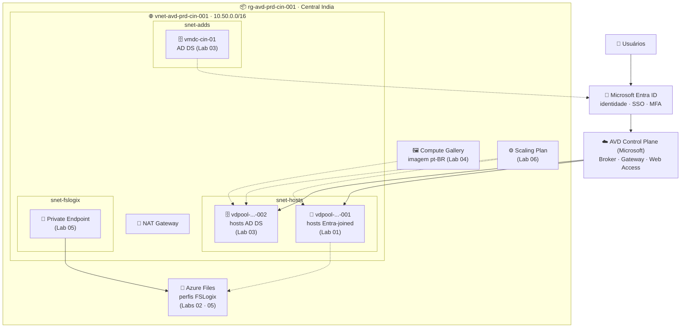

<h1 align="center">🖥️ Laboratórios Azure Virtual Desktop (AVD)</h1>

  <em>Material prático da disciplina de Azure Virtual Desktop — Pós-Graduação em Arquitetura Avançada em Azure</em>

  
  
  
  
  

---

## 📚 Sobre

Seis laboratórios **passo a passo via Portal do Azure** (portal-first), com scripts apenas onde são obrigatórios. Cada lab traz ficha resumida, diagrama de arquitetura, critérios de sucesso e uma tabela de erros comuns.

> 🏷️ Nomenclatura no padrão **Cloud Adoption Framework (CAF)** — ambiente **prd**, região **Central India (cin)**. Detalhes em [`00_Padrao_de_Nomenclatura_CAF.md`](00_Padrao_de_Nomenclatura_CAF.md).

> 🧭 **Não sabe qual trilha seguir?** Comece pelo [**Guia de decisão — Entra ID vs AD DS**](00_Guia_Decisao_Identidade_Entra_vs_ADDS.md).

## 🧭 Trilha de laboratórios

| # | Lab | Foco | Nível | Depende de |
|:-:|-----|------|:-----:|:----------:|
| 01 | [🔐 Host Pool 2 VMs — Entra ID](Lab01_Hostpool_2VMs_EntraID.md) | Host pool cloud-native + SSO | ★★ | — |
| 02 | [💾 FSLogix — Entra ID](Lab02_FSLogix_EntraID.md) | Perfis em Azure Files (Entra Kerberos) | ★★★ | Lab 01 |
| 03 | [🗄️ Host Pool 2 VMs — AD DS](Lab03_Hostpool_2VMs_ADDS.md) | Criação do AD DS + hosts domain-joined | ★★★ | — |
| 04 | [🖼️ Imagem Windows 11 customizada](Lab04_Imagem_Windows11_Customizada.md) | Golden image pt-BR + Gallery + GPOs | ★★★ | Lab 03 |
| 05 | [🔌 FSLogix — AD DS + Private Endpoints](Lab05_FSLogix_ADDS_PrivateEndpoints.md) | Perfis com AD DS e acesso privado | ★★★ | Lab 03 |
| 06 | [⚙️ Scaling Plan — agendamento](Lab06_ScalingPlan_Agendamento.md) | Startup/shutdown automático (FinOps) | ★★ | Host pool |

> 🟦 **Trilha Entra ID:** Labs 01 → 02  ·  🟨 **Trilha AD DS:** Labs 03 → 04 → 05 → 06

## 🗺️ Visão geral do ambiente

## 🚀 Como usar

1. Comece pela trilha que interessa (**Entra ID** ou **AD DS**).
2. Siga os labs na ordem da coluna **Depende de**.
3. Reutilize o ambiente base (RG, VNet, sub-redes) entre os labs.

### 🧱 Ambiente base

| Recurso | Nome | Detalhe |
|---------|------|---------|
| 🌍 Região | Central India | `cin` |
| 📦 Resource Group | `rg-avd-prd-cin-001` | agrupa tudo |
| 🌐 VNet | `vnet-avd-prd-cin-001` | `10.50.0.0/16` |
| 🔹 Sub-redes | `snet-hosts` · `snet-fslogix` · `snet-adds` | `.1` · `.2` · `.3` /24 |

---

  👨‍🏫 Professor: Raphael Andrade · Pós-Graduação em Arquitetura Avançada em Azure

